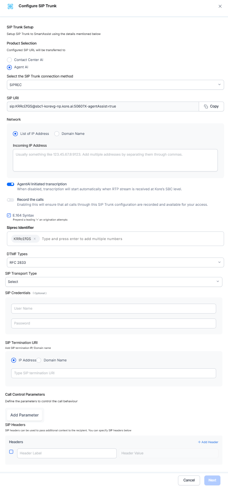

# Getting Started and Basic Configuration

Voice Gateway is a comprehensive voice automation solution that manages inbound call automation for Contact Center AI. It integrates with existing voice systems or uses the native voice processing capabilities, enabling seamless transitions between automated and human interactions within the XO Platform.

This section covers the fundamental steps required to set up and configure your Voice Gateway for basic operation.

Go to The Product (For example, Automation AI/ Contact Center AI) > Flows & Channels > Channels > Voice Gateway.  

## Configuration

### Buy New Phone Number

Steps to buy a new phone number:

1. Click the **Phone Numbers** tab and click **Buy New Phone Number**. You can configure a custom local or toll-free number by clicking **Get New Phone Number** on the **Phone Number** window.  

    1. Select a country in the **Country Name** field.
    2. Select either the **Local** or **Toll-Free Number** option.
    3. Select the **State**.
    4. Enter the **Area Code**.
    5. After the above fields are configured, Contact Center AI displays the monthly fee and the operational charge per minute.  
        

2. Configure an available number with the following steps:

    1. Click the **Get Number** button.
    2. On the **Forward to Phone Number** page, select whether the number will be reserved for Inbound Calls, Outbound Calls, or both.  
    3. Select an App for outbound calls from the dropdown. AgentAI will trigger this app when the agent makes an outbound call with this phone number.  
        
    4. Click **Done**. A success confirmation message is displayed, and the phone number is added.
    5. You can now call this number to test your Use Cases.
    6. When ready to go live, forward the calls you receive to this phone number or use this number as your customer support number.

!!! Note

    This feature is only available when using Kore's Twilio account. It's not supported for SIP trunk setups.

### Attach Flow

Steps to attach a flow to the phone number:

1. Click **+ Attach Flow**. Hovering over the pie icon displays "**No Flow Attached**".  
    

2. Select a **Start Flow** you want to add to this number and click **Done**. You can add a start flow by clicking **+ New Start Flow**. [Learn more](../../flows/create-flows.md#create-a-start-flow).  
    

3. The attached flow appears. Hovering over the pie icon displays "**Configured**".  
    

### Edit a Phone Number

Steps to edit a previously added phone number:

1. Click the **ellipsis (︙)** and select **Update**.  
    

2. On the **Forward to Phone Number** page, click **Change**.  
    

3. Make the necessary edits, and click **Done**.
4. A success confirmation message is displayed when the phone number is updated.

### Delete a Phone Number

Deleting a phone number means stopping all services associated with it. If you remove a phone number and want to add it back later, you may be unable to do so if another user has selected it.

Steps to delete an existing phone number:

1. Click the **ellipsis (︙)**, and select **Delete**.  
    

2. Click **Delete** to confirm your choice.  

3. Alternatively, click **Update**, go to the **Forward to Phone Number** window, and click **Remove**. You will need to confirm your choice.  
    

4. A success confirmation message is displayed once the phone number is deleted.

    !!! Note

        The phone number cannot be deleted if there are active voice campaigns or flows attached to the channel.

### SIP Trunk Setup

This option is useful when transferring calls to Contact Center AI from a toll-free or local phone number using Session Initiation Protocol (SIP) in the IVR system.

Under the SIP Trunk tab, you can configure the network IPs and domains, DID number, SIP transport protocol, SIP credentials (optional), and Inbound/Outbound direction for phone numbers while the SIP URI is pre-configured.

Agent AI supports real-time audio streaming through two primary methods:  

* **SIPREC (SIP Recording)**: Agent Assist acts as a SIPREC server, receiving duplicated audio streams from the contact center platform or a Session Border Controller (SBC). 

* **WebSocket Audio Streaming**: For cloud-native platforms like Genesys AudioHook, Agent Assist subscribes to real-time audio feeds over secure WebSocket connections.

### Steps to configure SIP Trunk

1. Click **Configure SIP Trunk**.  
     

2. On the **Configure SIP Trunk** page, configure the following:  
    1. **Product Selection**: Select the product for which the SIP Trunk is being configured. You can select from the following options:
        * <a href="#ccai">Contact Center AI</a>
        * <a href="#agentai">Agent AI</a>

        If you select **Contact Center AI**:

        * **SIP URI**: This is a pre-configured field. A copy button allows you to copy the SIP URIs.
        * **Network**: To configure the Network, you can select one of the following:
            * Under **List of IP Address**, type the values for **Incoming IP Address** in the textbox.  
             

            * Under **Domain Name**, provide the following:
                * **Fully Qualified Domain Name**: The domain name specifies all domain levels, including the top-level domain and the root zone. [Learn more](./../../channels/voice-gateway/deployment-and-operations.md#ips-ports-and-protocols).
                * **DNS Resolve Method** (Optional): Select an option from the list to translate IP addresses to domain names for resolution when the hostname is associated with multiple IP addresses. You can choose a-record, srv, naptr, or ms-lync.  
                

            * Under **MS Teams**, provide a **Fully Qualified Domain Name** (the domain name that specifies all domain levels, including the top-level domain and the root zone).  
              

        * (Optional) The **E.164 Syntax** is selected by default. Selecting this option prepends a + before the DID number.  
          

        * Under **Direct Inward Dialing (DID) number**, you can enable virtual phone numbers (SIP trunk numbers) that route calls to your existing telephone lines. You can configure SIP trunks by entering DID numbers using wildcard patterns (for example, `123*`) to automatically handle multiple similar DIDs without listing each one individually. If two wildcard patterns are configured for different experience flows within an application, and a caller dials a number that matches both patterns, the system triggers the experience flow associated with the pattern that matches the most digits.  
        Example:  
        If the DID numbers `7896*` and `789654*` are mapped to Experience Flow 1 and Experience Flow 2, and a caller dials `78965478`, the system triggers Experience Flow 2, as `789654*` matches more digits than `7896*`.
        * **DTMF Type**: (Optional) Select the DTMF type. RC2833 is the default selection.
        * Select an option from the list for **SIP Transport Type**. This field will set a protocol to route SIP traffic to servers and other endpoints. The available options are *TCP*, *UDF*, and *TLS*.
        * (Optional) Set the **SIP Credentials** (username and password) to access your SIP trunk setup account.
        * Under **SIP Termination URI**, enter the **IP Address**/**Domain Name**.
        * **Option Ping**: If selected, the system will regularly check whether the IP addresses are accessible. This option is selected by default.  
          

        * Enter the **SIP Headers**. You can include all available agent data in the SIP headers, enabling customers to use only the parameters relevant to their needs. The parameters are listed as key-value pairs:
            * X-AgentName: {{agentName}}
            * X-AgentPhoneNumber: {{agentPhoneNumber}}
            * X-AgentEmailID: {{agentEmailId}}
            * X-AgentGroup: {{agentGroup}}
            * X-AgentCustomID: {{agentCustomId}}
            * X-AgentNickName: {{agentNickName}}
            * X-QueueName: {{agentQueue}}
            * X-AgentFirstName: {{agentFirstName}}
            * X-AgentLastName: {{agentLastName}}

            !!! note

                The caller number specified in the [Script Task](../../flows/node-types/script-task.md) is passed through the SIP headers when a third-party desktop application transfers the call to an agent. 

        If you select **Agent AI**: 

        **Select the SIP Trunk connection method**: Select the method based on your third-party vendor’s requirements (<a href="#siprec">SIPREC</a> or <a href="#websocket">WebSocket</a>). 

        * If you select **SIPREC**:
            * **SIP URI**: This is a pre-configured field. A copy button allows you to copy the SIP URIs.
            * **Network**: To configure the Network, you can select one of the following:
                * Under **List of IP Address**, type the values for **Incoming IP Address** in the textbox.
                * Under **Domain Name**, provide the following:
                    * **Fully Qualified Domain Name**: The domain name specifies all domain levels, including the top-level domain and the root zone. [Learn more](./../../channels/voice-gateway/deployment-and-operations.md#ips-ports-and-protocols).
                    * **DNS Resolve Method** (Optional): Select an option from the list to translate IP addresses to domain names for resolution when the hostname is associated with multiple IP addresses. You can choose a-record, srv, naptr, or ms-lync.
            * **Agent AI Initiated transcription**: Enable or disable auto transcription. When disabled, transcription starts automatically when an RTP stream is received at Kore’s SBC level.
            * **Record the calls**: Enable or disable call recordings for third-party Agent Desktop integrations. These recorded calls can be accessed through a public API.
            * (Optional) The **E.164 Syntax** is selected by default. Selecting this option prepends a + before the DID number.
            * **Siprec Identifier**: Enter Siprec identifier values.
            * **DTMF Type**: (Optional) Select the DTMF type. RC2833 is the default selection.
            * Select an option from the list for **SIP Transport Type**. This field will set a protocol to route SIP traffic to servers and other endpoints. The available options are *TCP*, *UDF*, and *TLS*.
            * (Optional) Set the **SIP Credentials** (username and password) to access your SIP trunk setup account.
            * Under **SIP Termination URI**, enter the **IP Address**/**Domain Name**.
            * **Call control parameters**: Define the parameters to control the call behavior. Click **Add Parameter**, enter the **Parameter Name** and **Value**, and click **Save**. [Learn more](./../../channels/voice-gateway/speech-customization.md#introduction-to-call-control-parameters).
            * Enter the **SIP Headers**. You can include all available agent data in the SIP headers, enabling customers to use only the parameters relevant to their needs. The parameters are listed as key-value pairs:
                * X-AgentName: {{agentName}}
                * X-AgentPhoneNumber: {{agentPhoneNumber}}
                * X-AgentEmailID: {{agentEmailId}}
                * X-AgentGroup: {{agentGroup}}
                * X-AgentCustomID: {{agentCustomId}}
                * X-AgentNickName: {{agentNickName}}
                * X-QueueName: {{agentQueue}}
                * X-AgentFirstName: {{agentFirstName}}
                * X-AgentLastName: {{agentLastName}}  
                

        * If you select **WebSocket**:

            * **Connection URL (Generate URL)**: Copy the auto-generated URL and paste it into your third-party desktop configuration settings.  
            * **Agent AI Initiated transcription**: Enable or disable auto transcription. When disabled, transcription starts automatically when an RTP stream is received at Kore’s SBC level. 
            * **Record the calls**: Enable or disable call recordings for third-party Agent Desktop integrations. These recorded calls can be accessed through a public API. 
            * **Call control parameters**: Define the parameters to control the call behavior. Click **Add Parameter**, enter the **Parameter Name** and **Value**, and click **Save**. [Learn more](./../../channels/voice-gateway/speech-customization.md#introduction-to-call-control-parameters).

3. Click **Next**.  
    

4. On the **Forward to Phone Number** window, reserve the phone numbers for **Inbound Calls**, **Outbound Calls**, or both by selecting the appropriate options. 
5. Click **Save**.  
      

    Please wait for up to 10 minutes after saving for the IPs to be whitelisted.  
    

6. The selected information appears on the SIP Numbers tab.  

### Attach a Flow

Steps to attach a flow to the SIP Number:

1. Click **+ Attach Flow**. Hovering over the link icon displays "**No Flow Attached**".  
    

2. Select a **Start Flow** to add to individual numbers and click **Done**. You can add a start flow by clicking **+ New Start Flow**. [Learn more](../../flows/create-flows.md#create-a-start-flow).

3. The attached flows appear. A pie icon appears below the attached flows. Hovering over the pie icon displays "**Configured**".  
    

!!! Note

    You cannot attach channels to the Default Welcome Voice flow or Default Welcome Chat flow. Channels already attached to these flows will continue to function as configured. However, if a channel is reattached to a different flow, it cannot be reattached to a Default Welcome Voice flow or Default Welcome Chat flow.

### Edit a SIP Number

Steps to edit a previously added SIP number:

1. Click the ellipsis (**︙**) and select **Update**.  
    

2. Make the necessary changes on the Transfer from IVR page, and click **Next**.  
    

3. Make the necessary changes on the Forward to Phone Number page, and click **Save**.  
    

4. A success confirmation message is displayed when the phone number is updated.

### Delete a SIP Number

Deleting a SIP number means stopping all services associated with it.

Steps to delete a SIP number:

1. Click the ellipsis (**︙**) and select **Delete**.  
    

2. The following pop-up is displayed. Click **Delete** to confirm your choice.  
    

3. The sip number is deleted.

## ASR and TTS

### Voice Preferences

This section outlines the steps to configure Automatic Speech Recognition (ASR) and Text-to-Speech (TTS) for your Voice Gateway. You can configure the voice preferences to personalize the ASR Engine and the voice that plays for your TTS conversions by going to the Voice Preferences tab and clicking **Manage**.  
    

Steps to configure Voice Preferences:

1. Select the following on the Voice Preferences window:
    1. Language
    2. Automatic Speech Recognition Engine (ASR)
        1. ASR
            You can choose between
            * Microsoft Azure Speech Services,
            * Google Cloud Speech-to-Text,
            * Amazon Transcribe.
        2. Dialect
        3. Primary ASR Configuration (Advanced Setting)
        4. Fallback ASR Configuration (Advanced Setting)
    3. Text to Speech Engine (TTS)
        1. TTS
            You can choose between
            * Microsoft Azure Speech Services,
            * Google Cloud Text-to-Speech,
            * AWS Amazon Polly,
            * ElevenLabs,
            * OpenAI TTS,
            * PlayHT,
            * Deepgram Text-to-speech.
        2. Voice
    4. Voice Preview
        1. Sample Text: Enter Sample Text to preview your voice selection. You can play, navigate through the audio (Back/Forward), and adjust the preview volume. Clicking the More Options (**⋮**) button reveals options to adjust Playback Speed. Click the Play button next to any available voice to preview it. Voices are available for all TTS engines, but each engine has its voice options. Select a different Voice Language if required.
        2. Primary TTS Configuration (Advanced Setting)
        3. Fallback TTS Configuration (Advanced Setting)
2. Click **Done** once you have completed configuring your voice preferences. The set voice, language, and dialect apply to automated customer responses that use text-to-speech.  

    

### Configure ASR (Automatic Speech Recognition)

#### Configure Primary and Fallback ASR/TTS

ASR/TTS Fallback functionality can be implemented at various levels within the system, such as the application level, experience flow level, or even the call control parameter level. This mechanism ensures that if there is an error or failure with the primary ASR (Automatic Speech Recognition) or TTS (Text-to-Speech) service, the system will automatically switch to a secondary, or fallback, ASR/TTS configuration. By doing this, the fallback prevents interruptions in the service and ensures a seamless user experience, regardless of issues with the primary configuration.

* For optimal performance, it’s advised to configure the fallback with the same vendor in a different region/label.

**Location 1 - Global Setting**

In SmartAssist: **Configurations** > **System Setup** > **Language & Speech** > **Voice Preferences** > **Show Advanced Settings**.  

**Location 2 - Call Control Parameters**

In SmartAssist: **Automation** > **Select app** > **Conversational Skills** > **Dialog Tasks** > **Select Dialog Task** > **Select the Node you want to configure** > **IVR Properties** > **Advance Controls** > **Call Control Parameters**.  

**Location 3 - Experience Flows**

In SmartAssist: **Configurations** > **Experience Flows** > **Update/New Experience Flow** > **Speech Recognition Engine (ASR/TTS)** > **Show Advanced Settings**.  
  

**Location 4 - Start Node in Experience Flow**  
  

!!! Note
      
      * This feature is available only in ‘SmartAssist’ and not implemented in ‘AI for Service’. We will implement it in the next releases. 
      * For now, you can add Primary & Fallback ASR/TTS from the same vendor only.
         * Example: If you have selected the ‘Microsoft Azure Speech Services’ vendor as the ASR, you can enter a label name from the Microsoft vendor itself, such as ‘my_azure-US’.
         * You can configure the label name in Primary ASR/TTS configuration and Fallback ASR/TTS configuration under Show Advanced Settings.
         * The fallback ASR/TTS configuration should not be the same as the Primary ASR/TTS configuration.
         * Both Primary and Fallback ASR/TTS configurations should be available in VG Speech Services otherwise you will not be able to configure in SmartAssist.
         * The Credential Status of the Speech services configured in VG should be verified. If credential status is failed then ASR/TTS conversations will fail.
      * In Call control parameters, 
         * You can configure the fallback for different vendors. But for optimal performance, it’s advised to configure the fallback with the same vendor in a different region.
         * In-call control parameters don’t have any validation of duplicate values for Primary and Fallback configurations, so you have to pay closer attention to spelling mistakes.

### Supported ASR, TTS, and Voice Biometrics Providers

Voice Gateway supports integration with third party ASR, TTS, and Voice Biometrics providers. [Learn more](../voice-gateway/third-party-asr-tts-support.md)

### Supported Languages and Dialects

The following languages and dialects are supported:

| English (Australia)   | English (Nigeria)        |
|-----------------------|--------------------------|
| English (Canada)      | English (Pakistan)       |
| English (Ghana)       | English (Philippines)    |
| English (Hong Kong)   | English (Singapore)      |
| English (India)       | English (South Africa)   |
| English (Ireland)     | English (Tanzania)       |
| English (Kenya)       | English (United Kingdom) |
| English (New Zealand) | English (United States)  |

## Best Practices

### Multi-Language App Setup

This guide details the process for setting up a multilingual App that can switch languages based on the caller's selection. We'll cover the steps for both the **Experience Flow** (how the call is routed) and the **Dialog Flow** (how the AI Agent responds).

### Understanding the Use Case

The primary goal is to let a caller choose their preferred language (for example, by pressing a number on their phone) and have the AI Agent immediately start communicating with them in that language. This ensures a smooth, user-friendly experience from the very first interaction.

Steps to configure a Multilingual App:

### Step 1: Add Languages to Your Platform

Before you can use a language in an APP, you need to enable it on the platform.

1. Log to AI for Service and click the **Product Switcher**.
2. Go to **Settings** > **Language Management**.
3. Click **+ Add Language** and select the languages your AI Agent will support, such as English, Hindi, and Telugu.  
    

### Step 2: Configure the Flow

The Flow is the first part of your journey, where you'll present the caller with language options and then set the chosen language.

#### The DTMF Approach (IVR Menu)

The most common way to let a caller choose a language is through an **Interactive Voice Response (IVR)** menu.

1. Create a new Flow.
2. After the Start node, drag and drop an [IVR Menu](../../flows/node-types/ivr-menu.md) node.
3. In the IVR Menu node, create prompts for each language option (for example, "Press 1 for English," "Press 2 for Hindi," "Press 3 for Telugu").  
    

4. For each language option, connect the number key (for example, "1") to a new [Script node](../../flows/node-types/script-task.md). This is the key step where the language will be set.  
    

5. For each Script node:
    * Assign a name, such as 'Set Language to English'.
    * In the **'Define a Script'** section, add the following code, replacing '&lt;language code>' with the correct lowercase code for that language:
    * JavaScript

        `agentUtils.setBotLanguage('&lt;language code>');`

        * Example for English: `agentUtils.setBotLanguage("en");`
        * Example for Hindi: `agentUtils.setBotLanguage("hi");`
        * Example for Telugu: `agentUtils.setBotLanguage("te");`

      

!!! Note

    Use two-letter language codes in **lowercase**. For example, use "en", not "EN",  "hi", not "HI", 

6. Connect all nodes to a **Run Automation** node. This will trigger the main part of your AI Agent's logic, the Dialog Flow.

7. Inside the Run Automation node:

    * Under Automation AI options, select Run a specific Dialog.  
    * Choose the Dialog Flow you've built for your AI Agent.  
        

    * Configure ‘Agent Transfer’ under ‘Connection Rules’.  
    * Reference configuration of the entire flow.  
        

### Step 3: Configure the Dialog Flow

The Dialog Flow is the AI Agent's conversation logic. Ensure the AI Agent's responses are in the correct language.

1. Open the Dialog Flow you connected in the previous step.
2. The platform allows you to configure different languages within the same flow. Look for a **language selector** on the app header.  
    

3. Select a language (for example, Hindi) from the dropdown. Now, any text you add to nodes will be associated with this language.
4. For each node (like a **Message** node or **Entity** node), enter the text in the selected language.

    **Example:** For a Message node, if you've selected Hindi, you'll enter the Hindi text in the "Bot Response" box.  
    

5. Repeat this process for every language that the AI Agent supports. Switch the language selector and add the corresponding text for each node. This makes it easy to manage a single flow with all language variations.

#### Advanced Configuration (ASR & TTS)

For more precise control, you can customize the Automatic Speech Recognition (ASR) and Text-to-Speech (TTS) settings for each language.

1. In a specific Dialog Flow node (for example, a Message or Entity node), click the IVR Properties tab.
2. You can set specific call control parameters that override the default settings. This is useful for:  

* Using a different TTS provider or voice in a particular language.  
      

* Choosing a different ASR provider that's better at understanding a particular accent or language.  
      

For more details on these advanced settings, refer to the [Call Control Parameters](../voice-gateway/speech-customization.md#supported-call-control-parameters).

### Step 4: Publish and Test

Once the Flow and Dialogs are configured, publish the flows and perform thorough testing. Dial the number and ensure that the language selection works correctly and that the AI Agent responds in the chosen language.

!!! Note

    Double-check that the language codes are in lowercase in the script node and that you've configured both the IVR and the Run Automation nodes correctly.

The multi-lingual behavior can also be achieved with **Automatic Language Detection** based on the caller's speech.

## Voice Call Properties (Account Level)

This section describes global voice call properties that apply to your entire Voice Gateway setup. Voice call properties are fundamental aspects that define the quality and reliability of communication over Voice Gateway. These properties include End of Task Behavior, Event Configuration, Call Termination Handler, Call Control Parameters, Timeout Prompt, Barge-in, Timeout, and No. of Retries, which collectively determine the user experience during a voice call. Configuring these properties is crucial for ensuring seamless and effective voice communication over network infrastructures.

You can configure the voice call properties by going to the Voice Preferences tab and clicking **Configure** on the **Voice Call Properties** section.  
    

The Voice Call Properties window is displayed.  
    

### End of Task Behavior

Define the bot's behavior when reaching the end of a task. You can choose the following actions:

* Trigger End of Task Event
* Terminate Call  
    

### Event Configuration

Define how to proceed when this event is detected. You can choose the following actions:

* **Initiate Task**: Select a task from the dropdown menu to be initiated when the event is detected.  
    

* **Run Script**: Enter the script to be run when the event is detected.  
    

* **Show Message**: Click **+ Add Response**, enter the message to be displayed when the event is detected, and click **Done**.  
    

### Call Termination Handler

Specify the intent (dialog) to handle the call termination event from the dropdown.  
    

### Timeout Prompt

Define prompt to be played when user input is not received within the time-out period.  
    

### Barge-in

Define whether user input will be allowed while a prompt is in progress. By default, this option is disabled. 
    

### Timeout

Define the maximum wait time to receive user input. The maximum wait time is 60 seconds.  
    

### No. of Retries

Define the maximum number of retries allowed.  
    

Click **Save**. A success message is displayed, and the voice call properties are saved.