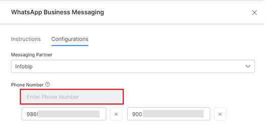
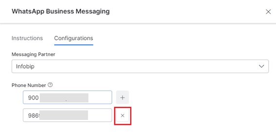

# Multiple Phone Numbers Support in the WhatsApp Channel

The platform now supports virtual assistant responses via WhatsApp to the incoming messages for **Infobip** from multiple phone numbers. The virtual assistant responds only to all the relevant source phone numbers rather than a universal number.

!!! important

    The user can add a **maximum of 20 phone numbers** to the list after which the Phone Number input field is disabled.

* The user can remove/delete a phone number from the configured list to stop receiving messages.
* An alert message is displayed when you add a phone number that is already in use (configured on the Platform) as shown below:

    

## Adding a Phone Number

To add a new phone number on the Kore.ai XO Platform to message via WhatsApp for Infobip, follow the steps below:

1. Navigate to **Channels & Flows** > **Channels** > **Digital** > **All** > **WhatsApp Business Messaging** > **Configurations**.
2. Select **Infobip** from the **Messaging Partner** dropdown list.
3. Click the **Add** icon for the **Phone Number** field.

4. Type a valid phone number and press enter to confirm.
5. Click **Save** to complete the configuration.
6. Follow steps 3 to 5 to add up to 20 phone numbers.

## Deleting a Phone Number

To delete a phone number, click the **Delete** icon next to the phone number.

## Responding to an Incoming Number

The Kore.ai XO Platform validates the incoming number by checking if it’s present in the configured list. Only when present will the platform respond and deliver the message. Otherwise, the platform fails to deliver the message to Infobip, triggers an exception, and logs the information under the **NLP Insights** > **Debug Log** section. [Learn more](../analytics/automation/nlp-insights.md).
