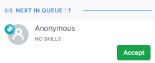

# Incoming Interactions

## Next In Queue Notifications

The section at the bottom left corner of the Agent Console displays new interactions assigned to an agent along with the count.

## Browser Notifications

A system push notification accompanies new interactions, so you can see them even when the browser is minimized or the SmartAssist tab is not in use. System notifications are supported for Chrome, Firefox, Chromium-based Microsoft Edge, and Safari. Each notification plays a sound, too.

When the first notification is pushed, your browser will ask you to allow notifications from SmartAssist. Please allow this if you want to receive such notifications or block if you do not. If you block these notifications, you will continue to hear the sound alert and will see the Next in Queue popup under your Conversation Tray when opening SmartAssist.

## Handling Incoming Interactions Based on Answer Mode

### Manual Answer Mode

When the **manual answer mode** is enabled, agents can click **Accept** to interact with the next customer. When the agent clicks this button, the conversation panel corresponding to the newly accepted conversation is displayed.

### Auto-Answer Mode

If you have enabled **auto-answer** mode, the Live Interaction section will automatically display and accept the interaction. For more information, refer to [Agent Settings > Answer Mode](https://docs.kore.ai/smartassist/user-management/agent-settings/#Answer_Mode).
