# Interacting with Customers

## The Interaction Pane

### Compose Responses

Agents can respond to customers by typing their messages in the compose bar.
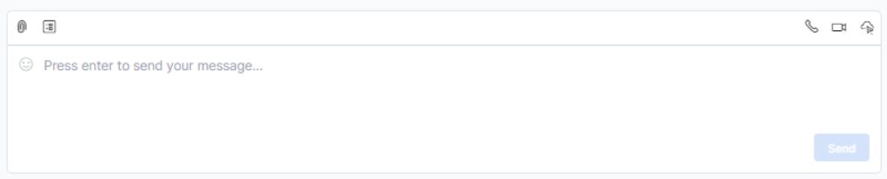

Agents can type their responses in the compose bar and send the message by clicking the **Send** button on the bottom right corner. Pressing the **Tab** button on your keyboard shifts the focus to the Send button. You can also press **Tab + Enter** to send a message.
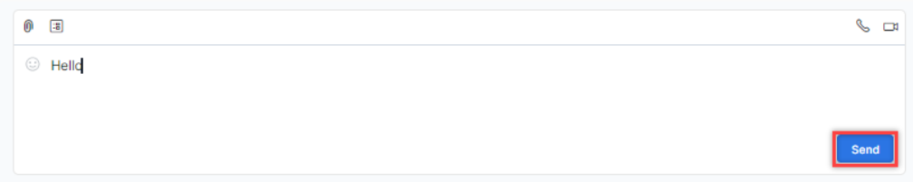

!!! Note

    You can still press **Enter** to send messages. Pressing (ctrl+enter / shift+enter) on Windows and (ctrl+return / shift+return) on Mac creates a new line.

Agents can send a standard response to the customer from a pre-configured library. Press **/** in the compose bar to display the standard response templates window.
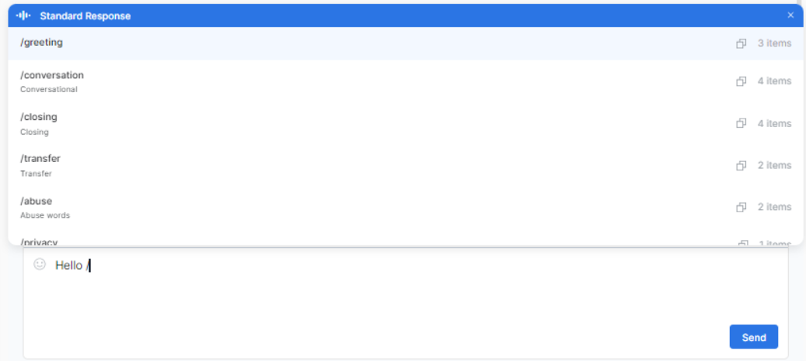

Pressing **Escape **after typing “**/**” closes the standard response window.

### AI-enhanced Compose Text Box

Using the AI-enhanced compose text box, agents can create customized responses to address customer inquiries, concerns, or issues. They can also add personal touches to their messages to make the communication more human and empathetic.
There are three choices available:

1. **Make more friendly**: This option rephrases the draft response to make it more friendly and informal.
For example, the formal draft response “Your mortgage appointment has been scheduled for Jun 24, 2023, 1 pm” is rephrased as “Great news! We’ve scheduled your mortgage appointment for Jun 24, 2023, at 1 pm.”
2. **Make more formal**: This option rephrases the draft response to make it more formal. For example, the draft response “Your mortgage appointment has been scheduled for Jun 24, 2023, at 1 pm” is transformed into a more formal response, “We would like to inform you that your mortgage appointment has been scheduled for Jun 24, 2023, at 1:00 pm.”
3. **Expand**: This option expands the draft response. For example, the draft response “Your mortgage appointment has been scheduled for Jun 24, 2023, at 1 pm” is elaborated as “We would like to notify you that your mortgage appointment has been successfully scheduled for June 24, 2023. Please arrive promptly at 1:00 pm for your appointment.”

This feature can be enabled from [CONFIGURATION > Advanced Settings > Intelligent Agent Tools](https://docs.kore.ai/smartassist/configuration/intelligent-agent-tools-beta/).

## Resend Message When Network Disconnects

The following table lists scenarios with expected results in case of a network failure while an agent attempts to send a response.

<table>
  <tr>
   <td><strong>SCENARIO</strong>
   </td>
   <td><strong>RESULT</strong>
   </td>
  </tr>
  <tr>
   <td>When an agent sends a message
   </td>
   <td>“Sending” appears on the chat window.
   </td>
  </tr>
  <tr>
   <td>If the message is sent successfully
   </td>
   <td>“Sent” appears on the chat window.
   </td>
  </tr>
  <tr>
   <td>If the network is disrupted
   </td>
   <td>The chat window is disabled. Undelivered messages appear as “Not Delivered” with the Resend icon in the compose bar’s left corner.
   </td>
  </tr>
  <tr>
   <td>When the network is restored
   </td>
   <td>The chat window is enabled.
   </td>
  </tr>
  <tr>
   <td>If the resend icon is clicked
   </td>
   <td>The message is sent again.
   </td>
  </tr>
  <tr>
   <td>If the conversation is terminated
   </td>
   <td>The Resend icon does not appear.
   </td>
  </tr>
  <tr>
   <td>If the page is refreshed
   </td>
   <td>The undelivered messages do not appear.
   </td>
  </tr>
</table>

## Audio and Video Calls with Customers

Agents can request the customer for an audio or video call during the chat conversation if required. Clicking the **Audio** or **Video Call** icon initiates a call.

!!! Note

    The initial interaction and the phone call interaction must be closed separately, with corresponding dispositions.

### Manual Outbound Call

Agents can make outbound calls to the customers as follows:

1. Click the **Dial pad** on the conversation tray. The dial pad appears.
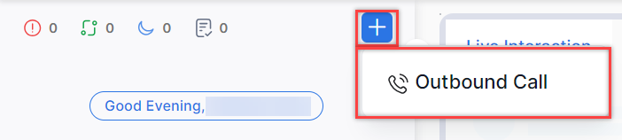

2. Click the **Calling from** button on the Dialer tab, and select the number for placing the outbound call.
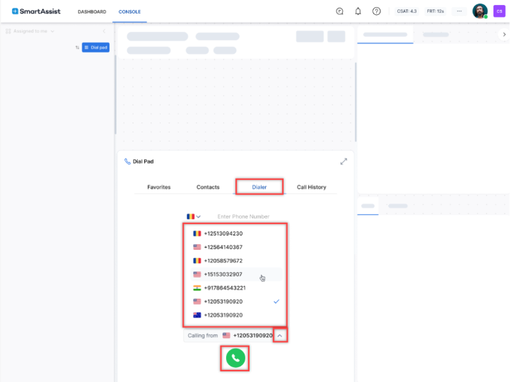

3. Enter the country and the number, and click the **Call** button to place the outbound call.

## Voicemail

If auto answer mode is enabled in [Agent Settings](https://docs.kore.ai/smartassist/user-management/agent-settings/#Voice), the transcript and recording appear automatically in the conversation tray of the agent.

If manual mode is enabled, a notification is displayed on the [Next in Queue Notification](https://docs.kore.ai/smartassist/console/incoming-interactions/#Next_Customer_Notifications) panel. The agent must accept the voicemail, although no inbound conversation slots are consumed.

When the agent accepts the voicemail, the transcript and recording are displayed on the interaction pane. The agent can play, transfer, call (outbound), and download the voicemail from the interaction pane.

### Callback Option

You can call the customer as follows:

1. Click the **Call** button on the VOICE MAIL panel.

2. The outbound call dialer is displayed. Click the **Call** button to initiate the outbound call.
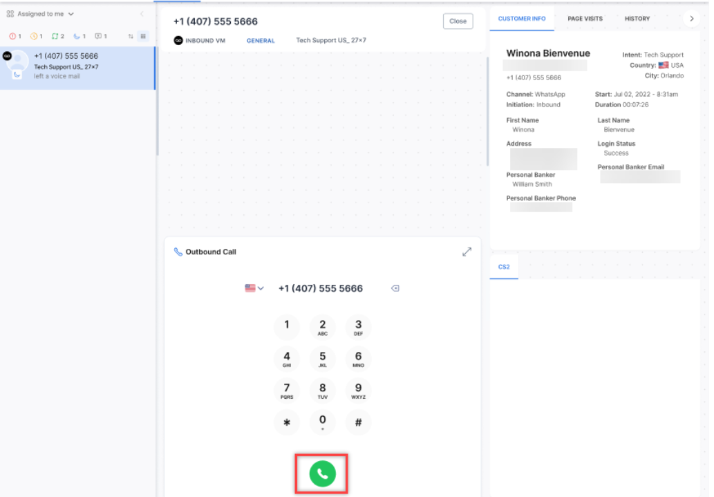

3. The agent can continue the conversation.

## Chat Co-Browse

During chat interactions, agents can use Co-Browse, a collaboration tool that allows them to browse the customer application and offer real-time assistance. To initiate a co-browse session, agents need to click the Co-Browse icon.
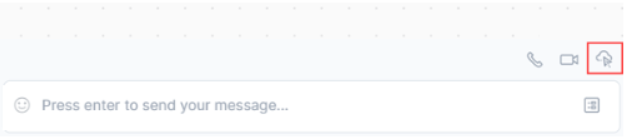

## Voice Co-Browse

Agents can initiate a co-browsing session during voice calls.

* Clicking the Co-browser icon initiates a session directly if the agent and customer desktops are connected.

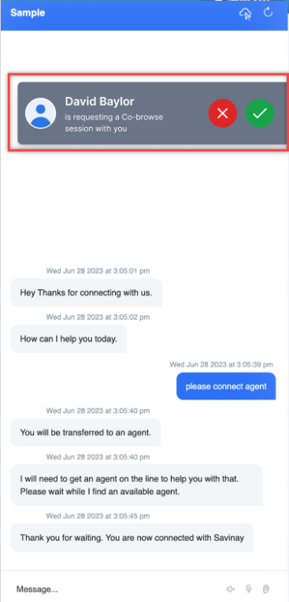

* To initiate a Co-browse session when the connection between the agent and the customer desktop screen is over the phone:
    1. The agent generates a security code to establish a website-to-website connection.
    

    

    2. Share the security code with the customer.
    3. The customer clicks the Co-browse button. A prompt appears to enter the code shared by the agent during the voice call.
    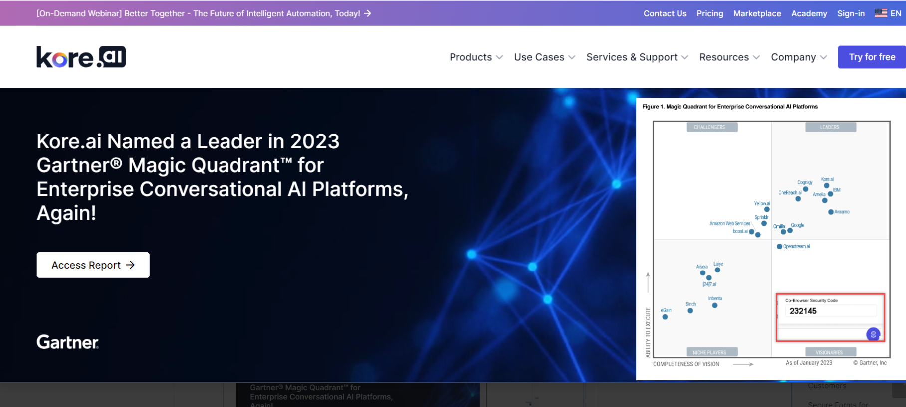

    4. After entering the code, the system establishes an end-to-end connection between the agent and the customer desktops to initiate co-browsing.
    

### Initiate Co-browse on the Console When Connected to an External System

When the agent and user connect through an external system (for example, Genesys) and need to initiate a co-browse session using the SmartAssist console, they can achieve this using this feature.

Steps to initiate co-browse session:

1. Click the **Co-browse** icon on the conversation tray.

2. A security code is generated. Share the security code with the customer.

A co-browse session is initiated.
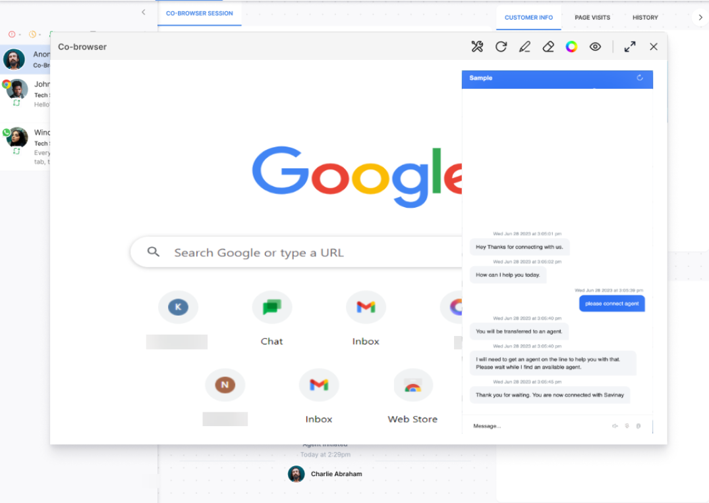

## Sending Emojis

During a conversation, agents can click the **Emoji** icon to react to the conversation.

## Sending Attachments to Customers

During a conversation, agents can click the **Attachments** icon to share attachments with customers.
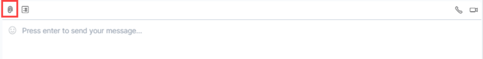

## Secure Forms for Handling Sensitive Information

Agents can guide customers to fill in data using secure forms. The secure forms option is an additional security layer that helps customers provide information faster while maintaining confidentiality.
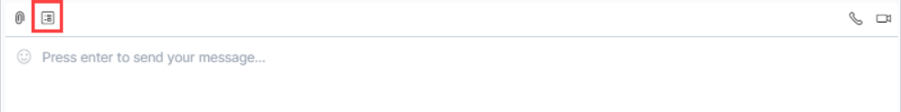

## Snooze

Waiting for customer responses or time spent on information retrieval can result in prolonged conversations and negatively impact agents’ performance metrics like Average Handle Time (AHT). Snooze allows agents to pause the conversation timer and resume it when the agent responds while freeing up slots for additional conversations.

Administrators can configure the snooze functionality from the [Agent Settings](https://docs.kore.ai/smartassist/user-management/agent-settings/#Snooze).

Steps to snooze a conversation:

1. Click the **Snooze** button at the top of the live interaction window.

!!! Note

    The snooze function is not available if the conversation is overdue or a reply is due from the agent.

2. On the **Snooze Conversation Until** pop-up window, select the snooze duration from the available options or select a custom snooze duration.
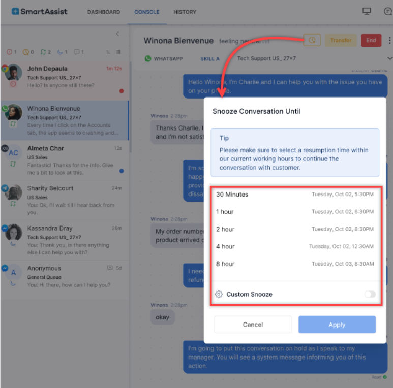

3. To select a custom snooze duration, turn on the **Custom Snooze** toggle, configure your required snooze duration, and set the snooze duration.
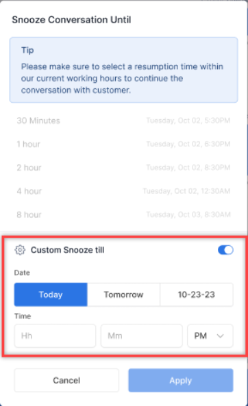

4. Click **Apply**. The snooze duration is set, a message appears on the live interaction pane at the top, and an intimation is sent on the live interaction to the agent.

Hovering over a snoozed conversation in the conversation tray shows the duration for which the conversation is snoozed. It also displays the count of snoozed conversations.

## Emails

Agents can view and respond to emails on the console. The emails appear on the console as follows:

**Threaded email structure**: A threaded email structure features a visible distinction between agent and user emails.

**Collapsible email tiles**: This allows agents to minimize or expand email threads as needed, reducing clutter and improving the organization of the email inbox.
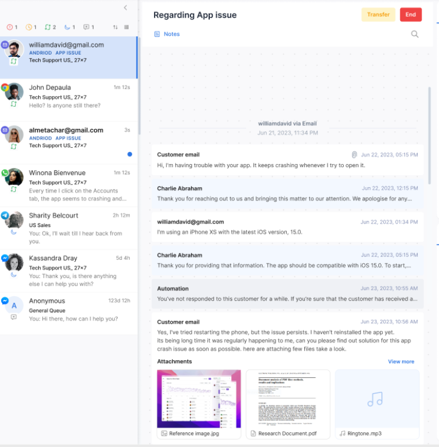

These settings can be configured from [Agent settings](https://docs.kore.ai/smartassist/user-management/agent-settings/).

**Distribution**: You can distribute emails to multiple recipients using CC (Carbon Copy) and BCC (Blind Carbon Copy) fields.

**Standard Responses**: 
You can choose from a library of configured standard responses.

1. Click the **Standard Response** icon at the bottom of the email compose bar. The count of response templates in each category is displayed.

2. Click the category to view the standard response templates in that category.
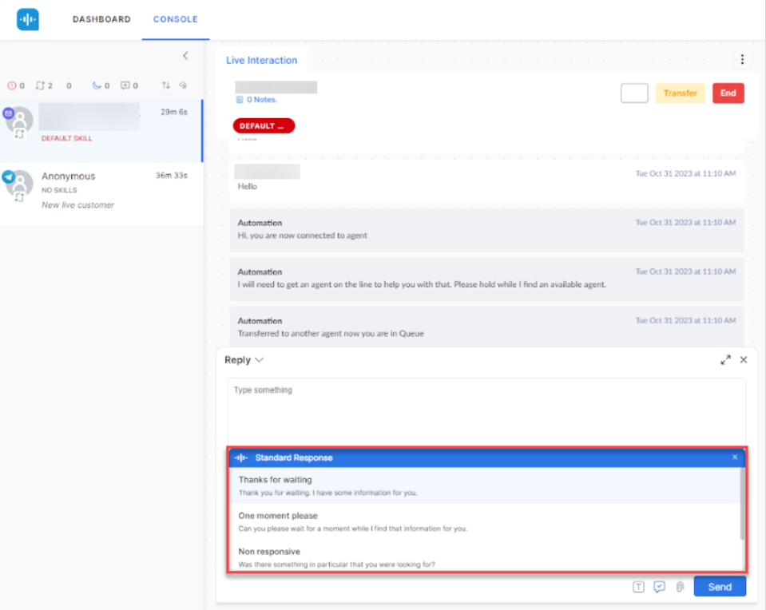

3. Click the Standard Response from the list to use that response in the email.

**Attachments**: You can attach files and documents to the email to share relevant information or resources with customers. Attachments appear in a list format. If there are more than three attachments, a ‘**View More**’ button is displayed.

Click the **Attachment** icon to select and upload files.

**Notes**: You can add notes on the interaction (customer feedback, key points, next action, suggestions). This section includes any previous notes added by agents while interacting with the same customer.

To add a new note:

1. Click **Notes**.
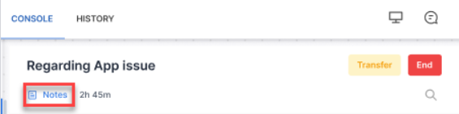

2. Click **+ Add New Note**.

3. Type the message and click **Save**. A confirmation message is displayed, and the note is displayed.  

4. **Drafts**: If you click the **Close** button on the email editor and there’s content inside, the mail is preserved as a draft. Drafts are accessible at the bottom of the console.

## Color Codes

Color codes help in easy identification and better readability of conversations on digital channels.

* The blue dot represents a conversation in which an agent is engaged.

* The red dot represents an overdue conversation.

* New email conversations in the conversations tray.
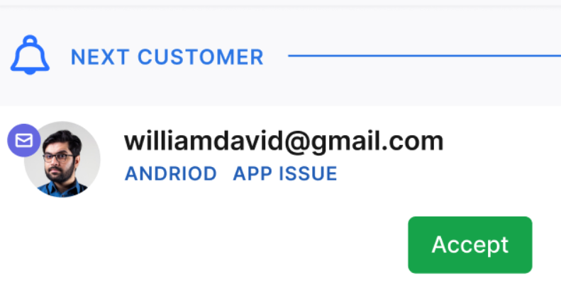

## Add Notes to Interactions

You can add notes on the interaction (customer feedback, key points, next action, suggestions). This section includes any previous notes added by agents while interacting with the same customer.

To add a new note:

1. Click **Notes**.  

2. Click **+ Add New Note**.

3. Type the message and click **Save**.

## Modify Skills in Interactions

To modify skills in a live interaction when the Live Interaction option is selected in [Skill Modification](https://docs.kore.ai/smartassist/user-management/agent-settings/#Skill_Modification):

1. Click the **Add Skills** option on the Skills bar.
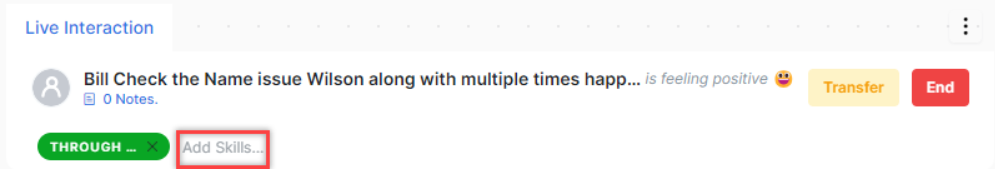

2. Select the necessary skills from the drop-down.

## Transfer Interactions

SmartAssist allows agents to transfer ongoing conversations to other queues, other agents, or both. The Agent Console displays transfer options according to the [Transfer Destinations](https://docs.kore.ai/smartassist/user-management/agent-settings/#Transfer_Destinations) setting. In the example screenshots below, both queues and agents are enabled for transfers.

**Transfer to Another Queue**

To transfer a conversation to another queue when the [Enforce Skill Match for Transfers](https://docs.kore.ai/smartassist/user-management/agent-settings/#Enforce_Skill_Match_for_Transfers) setting is enabled:

1. Click **Transfer** at the top of the Conversation space.

2. Search for a queue in the search bar on the **Transfer to** window.
3. Select a queue from the dropdown list. Agents with matching skills are displayed for the queue during the transfer.

4. Click **Transfer**. The conversation gets transferred to the selected queue.

!!! Note

    * When transferring an interaction to another queue, you need to consider the following rules:
    * The system verifies the valid hours of operation and displays the online queues.
    * If the skill match option is enabled, the destination queue must have agents with the right skills based on the skill match rules. If there are no agents with the required skills, the conversation will wait for the maximum wait period assigned to the destination queue and then timeout to the no agents available scenario.

To transfer a conversation to another queue when the [Skill Modification](https://docs.kore.ai/smartassist/user-management/agent-settings/#Skill_Modification) setting is enabled:

1. Click **Transfer** at the top of the Conversation space.
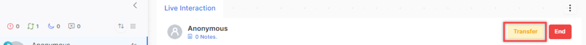

2. Search for a queue in the search bar on the **Transfer to** window. All matching queues are displayed.
3. Select the queue and click Next.
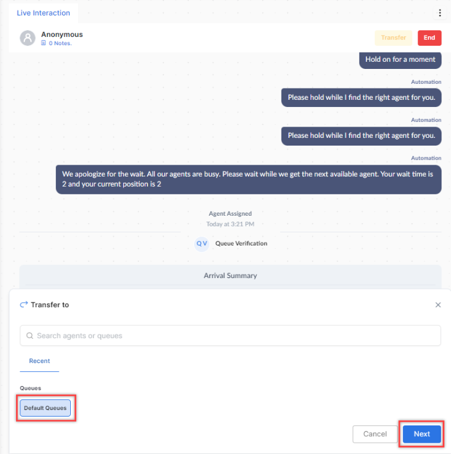

4. You can add or delete skills to the interaction before transferring it to another queue.
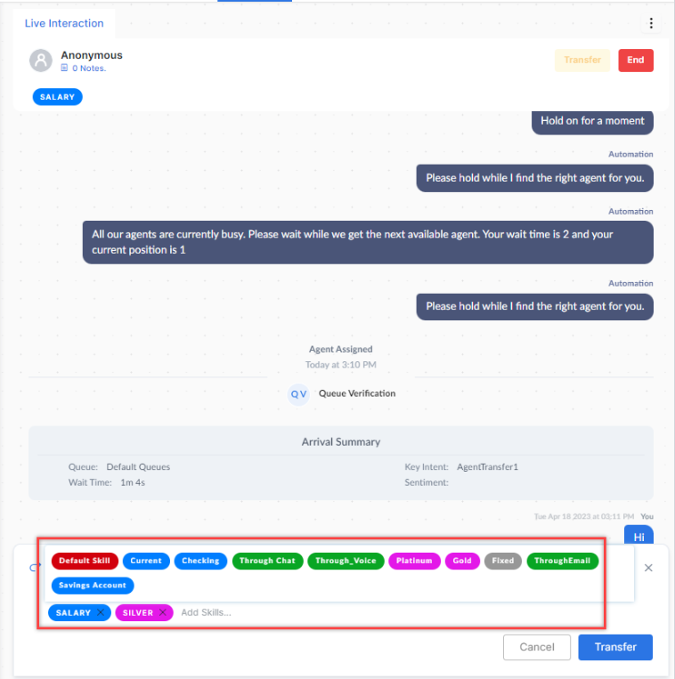

5. Click **Transfer**. The conversation is transferred to the selected queue.

**Transfer to Another Agent**

To transfer a conversation to another agent:

1. Click **Transfer** at the top of the Live Interaction pane.

2. Search for an agent in the search bar on the **Transfer to** window.
3. Select an available agent.
4. Click **Transfer**. The conversation gets transferred to the selected agent.

!!! Note

    If the customer ends the chat before the agent completes the transfer, SmartAssist will drop the transfer, and the conversation will not be assigned to any queue or agent. Kore WebSdk v1.0 supports this feature only for chat conversations.

**Transfer to External Contacts**

An agent can transfer the call to an external contact during a voice interaction. An administrator must enable this feature in [Agent Settings](https://docs.kore.ai/smartassist/user-management/agent-settings/) to allow

external transfer of ongoing customer calls. To transfer a conversation to an external contact from the Agent Console, follow these steps:

1. Click **Transfer** at the top of the Conversation space.

2. Search for an external contact in the search bar on the **Transfer to** window.
3. Select an available contact.
4. Click **Transfer**. The conversation gets transferred to the selected contact.
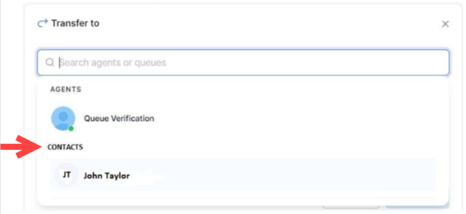

!!! Note

    * The outbound transferred call by the agent will be a blind transfer. 
    * For the agent, the call ends like other interactions. 
    * The agent must add a disposition and perform After Call Work (ACW).

## **End Interactions**

1. To end an interaction session, click the **End** button at the top right of the _Live Interaction_ pane.
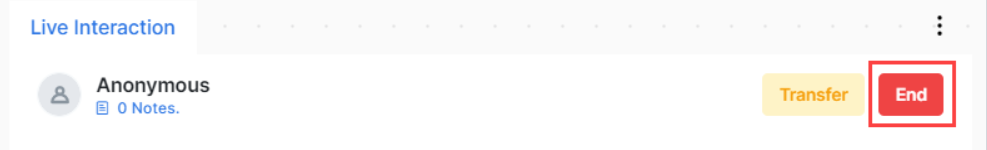

2. Once clicking _End_, you must **confirm** that you want to end the interaction. Click **Yes** to do so, or otherwise, click **No**.

Clicking **_Yes_** ends the session and moves the interaction to _After Call Work_.

### After Call Work (ACW)

If ACW is enabled, then the conversations are managed based on the ACW configuration:

**Immediate Slot Release**

* Slots are freed up, allowing other conversations to be accepted.
* The close button is enabled when all the required disposition codes are selected.
* There is no time restriction for selecting the disposition codes and they are available until the agent manually closes them.
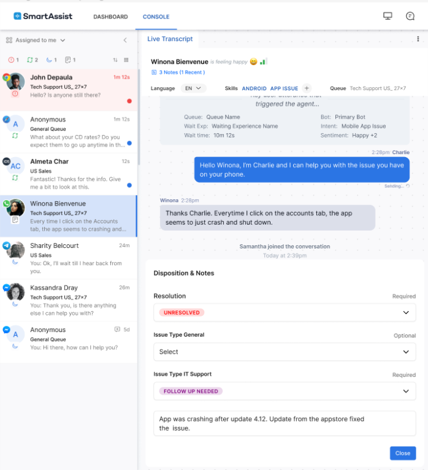

**Timed Slot Release**

* Agents can see a countdown timer when the conversation ends, indicating the time left to provide a disposition.
* The slot becomes available if the agent submits a disposition or when the timer elapses.
* Empty disposition fields are filled with a ‘system-generated disposition code’ if no disposition is provided within the allotted time.
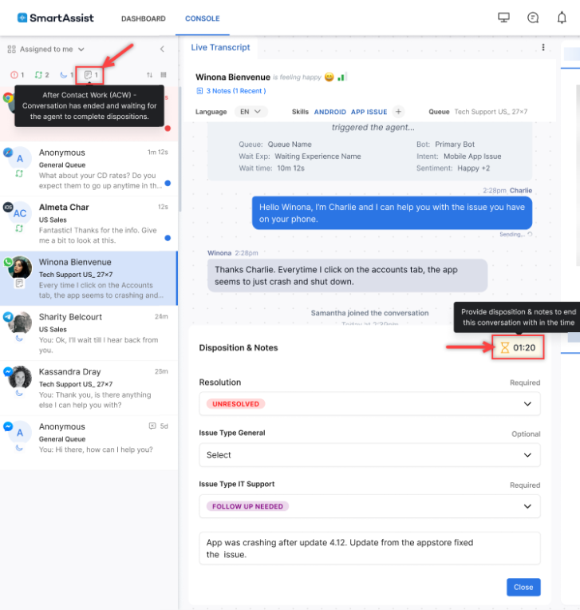

* When the disposition timer expires, the system displays a message to the agent.
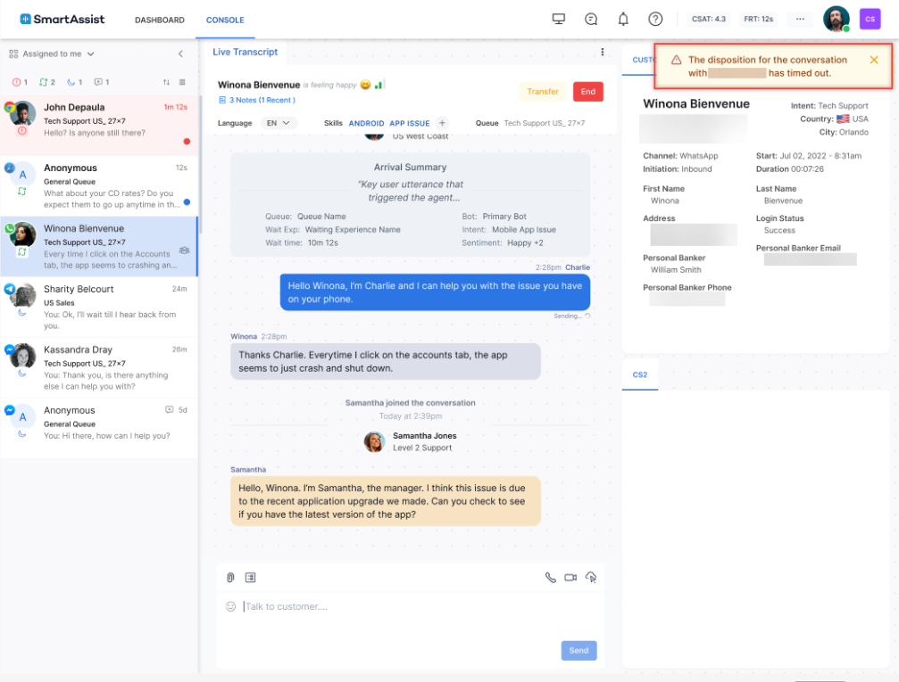

* For conversations transferred to another queue, the final queue’s disposition mode is applied to determine the required dispositions.

If ACW is disabled the conversation disappears from the agent console at the end of the conversation, freeing the slots for accepting other conversations. Agents do not receive any disposition sets or summary notes related to these conversations.

### Dispositions

To set the disposition and close the conversation, follow these steps:

* Select the **Conversation** in your tray.
* You must select a **Status** from the following available options:
    * **Resolved**: Select when the customer query is resolved.
    * **Abandoned**: Select if the customer has abandoned the conversation and is no longer responding.
    * **Pending**: Select if the query is still pending resolution.
    * **Custom**: Administrators can [create custom disposition codes ](https://docs.kore.ai/smartassist/disposition-codes/disposition-codes/#Custom_Disposition_Codes)to address specific business needs. Select according to your use case.
* Optionally, type a **Description** of your reason for selecting the disposition.
* Click **_Close_** to close the conversation.

# Information Provided to Agents and Customers During Live Interactions

You can interact with customers within the **Live Interaction** area of the Agent Console.  

The **Live Interaction** area provides access to features and information that can be used during live conversations, as follows:

## Arrival Summary

Every conversation begins with an Arrival summary once an agent accepts it.

This section displays the live interaction summary with the following details:

* **Agent Name**: Identifies the agent who is handling the live interaction.
* **SUMMARY**: Conversation Summary leading up to the transfer. In case of multiple transfers, the summary of all transfers is shown.
* **Queue**: Indicates the queue in which the conversation is placed.
* **Wait Time**: This shows the time that the chat has been waiting for an agent to respond.
* **Intent**: Shows the customer’s primary purpose for initiating the live interaction.
* **Avg. Sentiment**: Captures the customer sentiments based on their responses.
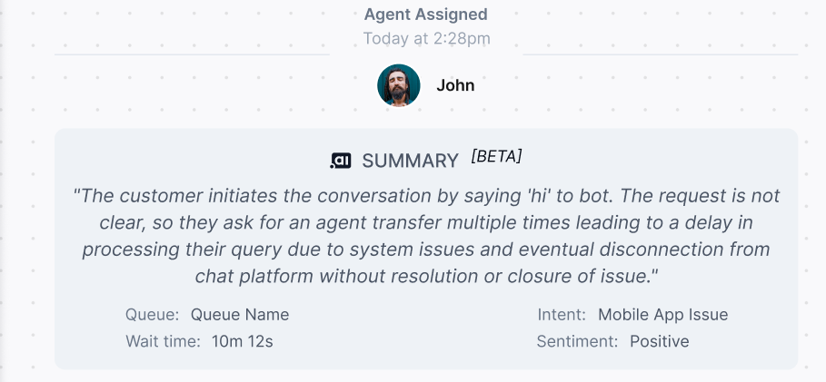

## Typing Chat Indicator

When the agent types a response during a chat conversation with a customer, the customer’s chat window displays three dots, indicating that the agent is responding to the customer.

Do the following to enable the typing indicator for chat conversations:

1. To integrate Kore.ai bots chat capability into custom applications, install WebSDK 2.0 on your server. WebSDK 2.0 is a set of libraries that offer a quick and convenient way to do this. Refer to the [installation instructions](https://github.com/Koredotcom/web-kore-sdk/tree/v2/9.3.11) for additional information on installing WebSDK 2.0.
2. To receive read receipts, and typing indicators, install the AgentDesktop plugin in WebSDK 2.0. The Agent Desktop plugin allows the user to interact with the agent through the bot and supports the following features:
    * Audio Calling
    * Video Calling
    * Co-browse
    * Screen Sharing

Refer to the[ installation instructions](https://github.com/Koredotcom/web-kore-sdk/tree/v2/9.3.11/docs/plugins/agent-desktop) for additional information on installing the plugin.

## Stacked Messages, Timestamp, and Read Status

* Any message sent by an agent will display along with a date and timestamp.
* If the customer does not respond to the first message sent by an agent, the message displays a timestamp, and the following messages  will not show a timestamp until the clock minute changes. For example, If an agent sends a message at 11:30:24, the second message at 11:30:36, the third message at 11:30:45, and the fourth message at 11:31:08, then the first three messages will be stacked under one timestamp, and the fourth message will have a different timestamp.
* If the customer responds in the same minute, the response will display with the date and timestamp. The responses from the customer will only show a timestamp once the clock minute changes.
* Agents can see the read status on the last message sent. If the messages are stacked, the read status will appear only against the most recent one.

# Behavior When Login Prep Status is Enabled

A message appears on the console for the duration configured on the [Agent Status](https://docs.kore.ai/smartassist/settings/agent-status/agent-status/#) page. This status allows an agent to prepare themselves before they start receiving interactions.

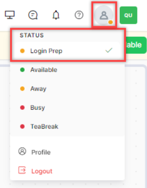

At the end of the Login Preparation time slot, the system automatically marks the agent as ‘Away,’ and a pop-up message appears with the following content:
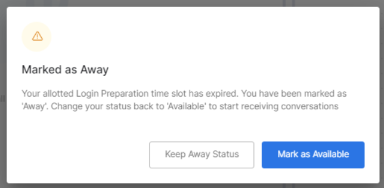

Agents can choose the following options:

**Mark as Available** – Clicking this button changes an agent’s status to Available.

**Keep Away Status** – Clicking this button keeps the status as Away. If agents click Keep Away Status, they remain in the ‘Away’ state with a notification displayed for the ‘Away’ status. Agents can mark themselves as ‘Available’ when they are ready to receive conversations.

# Behavior During Active Interactions

## If Auto-Answer Is Enabled, Transfer and End are Disabled Until the First Agent Response

If the Auto Answer mode is enabled in [Agent Settings](https://docs.kore.ai/smartassist/user-management/agent-settings/#Voice), the Transfer/End buttons do not display on the Live Interaction pane until the assigned agent sends the first message.

Below is what the Agent Console looks like **before the first message** from the agent:

Below is what the Agent Console looks like **after the first message** from the agent:
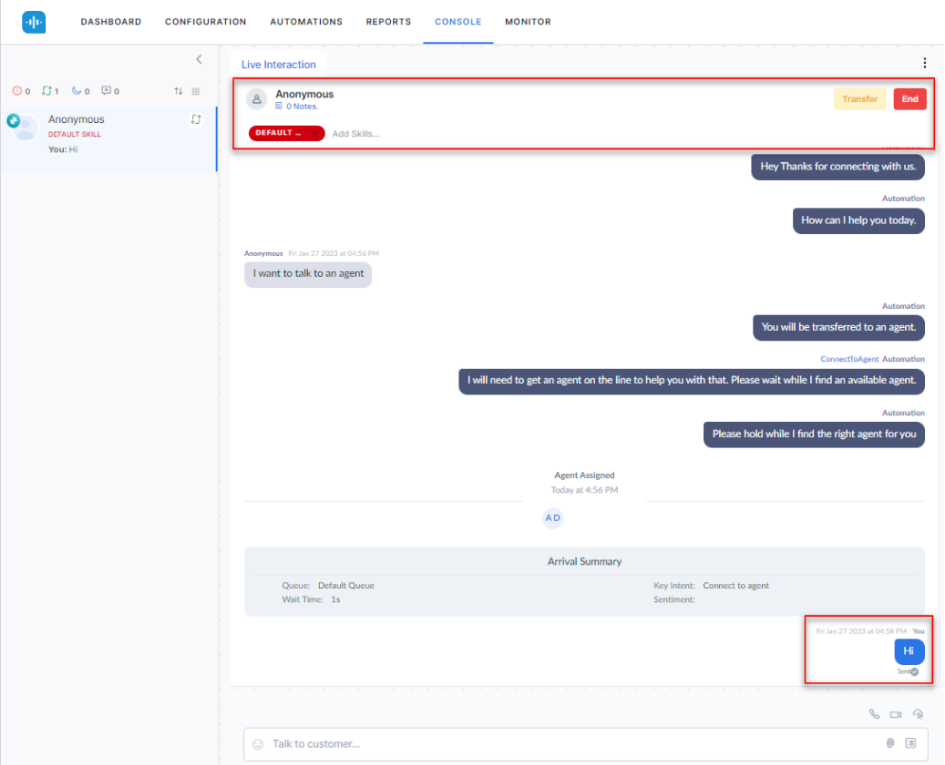

## Behavior When an Agent Changes Their Status

A warning message displays if an agent changes their status to **_Away_** or a custom status tagged to _Away_ during an active interaction.

## Behavior When an Agent Tries Logging Out

SmartAssist does not permit agents to log out during an ongoing conversation.

If an agent tries to log out during an ongoing conversation, SmartAssist prevents the agent from logging out without transferring or closing the conversation. A pop-up window is displayed along with the following message:

If an agent logs out suddenly (the browser is closed or the system crashes, for example), then the counter for Agent inactivity starts and after the threshold, any active conversations are assigned back to the Queue.

## Behavior When an Agent Does Not Accept/Send a Response Within a Specified Time

If an agent does not accept/send a response within a specified time, the system automatically changes the status to **Away (Idle)**.
This status is not available for selection by an agent.
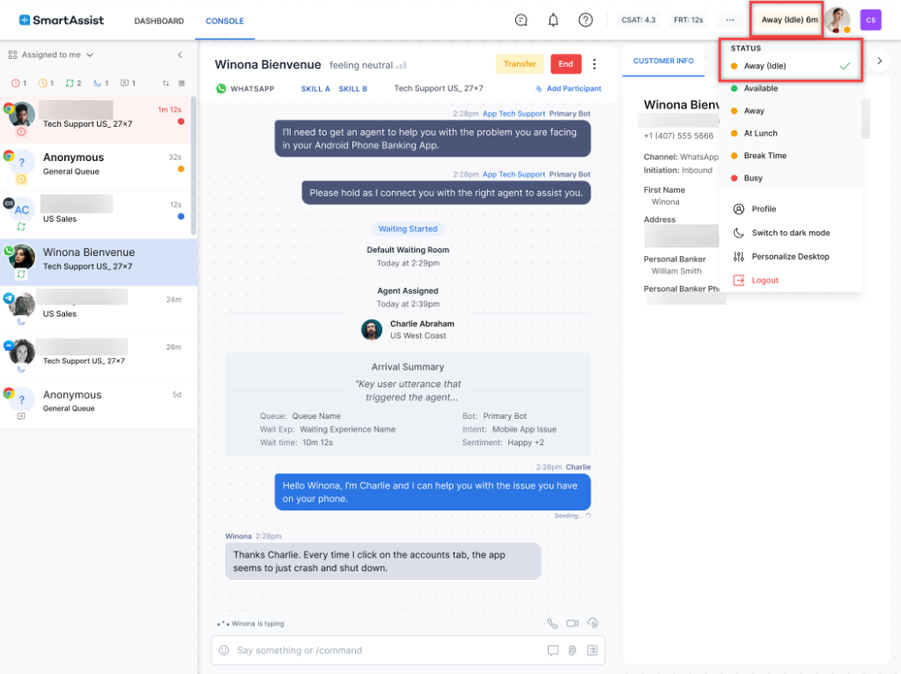