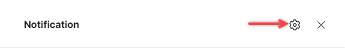
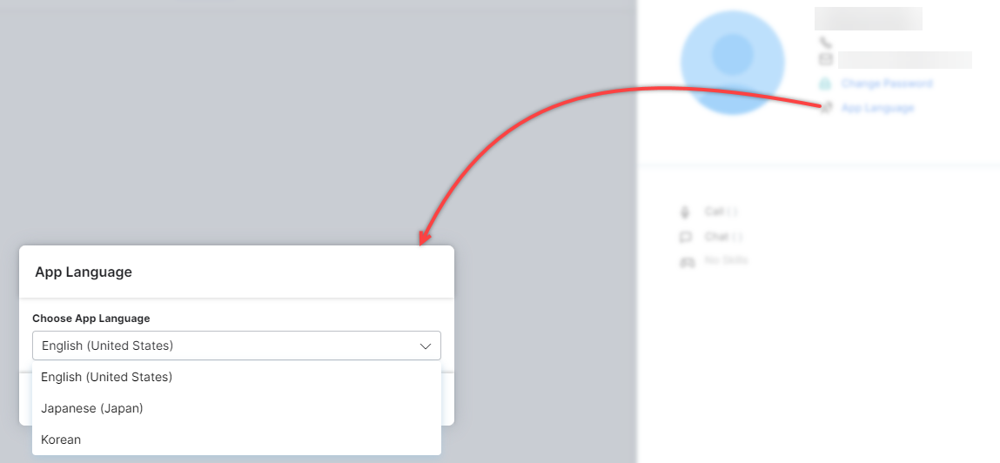
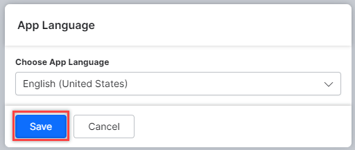
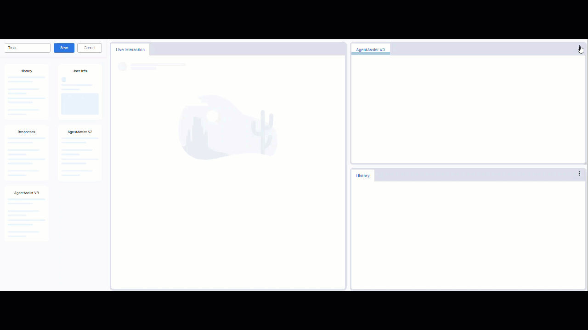

# Manage Layout

The Manage Layout option allows you to add, delete, and switch between different layouts. While creating a new layout, you can add customizable widgets to the interface.  

## Notifications

Notifications are real-time alerts that keep agents informed about crucial events and updates. Notifications plays a key role in enhancing the user experience by improving responsiveness, productivity, and workflow management. By promptly alerting agents about New Conversations, Messages from other Agents, Error prompts, Transfer Request, etc., notifications ensure that agents can prioritize their workload effectively and deliver swift, personalized customer service.

The Notifications icon helps you choose preferences to get notified about upcoming events, agent responses, and the type of sound generated upon receiving updates.  

Notifications is compatible with the following browsers:

* Google Chrome
* Mozilla Firefox
* Microsoft Edge

!!! Note

    It is essential to check the browser and system settings to allow notifications to work properly. For example, Check if the browser pop-up and redirect are enabled, system DnD is disabled etc.

Steps to manage notifications:

1. Click the **Bell** icon on the top right corner.  

2. Click the **Settings** icon to view the available options.

3. Notifications can be managed for the following:

    !!! Notes

        1. The error prompt sound notifications apply only to console runtime errors and not validation errors on the configuration page.
        2. Web notification option is available for New Message from Customer, Message from manager, SLA Breach, Transfer Request, and New Conversation.

    1. Click the name on the right corner to change the sound for a notification type.  
    
    
    2. Click **Save** to update the notification settings.

## Features

The three monitoring icons, CSAT, Completed, and Average Response, provide details on the completed tasks, in-progress conversations, response time, and customer feedback.

CSAT (Customer Satisfaction) is triggered under the following conditions:

* In all digital and voice channels, both for user-side and agent-side chat termination:
* Out of Hours of Operation: CSAT is triggered when a conversation occurs outside of the designated hours of operation.
* Queue Max Timeout: CSAT is triggered when a conversation remains unaccepted or unassigned to any subsequent agents due to reaching the maximum queue timeout.

## Agent Status

The Status icon allows agents to show customers whether they are available for the conversation or not.  

## Agent Profile

The Agent Profile icon is located on the top-right corner of the console.

Clicking the profile displays a window that allows an agent to change their login and contact details.

Clicking **Logout** allows an agent to exit XO Platform.

### App Language

You can choose the language for the Agent desktop application from the following language options:

* English (United States)
* Japanese (Japan)
* Korean (South Korea)

!!! Note

    The language selection does not apply to the XO Platform.

Steps to choose the app language:

1. Click **App Language**.

2. On the App language pop-up window, choose the language.

3. Click **Save**.  

The app language is updated and a confirmation is displayed.

## Add Users to Multiple Accounts

You can add all users (Agents/Supervisors/App Owners/App Developers/App Testers) to multiple accounts.

During Sign-in, the user can choose the account and set it as default.

!!! Note

    If the user has multiple accounts, they have the option to mark one as the default.

After the user has signed in, they can switch between accounts. The system displays the account name on the top right corner.

## Adding New Layout

To configure the responses under a new layout for a particular conversation, follow these steps:

1. Go to **Console** > **Manage Layout** > **+ Create New**. A new layout page is displayed with the available widgets on the left-side panel.

2. Drag and drop the required widgets to the right side of the layout page.

3. Enter a **Layout Name** for the new layout and click **Save**.

### Adding Agent AI Widget to a Layout

The below example illustrates the process of adding the Agent AI widget to a layout.

### Refresh a Widget

The widget level refresh button enables customers to refresh a widget individually, eliminating the need to refresh the entire application, and keeping widgets up-to-date with the latest information.

The refresh button is accessible only when the user is within that specific widget. Clicking this button refreshes the widget with the most recent data.

Users can still refresh widgets by refreshing the entire application.

## Chat

The **Chat** feature is used for internal communication between agents and supervisors. It provides real-time help to customers to solve product-related queries. Customers prefer live chat for quick query resolution. With live chat, you can provide customers with a method to contact you when they have questions or problems that they are unable to answer.

Clicking the **Chat** icon opens a new display to view the available agents, search for a particular agent, see chat history, and call the agent.
