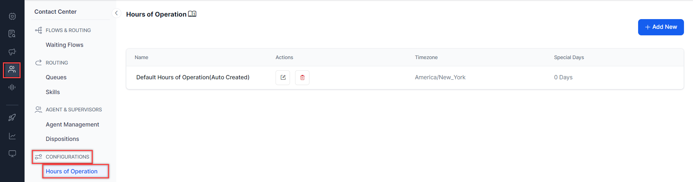

# Hours of Operation

The **Hours of Operation** feature helps set the standard hours when agents are available for customers based on business operating hours, non-operating hours, and holidays.

In **Contact Center,** you can define the standard working hours for each day of the week and set the non-working hours for weekends and public holidays in different time zones.  [Default Flows](https://docs.kore.ai/smartassist/default-agent-flows/default-flows-2/) are handled by SmartAssist based on your configuration for **Hours of Operation**,

You can reach the Hours of Operation feature by going to **Contact Center > Configurations > Hours of Operation**.

The Hours of Operation section displays the following details:

* A **Name **for each configuration;
* **Actions**: Here is where you can **Edit** or **Delete** a configuration.
* **Timezone**: Lists the timezone for which the hours of operation are configured;
* **Special **Days: Lists any configured special days or holidays.

# Add Hours of Operation

To add **Hours of Operation**, follow these steps:

1. Click **+ New Hours **to add a new** Hours of Operation** entry. \

>>>>>  gd2md-html alert: inline image link here (to images/image2.png). Store image on your image server and adjust path/filename/extension if necessary.  (<a href="#">Back to top</a>)(<a href="#gdcalert3">Next alert</a>) >>>>> 

2. In the **New Hours of Operation** panel, configure the following fields:
    1. **Name:** Add a name to identify the **Hours of Operation** profile. For example, _Official Working Hours_.
    2. **Time Zone:** Select the time zone for which these hours apply.
    3. **Work Days, Holidays, and Special Days**: Configure the days and hours of operation per day, and set up holidays and special days as follows:

## Standard Hours 

Set the standard working hours explicitly or opt for the pre-selected hours (9 AM to 6 PM). By default, the weekdays are open, and weekends are closed. The status for Saturday or Sunday can be enabled or disabled using the toggle.

>>>>>  gd2md-html alert: inline image link here (to images/image3.png). Store image on your image server and adjust path/filename/extension if necessary.  (<a href="#">Back to top</a>)(<a href="#gdcalert4">Next alert</a>) >>>>> 

## Holidays and Special Days 

Set the Date, Name, Period, Start Work Time, and End Work Time for holidays or special days. 

To add a new entry, click the **+ Add New **button.

>>>>>  gd2md-html alert: inline image link here (to images/image4.png). Store image on your image server and adjust path/filename/extension if necessary.  (<a href="#">Back to top</a>)(<a href="#gdcalert5">Next alert</a>) >>>>> 

* Enter the **Date **of the holiday or special day;
* Enter a **Name**;
* Toggle the **Period **to either _Partial _or _Full_. When set to _Partial_, you can adjust the working hours for the day. When set to _Full_, the day is considered a holiday.
* To add more hours of operation for holidays and special days, click **+ Add Another**.
* To delete an entry, click the **Delete (bin)** icon next to it.
* Click **Save. \
**

>>>>>  gd2md-html alert: inline image link here (to images/image5.png). Store image on your image server and adjust path/filename/extension if necessary.  (<a href="#">Back to top</a>)(<a href="#gdcalert6">Next alert</a>) >>>>> 

# Edit Hours of Operation

To edit **Hours of Operation**, click the corresponding **Edit **icon under _Actions_.

>>>>>  gd2md-html alert: inline image link here (to images/image6.png). Store image on your image server and adjust path/filename/extension if necessary.  (<a href="#">Back to top</a>)(<a href="#gdcalert7">Next alert</a>) >>>>> 

# Delete Hours of Operation

To delete an **Hours of Operation** entry, click the corresponding **Delete **icon under _Actions_. You will be asked to confirm your choice.

>>>>>  gd2md-html alert: inline image link here (to images/image7.png). Store image on your image server and adjust path/filename/extension if necessary.  (<a href="#">Back to top</a>)(<a href="#gdcalert8">Next alert</a>) >>>>> 

