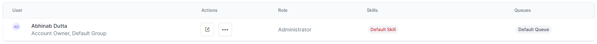

# Agent Management

## Agents

In the Contact Center, the term **Agent Management** refers to the management of agents (customer support representatives), supervisors, and administrators with an account within the contact center. To serve customers, you must add users to contact center and provide them with the necessary access. You can create user profiles, assign them to voice, chat, or both channels, and specific skills or queues.

You can find the _Agents_ section by going to **Contact Center > AGENT & SUPERVISORS > Agent Management**.

### Agents Section Features

The Agents section includes the features in the table below.

<table>
  <tr>
   <td><strong>FEATURE</strong>
   </td>
   <td><strong>DESCRIPTION</strong>
   </td>
  </tr>
  <tr>
   <td>Search
   </td>
   <td>Type in a user’s name to retrieve their record.
   </td>
  </tr>
  <tr>
   <td>User
   </td>
   <td>This is the name of the user you are viewing, as entered within their profile. Under every user’s name, contact center mentions the groups that the user is part of.
   </td>
  </tr>
  <tr>
   <td>Actions
   </td>
   <td>This field lets you perform actions on the user record:

<table>
  <tr>
   <td><strong>ACTION</strong>
   </td>
   <td><strong>DESCRIPTION</strong>
   </td>
  </tr>
  <tr>
   <td>

   </td>
   <td><strong>Edit </strong>the user record.
   </td>
  </tr>
  <tr>
   <td>

   </td>
   <td><strong>More options</strong>: 
<ul>

<li><strong>Clone</strong>: Create a copy of the user record with the same configuration. This feature is useful when adding new users by updating their profiles without needing to configure them every time.

<li><strong>Delete</strong>: Deletes the user. \
<strong><em>Note: You cannot restore deleted users. Please proceed with caution</em></strong>!
</li>
</ul>
   </td>
  </tr>
</table>
   </td>
  </tr>
  <tr>
   <td>Role

   </td>
   <td>Lists the role assigned to the user.

   </td>
  </tr>
  <tr>
   <td>Skills

   </td>
   <td>Lists the skills assigned to the user.

   </td>
  </tr>
</table>

### Add a User

You can add a user to Contact Center by following the steps below:

1. In the Agent section, click **+Add User**.

2. The **New User** window displays. Here, you can find the following three areas to configure: 
    1. **Profile**: Provide the user’s profile information. This section opens by default.
    2. **Settings**: Configure settings related to the Chat and Voice Experience.
    3. **Queues & Skills**: Assign the user to specific queues and skills.
    

#### Profile

In the profile section, configure the following:

* _(Optional)_ **Profile Picture**: Upload the user’s profile picture here.
* **First Name **and** Last Name** are mandatory fields for the user’s first and last names, respectively. Only alphanumeric characters are allowed.
* _(Optional) **Nick Name:**_ This is a mandatory field for the user’s nickname in contact center.
* **Role**: Select whether the new user should be an Agent, Supervisor, or Administrator. See [Role Management](https://docs.kore.ai/smartassist/agent/rolemanagement-overview/) for details.
* **Phone Number**: This mandatory field requires a 10-digit phone number.
* **Email ID**: This is a mandatory field for the user’s email address.
* **Group:** This is a mandatory field for a new user’s organizational group. The **Unassigned** group is pre-selected. \
!!! **_Note_**
   _Users in the Unassigned group are not considered when routing interactions._
* **Custom ID**: This optional field lets you enter a custom ID for each user. The field supports up to 15 alphanumeric characters and cannot include space or special characters. You can use this field via API while [adding ](https://docs.kore.ai/smartassist/api/create-an-agent/)or [editing ](https://docs.kore.ai/smartassist/api/update-a-specific-agent/)a user.
* **Desktop Layout**: Choose the layout with which the user will work within the Agent Console. See [Manage Layout](https://docs.kore.ai/smartassist/console/manage-layout/) for details.

#### Settings

##### Digital Experience

This section sets the chat support features for a user, such as the capacity by channel type, language, and proficiency level selections, and whether you want to allow attachments and emails within chats.

To configure the digital experience, follow these steps:

1. **Enable** or **Disable** the digital experience using the toggle switch.
2. **CAPACITY BY CHANNEL TYPE** – This lets you set the maximum number of sessions an agent can handle simultaneously in a specific channel (Digital, Email, or Message).
3. **Language Support** – Allows you to enable or disable the languages known by the user and sets the proficiency level (_Novice, Average_, _Good, or Expert_). To add more languages, see  [System Setup > Languages & Speech](https://docs.kore.ai/smartassist/settings/general-settings/language-management/#).\

##### Voice Experience

This feature helps configure a user’s voice (call) experience settings.

In the **Voice Experience** section, the following options are available:

* **Enable Voice Settings** – Enabling this option adds the user to the voice channel so that they can handle incoming calls.
* **Language Support** – Select the language for voice support from the given options and set the language proficiency level. To add more languages, see [System Setup > Languages & Speech](https://docs.kore.ai/smartassist/settings/general-settings/language-management/#).

* **Voicemail** – Enabling this option lets the user select the maximum number of voicemails an agent can receive.

#### Queues & Skills

This section lets you configure the queues and skills assigned to a user.

##### Queues

To assign queues to a user, follow these steps:

1. Type a **Queue Name** in the field, then select the one you need from the list. Clicking into the _Skills_ field shows the list of available options. The list only contains queues that are already created. To add a queue, see [Routing > Queues](https://docs.kore.ai/smartassist/routing/queues/).
2. Once you select a queue, it will be added to the user’s list of assigned queues. If you have more than one queue assigned to the same user, you can **select or deselect the queues** to assign; and **set queues as _Preferred_**. Queues set as such will take priority over others when the user receives incoming queries.

#### Skills

This section lets you configure the skills that the user brings to your team.

To assign skills to a user:

1. **Type a skill name**, and select it from the dropdown list to add it to the user’s skill list. Clicking into the _Skills_ field shows the list of available options. The list only contains skills that are already created. To add more skills, see [Routing > Skills](https://docs.kore.ai/smartassist/skills/skills/).
2. Once you select a skill, **choose the proficiency level**  (_Novice, Average, Good,_ or _Expert_).
3. You can remove a skill by clicking the **Delete (bin)** button next to it.

### save a User

To save the user, click the **Add** button at the bottom of the New User window. This is available regardless of the section that you are currently navigating.\

!!! **_Notes:_**

   _The minimum requirements to save a user record are the following:_

   1. _The mandatory profile fields (all except the Profile Picture and Nick Name);_
   2. _Enable at least one channel (Chat or Voice);_
   3. _Assign at least one language to the channel you enable._

### Edit a User

To edit a user, follow these steps:

1. On the **Agents** page, click the **Edit** icon corresponding to the user you want to edit.\

2. On the **Edit User** window, make the necessary edits.
3. Click **Save**.

### Delete a User

To delete a user, follow these steps:

1. On the **Agents** page, click the **...** icon corresponding to the user you want to delete.
2. Click **Delete**.\

\
Alternatively, edit the user, and on the **Edit User** window, click the **Delete (bin)** icon on the bottom left.

3. You will be asked to confirm your choice.

!!! **_Notes: _**

   1. _You cannot delete your own user._
   2. _You cannot delete the SmartAssist account owner._
   3. _Reports, dashboards, and APIs will display deleted agents as long as interactions and metrics contain data associated with the deleted agents._
   4. _After deleting a user record, the respective user can no longer sign into the contact center. If you want to temporarily restrict users from handling customer conversations, you can turn off their access to chat and voice channels, or add them to the [Unassigned group](https://docs.kore.ai/smartassist/agent/agent-group/agent-groups/#Preconfigured_Groups)._

## **Agent Groups**

An **Agent Group** is a collection of agents based on skills, scopes, roles, functionalities, etc. Agents are assigned to groups to streamline customer service within Contact Center.

To find _Agent Groups_, go to **Contact Center > AGENT & SUPERVISORS > Agent Management**. All groups are visible on this page by default.

### Agent Group Section Features

The Agent Group section includes the following features:

* You can use the **Search** field to find a group by name.
* Each group item shows the _Group Name, Description,_ and the _Number of Agents_ it includes.
* Clicking any group name reveals the agents who are part of it. Each agent is listed with their name, Edit Action, Role, assigned Skills, and Queues. Learn more about [User Management](https://docs.kore.ai/smartassist/getting-started/agent-management/).

### Pre-configured Groups

There are two pre-configured groups available:

* **Unassigned** is automatically selected in the _Group_ drop down while creating a new user. The _Unassigned_ group is not considered for routing interactions..
* **Default Group**.

## Create an Agent Group

To create a new agent group, follow these steps:

1. On the _Agent Groups _page, click**Add Group**.

2. In the **New Group** window, provide the input for the following fields:
    1. **Group Name** – Enter the name of the agent group.
    2. **Description** – Enter a brief description of the group.

### Add Agents to a Group

To add agents to a group, you either need to add a new agent to the Contact Center or edit an existing one to assign the group to them. Follow these steps to add an agent to a group:

1. Go to **Agents** and create or edit an agent.
2. On the **profile**, select the desired group.
3. **Save** the agent record.

To learn more about adding or editing agents, please see [User Management](https://docs.kore.ai/smartassist/getting-started/agent-management/).

## Edit an Agent Group

To modify an agent group, follow these steps:

1. On the **Agent Groups** page, hover over the group that you want to edit, then click the **Edit** icon next to the group name;

2. In the **Edit Group** window, make the required changes;
3. Click **Save**.

!!! **Note**
   _You cannot change the name of the pre-configured groups: Unassigned and Default Group._

## Delete an Agent Group

To delete an agent group, follow these steps:

1. On the **Agent Groups** page, click the **Edit** icon next to the group you want to delete.
2. In the **Edit Group** window, click the **Delete Agent Group** icon at the bottom left.\

## **Agent Status Management**

This feature lets you display various statuses of an Agent – such as available, offline, busy, or away – along with a brief description for each status. You can add new statuses and edit or delete the existing ones.

### The Agent Status Live Board

You can find the _Agent Status_ section by going to **Contact Center > Agent Management > AGENT & SUPERVISORS**.

Here you can see a list of existing statuses, along with the following information:

* **Name**: The name of the status that is displayed within the Agent Console.
* **Actions**: The available action is to Edit the status entry.
* **Type**: The type of status, mentioning whether the agent is _Available, Away, Busy,_or _Offline_ while the particular status is set.
* **Description**: A short description of the status. \

### Create an Agent Status

To create a new agent status, follow these steps:

1. In the **Agent Status** section, click **+ New Status**.
2. In the **New Status** window, enter the following details:
    1. **Status Name** – Enter the status name.
    2. **Status Type** – Select the status type: _Away _or _Busy_.
    3. **Description** – Type in a brief description of the status.
3. Click **Add & Exit** to create the status and exit the window or click **Add & Stay** to create the status and continue to a new one. \

4. The **_status created successfully_** success message is displayed on-screen and the new status is added to the **Agent Status** list. \

### Edit an Agent Status

To edit an existing **Agent status** entry, follow these steps:

1. In the **Agent Status** section, click the **Edit** icon corresponding to the status entry that you want to modify. \

2. In the **Edit Status** window, edit the **Status Name**, **Status Type**, and/or **Description**, then click **Update**. \

3. The **Status updated successfully** message appears in the window and the modified values reflect in the **Agent Status** window. \

### Delete an Agent Status

!!! Notes:

   1. The default statuses (Available, Away, Busy, and Offline) cannot be deleted. Only custom statuses provide this option.
   2. Deleted Agent Status entries cannot be restored.

To delete an existing **Agent Status** entry, follow these steps:

1. In the _Agent Status_ section, click the **Delete** icon corresponding to the status that you want to delete. \
 \

2. You will be asked to confirm your choice. Click **Yes** to confirm.
3. A success status message is displayed and the deleted _Agent Status_ is removed from the list.

### Configure Login Prep Status

Login Prep status ensures agents do not receive interactions immediately after they log in on the Console. This status provides agents with a designated time to prepare before they start receiving interactions. Administrators can enable and configure this status for their agents.

Steps to enable and configure Login Prep status:

1. By default, the login prep status is disabled. Click the Edit button to enable login prep. \

2. On the **Edit Status** window, turn on the toggle to Enabled. \
You can customize the following fields:
    1. Status Name
    2. Description
    3. Message to Agent
        1. Rule (default 30 seconds)
        2. Message \
        

4. Click **Update** to save the changes. \
  
A confirmation message is displayed. \

 \
Once enabled, the Login Prep becomes the default status for every new login for the agent. [Learn more](https://docs.kore.ai/smartassist/console/interacting-with-customers/#Behavior_When_Login_Prep_Status_is_Enabled).