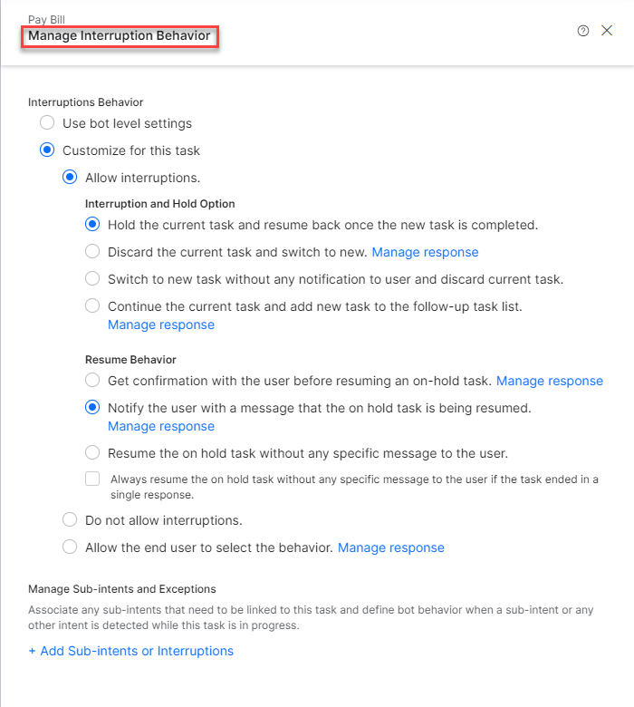

How does Intent Over Entity work?

[Intent](https://developer.kore.ai/docs/bots/chatbot-overview/about-bots/#I) over [Entity](https://developer.kore.ai/docs/bots/chatbot-overview/about-bots/#E) is a bot-level setting configured on the [Dialog Task](https://developer.kore.ai/docs/bots/chatbot-overview/about-bots/#D) to prioritize a customer’s intent. The bot understands the intention behind the customer's input. By focusing on the intent, the system quickly determines the customer's requirements and the desired outcome, and provides more efficient and effective responses.

There are two options for configuration:

1. **Intent over Entity**: The ongoing intent automatically terminates, initiating a new dialogue. For example: If a customer intends to place an order and during the interaction changes their intent and requests to edit the order, the system terminates the ongoing intent (place order) and initiates a new intent (edit order).

2. **Entity over Intent**: The ongoing dialogue task proceeds normally, considering the customer input as an entity value, and allows the dialogue task to progress to the next node. For example: If a customer intends to place an order and during the interaction changes their intent and requests to edit the order, the system continues with the ongoing intent to place the order.

Configure Intent Over Entity

Steps to configure Intent over Entity:

1. Go to **AUTOMATIONS** > **Attached bots** > Click the bot to be configured.

2. Click **CONVERSATIONAL SKILLS** on the left panel and then click **Dialog Task** from the dropdown menu.

3. The **Dialog Tasks** page appears. Clicking anywhere in the row opens the flow designer for the dialog task.

4. Click the **ENTITY** node to be configured and then click the **INSTANCE PROPERTIES** tab.

5. Click **Advanced Controls** and select **Intent over Entity**. A check box confirms the selection.

Manage Interruption Behavior

This feature allows you to manage the interaction's interruption behavior to suit your requirements. There are several pre-configured scenarios available to be configured.

!!! **NOTE**
    : Interruption Behavior can be configured only when Intent over Entity is selected.

Steps to configure Interruption Behavior:

1. Click the ellipsis (three dots) icon on the top right corner of the flow designer page.

2. Click **Manage Interruptions** from the dropdown menu. The **Manage Interruption Behavior** page appears.

3. Select the required interruption behavior. A confirmation is displayed.
