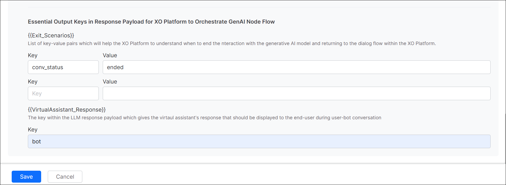

# Generative AI Features

## Overview

The Generative AI features improve design-time and runtime capabilities, accelerating an AI Agent development and enhancing performance. LLM-powered functionalities streamline the development process, reducing time and effort while boosting overall efficiency.

By default, all the features are disabled. To enable the feature, select the model, prompt, and then toggle the status to enable it. You can also change the model, its prompts, and the respective settings.
		
### Enable Feature

Steps to enable the feature:

1. Navigate to **Generative AI Tools** > **GenAI Features**.  
 

2. Select the **Model** and **Prompt** from the drop-down list for a feature. 
3. Turn on the Status toggle. The success message is displayed.

		

	
### Product Filter

Smart filtering in the features section is based on the context from which the users access the Generative AI menu. This will only show the relevant feature options for that product (e.g., Automation, Search, Agent). The users can easily add/remove this filter as needed.  
 
	

### Feature Search Functionality

A dedicated search feature functionality to enable quick and efficient discovery of GenAI features across the entire the Platform. This enhancement streamlines navigation, minimizes search time, and improves overall user efficiency by providing direct access to key tools and options.
			

## Change Settings for a Model

Choose the option below based on the model for which you want to change the settings:

### Change Settings for a Pre-built Model

			

You can change the selected model’s settings if required. **In most cases**, **the default settings work fine**.

Follow these steps:

1. Go to **Generative AI Tools** > **GenAI Features**.
2. Open **Advance Settings** using the feature gear icon. The **Advance Settings** dialog box is displayed.  
 

Adjusting the settings allows you to fine-tune the model’s behavior to meet your needs. The default settings work fine for most cases. You can tweak the settings and find the right balance for your use case. A few settings are common in the features, and a few are feature-specific:

* **Model**: The selected model for which the settings are displayed.
* **Instructions or Context**: Add feature/use case-specific instructions or context to guide the model.
* **Temperature**: The setting controls the randomness of the model’s output. A higher temperature, like 0.8 or above, can result in unexpected, creative, and less relevant responses. On the other hand, a lower temperature, like 0.5 or below, makes the output more focused and relevant.
* **Max Tokens**: It indicates the total number of tokens used in the API call to the model. It affects the cost and the time taken to receive a response. A token can be as short as one character or as long as one word, depending on the text.
* **Number of Previous User Inputs**: Indicates how many previous user messages should be sent to the model as context for rephrasing the response sent through the respective node. For example, 5 means that the previous 5 responses are sent as context.
* **Additional Instructions**: Add specific instructions on how prompts should be rephrased. You can create a persona, ask it to rephrase in a particular tone, etc.
* **Similarity Threshold**: The Similarity Threshold is applicable for the Answer from Docs feature. This threshold refers to the similarity between the user utterance and the document chunks. The Platform shortlists all chunks that are above the threshold and sends these chunks to the LLMs to auto-generate the responses. Define a suitable threshold that works best for your use case. Setting a higher threshold limits the number of chunks and may not generate any result. Setting a lower threshold might qualify too many chunks and might dilute the response.

		
### Change Settings for a Custom Model

	

		

			

For a custom model, you can only change the post-processor script to adjust the actual response with the expected response.

Follow these steps:

1. Go to **Generative AI Tools** > **GenAI Features**.
2. Click the feature **Settings** (gear) icon. 

3. Click **Edit**. The Actual Response is displayed. 

    .png  )
    

4. Click **Configure**. The Post Processor Script is displayed. 

    .png  )

5. Modify the script and click **Save & Test**. The Response is displayed. 

    .png  )

6. Click **Save**.
7. (Only for Agent Node) Enter the **Exit Scenario Key-Value** and **AI Agent Response Key fields**. Click **Save**.
The Exit Scenario Key-Value fields help identify when to end the interaction with the GenAI model and return to the dialog flow. An AI Agent Response Key is available in the response payload to display the VA’s response to the user.
    

## Automation AI - GenAI Features

- Agent Node  
- Automatic Dialog Generation  
- Conversation Summary  
- Conversation Test Case Suggestions  
- Few-shot ML Model  
- NLP Batch Test Case Suggestions  
- Prompt Node  
- Repeat Responses  
- Rephrase Responses  
- Rephrase User Query  
- Training Utterance Suggestions  
- Use Case Suggestions  
- Zero-shot ML Model

Learn more about [Automation AI - GenAI Features](genai-features-automationai.md).

## Search AI - GenAI Features

- Answer Generation  
- Metadata Extractor Agent  
- Query Rephrase for Advanced Search API  
- Query Transformation  
- Result Type Classification  
- Vector Generation

Learn more about [Search AI - GenAI Features](genai-features-searchai.md).

## Agent AI - GenAI Features

* Agent Response Rephrasing
* Generating Opposite Utterance Suggestions
* Generating Similar Utterance Suggestions

Learn more about [Agent AI - GenAI Features](genai-features-agentai.md).

