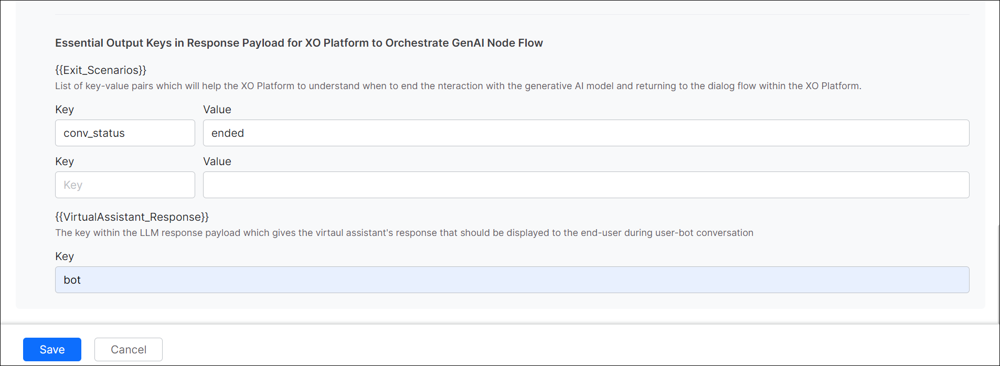

# Prompts and Requests Library

		

Effective prompts play a crucial role in enhancing response accuracy when interacting with LLMs. The new Prompts Library module empowers bot designers by allowing them to create and test suitable prompts for their specific use cases. It also displays all the newly added/custom and default request/prompt templates for the integrated models with their status as active or inactive. The default prompts are related to the pre-built models. However, you can import any default prompt, customize it, and use it for a pre-built and custom LLM model.

The post processor for prompts allows designers to align LLM responses perfectly with Platform expectations. Designers can modify the LLM response to guarantee the correct behavior and high-quality interactions during runtime.

For more information on adding prompt for GenAI node, see [GenAI Node](../automation/use-cases/dialogs/node-types/genai-node-v2.md#add-custom-prompt-for-genai-node).

!!! note

    Currently, the custom LLM integration and prompt creation are available only in English.

## Pre-requisites

Before proceeding, ensure that you have successfully Integrated a Pre-built or Custom LLM. For more information, see[ LLM Integration](models-library.md).

## How to add Prompts and Requests

To add a new prompt, follow the steps:

1. Go to **Generative AI Tools** > **Prompts Library**.
     

2. On the top right corner of the **Prompts Library** section, click **+ New Prompt**.
3. Enter the **prompt name**. Select the **feature** and the respective **model**. 

    .png  )

4. The Configuration section consists of End-point URLs, Authentication, and Header values required to connect to a large language model. These are auto-populated based on the input provided while model integration and are not editable. 

    .png  )

5. In the Request section, you can either create a request from scratch or import the existing prompt from the Library to modify as needed. 
    .png  )
    1. To import an existing prompt, do the following:
        1. Click **Import from Prompts and Requests Library**. All the newly added/custom prompts and prompts related to the pre-built LLM are displayed without integrating them.
            
             
        
        2. Select the **Feature** from the dropdown menu, select the **Model**, and select the **Prompt** from the dropdown menu. Hover over and click Preview Prompt to view the prompt before importing.

        !!! note

            You have the flexibility to interchange a prompt designated for one feature with that of another, and vice versa.

        3. Click **Confirm** to get it imported into the JSON body.

    2. To create a prompt from scratch, click **Start from scratch** and enter the **JSON** request the LLM. 
    .png  )

6. Once you type the JSON, the **Sample Context Values** fields are displayed. Fill in the values and click **Test**.
7. If the request values are correct, the response from the LLM is displayed. If not, an error message is displayed. 

    .png  )

8. In the Actual Response section, double-click the **Key** that should be used to generate the response path. For example, double-click the **text** key and click **Save**. 

    .png  )

9. The **Response Path** is displayed. Click **Lookup Path**.
10. The **Actual Response** and **Expected Response** are displayed. 
    1. If the response structure matches, the responses will be in green. Click **Save**. Skip to Step 11.

        **Note**: Both Actual Response and Expected Response are not editable.
        .png  )
    
    2. If the response structure does not match, the responses will be in red. Click **Configure** to modify the Actual Response. The Post Processor Script is displayed. 
    .png  )
        
        1. Enter the **Post Processor Script**. Click **Save & Test**. 
            .png  )
        2. The response is displayed. 
                .png  )
        3. Click **Save**. The actual response and expected response turn green.

11. (Only for GenAI Node) Enter the **Exit Scenario Key-Value fields** and **Virtual Assistance Response Key**. The Exit Scenario Key-Value fields help identify when to end the interaction with the GenAI model and return to the dialog flow. A Virtual Assistance Response Key is available in the response payload to display the VA’s response to the user.
    
12. Click **Save**. The request is added and displayed in the **Prompts and Requests Library** section.

 
13. Now proceed to enable[ Co-Pilot](co-pilot-features.md) and[ Dynamic Conversations](dynamic-conversations-features.md) features.

		
