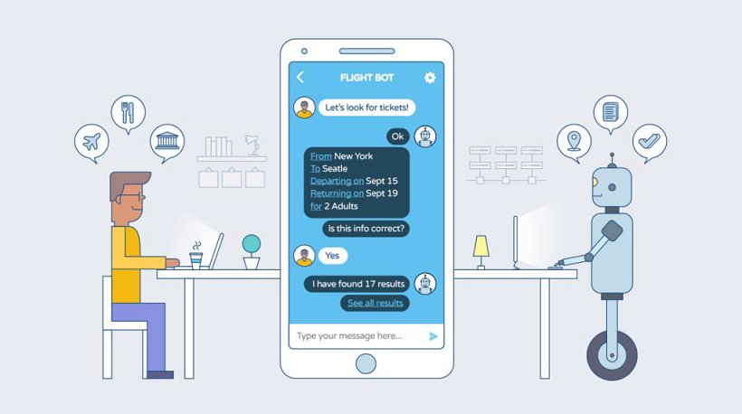

# Virtual Assistants Overview

Communication has been the essence of life from the beginning of time. Traditionally, conversations were restricted to verbal and textual interaction between humans. These interactions were usually guided by emotions, context, and awareness of previous conversations.

With the advent of computers, interactions have expanded to include machines i.e. human-machine interactions. The transitions from a command-based interface to a Graphical User Interface (GUI) to a Conversational User Interface (CUI) became natural and need-based, making communication easier.

Further enhancements facilitated the emergence of Artificial Intelligence (AI) that can process natural language (NLP). In turn, AI has contributed to Conversational Virtual Assistants that understand human communication, derive a task from this understanding and extract the information they require in order to execute this task.

AI-driven, NLP-based chat, and voice Conversational Virtual Assistants are the latest in technology and a must for contemporary enterprises.

## What are Conversational Assistants?

A Conversational Virtual Assistant (VA) acts as an intelligent intermediary between people, digital systems, and internet-enabled things. It replaces the traditional Graphical User Interfaces (GUIs) of an application or website with a Conversational User Interface (CUI). It is a paradigm shift from the earlier communications achieved either by entering syntax-specific commands or clicking icons.

These Virtual Assistants are designed to converse with users through a combination of natural language-based conversations. Responses can come in the form of text, links, buttons, calendars, or other widgets that accelerate the speed with which a user can respond.

AI-powered messaging solutions or Conversational Virtual Assistants serve as the stepping stone to the future. They communicate with intelligent virtual agents, organization apps, websites, social media platforms, and messenger platforms. Users can interact with such assistants using voice or text to access information, complete tasks, and execute transactions.

## Why Add a Conversational Virtual Assistant to Your Business?

In a nutshell, such an assistant can significantly reduce the amount of time and labor required to maintain specific business processes. Here is what a Conversational VA can achieve:

* Talk to people, systems, and internet-enabled things,
* Perform omnichannel communication through voice and text, using natural language,
* Understand natural language, including domain-specific,
* Learn from its interactions and apply this learning in future conversations,
* Handle multi-turn conversations,
* Apply context to improve communication,
* Handle task interruptions and accomplish what users want.

## How Do Conversational Virtual Assistants Work?

A Conversational Virtual Assistant works by analyzing what users say, to detect their goals and extract the information required in order to achieve that goal.

Let’s take a look at the key components and the core process that enable a Virtual Assistant to fulfill its functions.

### The Key Components

Whatever the user says is considered an Utterance. The main task of the Conversational VA is to analyze the utterance and extract the intent, and entities essential to carry a conversation. 

An Intent is the user’s intention and usually comes in the form of a verb or noun within the user's utterance.

Entities are a collection of data or information that the VA requires to complete the task which is identified in the user intent. They can be fields, data or words that the developer designates as necessary for the VA to complete a task. Entities can either be part of a user utterance, but the VA might also need to prompt the user to provide them. An Entity can be of any type; for instance: name, location, date, time, etc.

For example, let us consider the following message that a user sends to the Virtual Assistant: 

_I want to fly to London this weekend._

* The entire sentence represents the Utterance;
* “I want to fly” is the Intent;
* “London” and “this weekend” form the values for the Entities representing “Destination” and “Travel Date” respectively. As you can notice, the “Source” entity value is missing and in such a case, the VA needs to ask the user where they want to fly from.

### The Core Process

In order for a Conversational Virtual Assistant to work as intended, it has to simultaneously perform the following three processes:

* Detect the user’s Intent: Understand what the user wants
* Extract Entities: Obtain specific information from the user, in order to accomplish what the user wants;
* Execute the Dialog Task: Participate in the conversation process in order to accomplish what the user wants.

## Building Intelligent Conversational Virtual Assistants

Virtual Assistants are not smart by default. They are designed to show some level of artificial intelligence by leveraging technologies such as machine learning, big data, natural language processing, etc. However, a Virtual Assistant is only intelligent when it can understand user needs, perspectives, or context, and responds according to the user’s mood or emotion. This is only achievable through training and interaction with users, over a period of time. Below are a few suggestions that may help you increase your VA’s level of intelligence.

### Build a Rich Collection of Intents and Entities

The key for a Conversational Virtual Assistant to understand humans is its ability to identify human intentions (Intents), extract relevant information Entities) from utterances and map the relevant action/task against those utterances (Dialog Task execution). This is achievable using [Natural Language Processing](../automation/natural-language/nlp-introduction.md) (NLP), which you can train according to your organization’s needs.

### Develop Conversations

Managing dialogs to keep track of multiple conversation threads, remember the context, and respond to the user's tone or sentiment provides the much-needed humane touch to the conversation. At the same time, this serves the user with accurate and appropriate responses, ensuring a positive experience.

### Build a Knowledge Graph

In addition, having a Knowledge Graph gives the VA the ability to respond to frequently asked questions that return static responses. Building such knowledge collections is an attempt to represent entities, ideas, and events with all their interdependent properties and relations according to a system of categories. This structured categorization of data helps the VA to answer user queries effectively and with ease.
