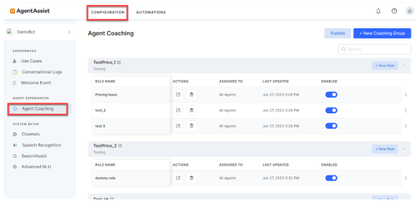
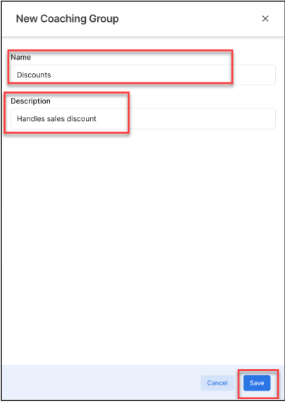
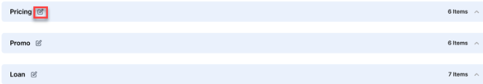
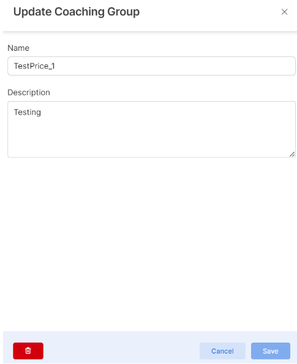
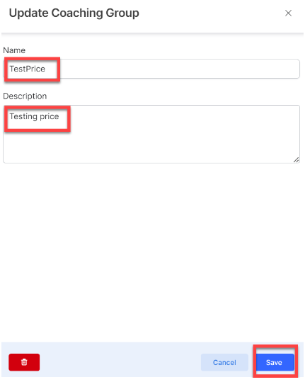
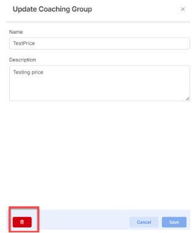
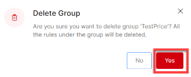

# Agent Coaching

## Introduction

As a contact center supervisor, you may want to view all the triggered utterances, the number of times each utterance is triggered, and the agent’s adherence to the action in a selected timeframe.

The Agent Coaching feature lets you configure utterance-based, real-time coaching. You can configure relevant utterances so that when they occur, AgentAssist performs relevant actions such as nudge, hint, and email manager action. This document explains everything about the Agent Coaching feature, including groups, rules, rule triggers, and rule actions.

This document is meant for the contact center supervisors.

## Create, Edit, and Delete Groups

The Agent Coaching groups are sets of rules for coaching the contact center agents. You create these groups to categorize a particular functionality or segregate all the related issues. For example, all the rules dealing with pricing may come under a group named Pricing. In this section, you will learn everything about creating, editing, and deleting groups.

### Creating a New Group

With more and more issues and situations arising that have common or related solutions, it is important to group them so that you get relevant answers. The Agent Coaching feature allows you to create new groups as and when required.

#### Steps to create a new group:

1. Log in to the **AgentAssist** UI.
2. From the top menu, click **Configuration**.
3. Click **Agent** **Coaching** from the left menu. The **Agent Coaching** page is displayed with pre-existing groups, if any.

    
4. Click the **+ New Coaching Group** button.
    

5. Enter a name for the new group in the **Name** field.
6. Enter a short description about the new group in the **Description** field.
7. Click **Save**. The new group appears on the list of pre-existing group names.

### Editing a Group

You can change or update an existing group from time to time based on the requirements.

#### Steps to edit an existing group:

1. Go to the **Configuration > Agent Coaching** main page.
2. Locate the group you want to edit by going through the displayed list.
3. Click the **edit** button beside a group name you want to edit.
    
    
4. Update the group name and description, as required.
    
5. Click **Save**.

### Deleting a group

You can remove an existing group for irrelevance or other reasons.

#### Steps to delete a group:

1. Go to the **Configuration > Agent Coaching** [main page](#create-edit-and-delete-groups)

2. Locate the group you want to delete by going through the displayed list.
3. Click the **edit** symbol beside a group name.
    
4. Click the **delete** button on the subsequent screen.
    
5. Click **Yes** on the confirmation screen, as shown in the following screenshot.
    { width="200" }

**Group Rules:**

<table>
  <tr>
   <td><strong>Field</strong>
   </td>
   <td><strong>Description</strong>
   </td>
  </tr>
  <tr>
   <td>Rule Name
   </td>
   <td>The name you have assigned to a rule.
   </td>
  </tr>
  <tr>
   <td>Actions
   </td>
   <td>Edit or delete a rule.
   </td>
  </tr>
  <tr>
   <td>Description
   </td>
   <td>A short description of the rule.
   </td>
  </tr>
  <tr>
   <td>Assigned To
   </td>
   <td>Agents or groups to whom a rule is assigned.
   </td>
  </tr>
  <tr>
   <td>Last Updated
   </td>
   <td>Time and date when a rule was last updated.
   </td>
  </tr>
  <tr>
   <td>Status
   </td>
   <td>Current status of a group. Valid values are:
<ul>

<li>Enable

<li>Disable
</li>
</ul>
   </td>
  </tr>
</table>

!!! Warning
    This is a trial document. Do not publish it.

!!! Note "About this document"
    It’s a trial document to view how notes render in GIT.
(#type:tip){ #type:tip }

:   !!! tip
        Do not publish this document.
