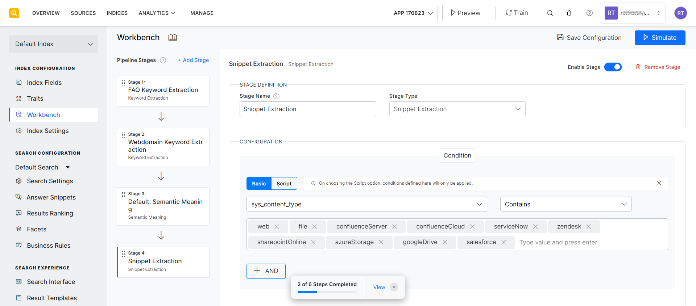
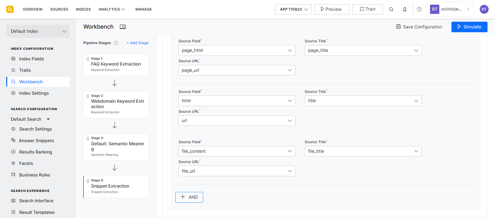

# Snippet Extraction 

The Snippet Extraction workbench stage helps extract pertinent excerpts from the source data which can be displayed as answer snippets in response to user queries. When data is processed, relevant snippets are extracted and stored along with a title and a URL. When a user queries, the generated snippets are displayed to the users.  This makes it an efficient way to find and display answer snippets. This stage can be used to configure the fields to be used for generating the answer snippets. 

Note that this stage is only used for the Extractive Model of producing answer snippets. When the Extractive Model is enabled in Answer snippets, this workbench stage is automatically added to the Index pipeline. 

Use the following fields to configure this Workbench stage.

**Stage Name**: Give an appropriate name to the stage for easy identification.

**Stage Type**: This field refers to the type of stage. In this case, it is set to Snippet Extraction.

**Configuration**: Use this section to define the condition under which the source data undergoes the processing of this stage and the outcome of the stage.

    **Condition**: Define a condition using the field type and operator to specify the source data on which snippet extraction is to be done. For example, if you want to generate snippets only for web pages, set the field to ‘sys_content_type’, set the operator to ‘contains’ and the value as ‘web’. This implies that the only web type of file will undergo snippet extraction.  

    **Outcome**: Specify the following fields for the outcome of the stage. 

    **Source field**: Index field whose content is to be used for extracting snippets.

    **Source Title**: Field whose value is to be used as the title of the snippet.

    **Source URL**: Field whose value is to be used as the URL in the snippet. This is the URL displayed to the user at the end of the snippet. 

    In continuation of the above example, you can set ‘page_html’ as the source field, which implies that the HTML content from the page will be used to generate the snippet. Set page_title as the Source Title and page_url as the Source URL.   

    You can add one or more outcome fields using the AND button. For example, if you want to run the snippet extraction stage for content from files, web pages, and data from the connectors, you can specify the condition and the outcome as shown below. 

    Note that currently for structured data and the FAQs, snippets are always generated by default. Hence you do not need any specific configuration to configuration for them. 

    Testing a table

    | Syntax      | Description |
| ----------- | ----------- |
| Header      | Title       |
| Paragraph   | Text        |