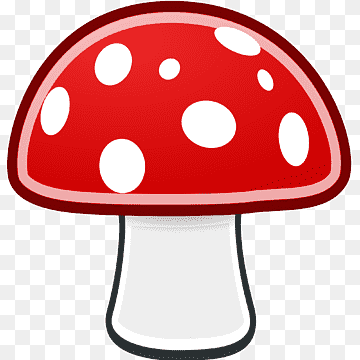

# Playing with links

how do different kind of links going to work?

1. Open link from image [{ width=60} ](https://www.pngwing.com/en/free-png-duoxo) 
2. [Open link through text](https://developer.kore.ai/docs/bots/how-tos/update-booking-task/) 
3. <a href="https://developer.kore.ai/uncategorised/change-flight-task/" target="_blank">Open link in new tab</a>
4. 

{ width=60}