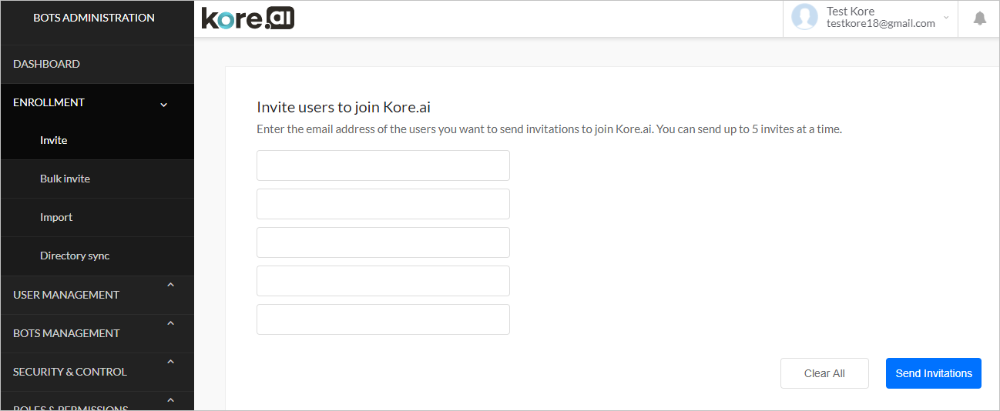

# Collaborative Development

Kore.ai allows cross-domain App sharing. You can share your app with one or more developers from the same or different enterprises enabling them to edit the shared app tasks, channels, and other settings.

		
## Sharing Bots

There are two ways of sharing an app with your co-developers – from Builder or from Admin Console (as Account Admin).

### From the Builder

1. To share the app with another Developer, log on to the **platform** and select the app you want to share.
2. Select **Manage > Users** through the **Product Switcher**.

    

3. From the left menu click **Manage Users**. Developers who have access to any of the ‘App Admin’ permissions, can invite new developers. The App Owner's details are present on this page by default.

    

4. Click the **Invite Users** button on the right side of the page. Enter the details of the developer, the role and click **+ Add**. You can add more than one developer at a time. 

    

    You can assign Group and Role to the user on the **User Attributes** popup. This can be accessed by clicking the  icon corresponding to each user. **Note** that you need to select a role to be able to access user attributes.

    

5. Confirm by selecting **Share Invites** to add and share your app with one or more developers.
6. You can also use the **Invite User** option from the Dashboard to add a user to your account. 

    
 
To add users to workspace and invite them to access your virtual assistant from the Bot Builder, read the[ Invite Members](https://developer.kore.ai/docs/bots/chatbot-overview/how-to-access-bot-builder/#Invite_Members) section in the Using Workspace article.

		

	

	

		

			

### Change Bot Share Settings

From the Bot Builder you can manage the developers working on your Bot. From the settings (gear) icon against each Developer you can:

* **Delete** – Click to delete the bot for the selected developer. The developer immediately loses access to the bot.
* **Promote to Bot Owner** – Click to change the selected developer to be the Bot Owner. When selected, you are immediately removed as Bot Owner and can no longer add or manage developers for this Bot.

!!! Note

     Settings for sharing for a bot can only be modified by the Bot Owner.

		

	

	

		

			

### From Bot Admin Console

To share a bot with a developer or another user, if you do not have permission to invite new developers, it is essential for the Bot Admin to send an invitation to the developer and assign Bot Developer access. 
 Here are the steps for the account Admin to add users to your account.

1. Log on to[ https://bots.kore.ai/](https://bots.kore.ai/) and select **Go To Admin Console**. You may be asked to login/re-login to the admin account. 

    

2. In the **Bot Administration** section from the right navigation go:
    1. to the **User Management > Users** section and click on **Invite new users** or
    2. to **Enrollment > Invite** section. You will be directed to the Invite user page.
3. Enter the email address of the users you want to send invitations to join your enterprise account. A maximum of 5 users can be invited at a time. Then, click **Send Invitations**.

    

4. The invitee must accept the invitation sent by the **Bot Admin** to get access to as a **Bot User**. Once the invitation is accepted, the username gets reflected in the list of Bot users for your enterprise account.

		

	

	

		

			

### Assign Bot Builder Access

You can make changes to the Bot user settings by modifying the **User Profile settings** from the **Bot Admin Console**.

Double click on the Bot User that you want to change the settings for and you can set the Admin as well as the Bot Builder Access roles.[ See here for more](https://developer.kore.ai/docs/bots/bot-admin/user-management/role-management/).

		

	

	

		

			

### Working with Shared Bots

When a task, channel, or flow is claimed, the lock expires after 30 minutes, or when you exit the editing mode for the task, channel, or flow, whichever comes first. After 25 minutes, you are prompted to extend the lock, if desired. If you do not extend the lock before 30 minutes has elapsed, your changes are automatically saved, editing mode is ended, and the claim lock is removed.

If you try to edit a shared task, channel, or flow that is claimed, the message, _“Oops! The bot is currently being edited by &lt; **Developer Name** >_” message is displayed.

Only the Bot Owner and developers that are shared to the bot can access and edit the task, channel or flow.

		
