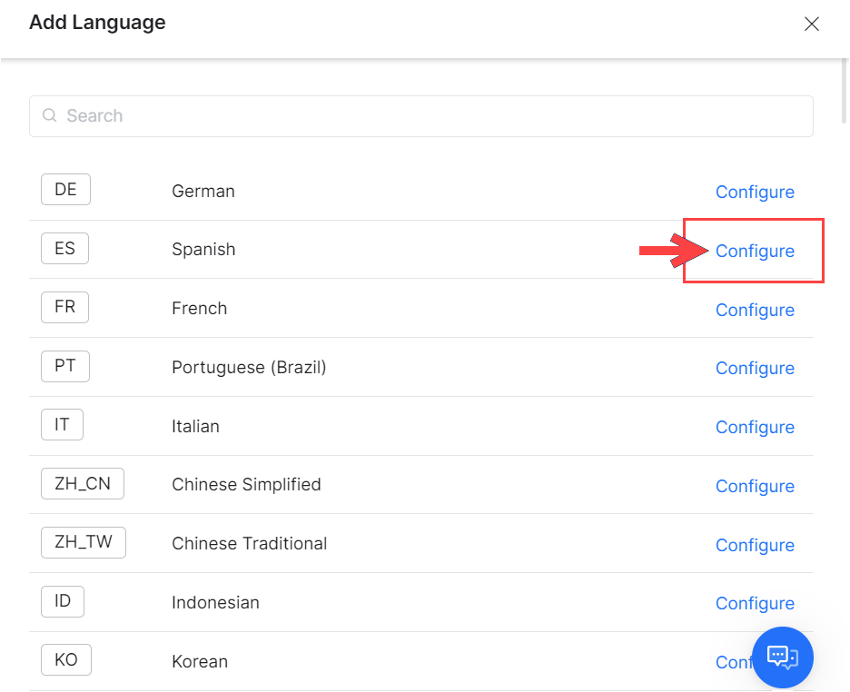

# Managing Languages for Multilingual VAs

You can create an assistant from scratch, enable a language for an existing assistant or update the language configuration for an existing assistant. Besides these functionalities, this article also shows you how to switch between languages and how to enable or disable a language.

## Selecting a Language when Creating an Assistant from Scratch

To create an Assistant from scratch, follow the below steps:

1. Log in to your Kore.ai XO Platform account.
2. On the Virtual Assistant landing page, click **New Bot** on the top-right and select the **Start from Scratch** option.
3. On the _Create New Bot_ window, enter the Assistant details:
    1. **Name** – Give a name to your Assistant. For example, Banking Assistant. If the name is already used, try something else
    2. **Select the language** from the **Default Bot Language** drop-down list.
    

4. If the selected language is from one of the 26 languages supported as NLU languages ([read more here](https://developer.kore.ai/docs/bots/advanced-topics/multi-lingual/multilingual-vas-components-feature-support/#NLP_Support)) then by default, the VA language will be the same as the NLU language. You can always change the NLU language to any language by clicking on the **Advanced Options** link to search and select the **NLU language** from the list of supported languages. 

    

5. Once you select an NLU language, which is different from the default Bot Language, you can enable the following translation modules:
    * **User Input Translation** – This approach uses language translation services to translate the user input into a base language. The conversation is executed in the base language and the responses are auto-translated back to the user’s language using translation services. (Supported from v9.1)

    * **Runtime Response Translation** – The Kore.ai XO Platform can automatically translate all the prebuilt responses as well as plain text messages to the user’s language. For this, you will need to provide your API keys for either Google Cloud Translation or Microsoft Translator service in the **Translation Configurations** section. You can also translate the content of the templated messages inside the JavaScript using the `koreUtil.AutoTranslate()` function by passing a string or a context variable. For example, <code>koreUtil.AutoTranslate(context.variable1)</code>. 
        

    !!! note

        If you select Multilingual as the NLU language option, by default the Assistant will be able to understand the user input in 100 plus languages supported by the Kore.ai XO Platform. The Multilingual NLU model is a language-agnostic model, it understands user input in 100 plus languages without the need for translation. However, you could enable Response Translation if the responses are configured in a language other than the assistant language.

6. Click **Create**.

## Adding a language to an existing Virtual Assistant

Even if your assistant has already been created, you can still add new languages to it. Follow these steps to add a new language for your virtual assistant:

1. Go to **Build > Configurations > Languages**.
2. On the Language Management page, in the **Standard Languages** section, click the + **Add Language** to add languages. 
    

3.The Platform will display all the 100 plus languages that are supported. You can click on the Configure button to enable a language.

!!! note

    You can also search for a language by entering its name in the Search field.
  

4.Once you click configure, you can setup the following language configurations:

* **Choose the NLU Language** – Allows you to select any supported language as the NLU model to train your assistant.
* **Select the Language Definition Mode** -You can choose any of the following options to copy the language definitions:
    * **Basic Mode** – Lets you only copy dialog prompts and messages.

    !!! note

        A base language is a language that is already enabled in the assistant. You need to choose a Base Language for your assistant from which you want to copy your assistant’s data for both Basic and Advanced modes.*

        

    * **Advanced Mode** – Lets you copy dialog prompts, messages, knowledge graph, small talks, traits, and training data as per your need. 
    
        

    * **Use Language Pack** – Lets you upload the language definitions after adding manually translating a JSON file. You can download a JSON language pack of any of the already-enabled languages and then edit the dialog prompts and messages in the JSON file. Upload the updated JSON file to enable the new language for the assistant.
    

    * **Manage Translations** – In case the Translation Engine is not configured, click the **Configure** link to set up the translation engine for your assistant. To learn how to enable Input Translation or Runtime Response Translation,[ refer to this article](https://developer.kore.ai/docs/bots/advanced-topics/multi-lingual/managing-translation-services/?preview=true). 

    

5. Once you have configured translations, click **Enable** to add/enable a new language for the assistant.

## Updating a language for an existing Virtual Assistant

If you want to enable/disable input translation, change the NLU language of the already enabled language for an assistant or modify the dialog prompts then you can use the update feature. 

To update an already enabled language for an assistant, follow the below steps:

1. Go to **Build > Configurations > Languages**.
2. The platform will display all the languages under the **Language Management** section.
3. Click on the language that is already enabled in the VA. The _Manage Language_ dialog appears, here you can:
    1. **Update the NLU language** – Updating the NLU language will need training for the virtual assistant again.
    2. **Update the dialog prompts** – You can update the language pack file and upload it to update the dialog prompts.
    3. **Update Manage Translations** – You can enable/disable input translation or runtime response translation based on your needs. 

    

4. Click the **Update** button once all the necessary changes are made.

!!! note

    AfterAfter you have configured a new language, to make the new language work, you must re-publish the VA. Until then, the VA continues to function with the previously published languages. 
    The default Synonym library is available only for English, French, Spanish, German, and Chinese languages. However, you can add custom synonyms for any language. 

## Switching Languages 

If you have configured multiple languages for a virtual assistant, you can switch the language to configure the virtual assistant from the top right corner (language dropdown) from within any area of your VA. The dropdown will display all the other supported languages with the corresponding NLU model that is configured for the language. 

!!! note

    The language dropdown will display the Bot Language and NLU language for the languages where the Bot Language is not equal to NLU language. If the Bot Language and the NLU language are the same then the language drop down will display only the Bot Language.

### Disabling/Enabling Languages

Languages can be enabled or disabled by going to **Build > Configurations > Languages &lt; Standard Languages**. Use the toggle to enable/disable a language.

Once you have configured and enabled a language you can:

* Disable or deactivate a language that is previously enabled for the VA. The actual language-specific data that has been added while enabling the language will continue to exist in the VA even after disabling the language. Disabling would prevent the users from talking  to the assistant in that language (can be viewed in the VA export copy).
* If a language is disabled you can enable it again, since the data is preserved, you need not enter all the details.

!!! note

    Any change in language settings needs to be published before it can take effect in the published assistant.