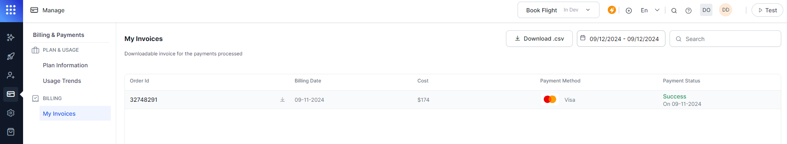

# Invoices

The Invoice module provides access to all the invoices associated with the virtual assistants for the Standard Accounts. This includes the subscriptions to the Usage Plans as well as the Support Plans. This module does not show the invoices for Enterprise Accounts. 

# Viewing Invoices

To view the invoices, follow these steps:

1. Log on to the XO Platform and select the assistant you’re interested in.
2. Select the **Manage** tab from the top menu.
3. From the left menu click **Invoices**.
4. All invoices are displayed in chronological order and include the following fields:
    * invoice number
    * Invoice Date
    * Plan Type
    * Bot Name
    * Plan
    * Amount
5. You can download any given invoice in PDF format.

    

