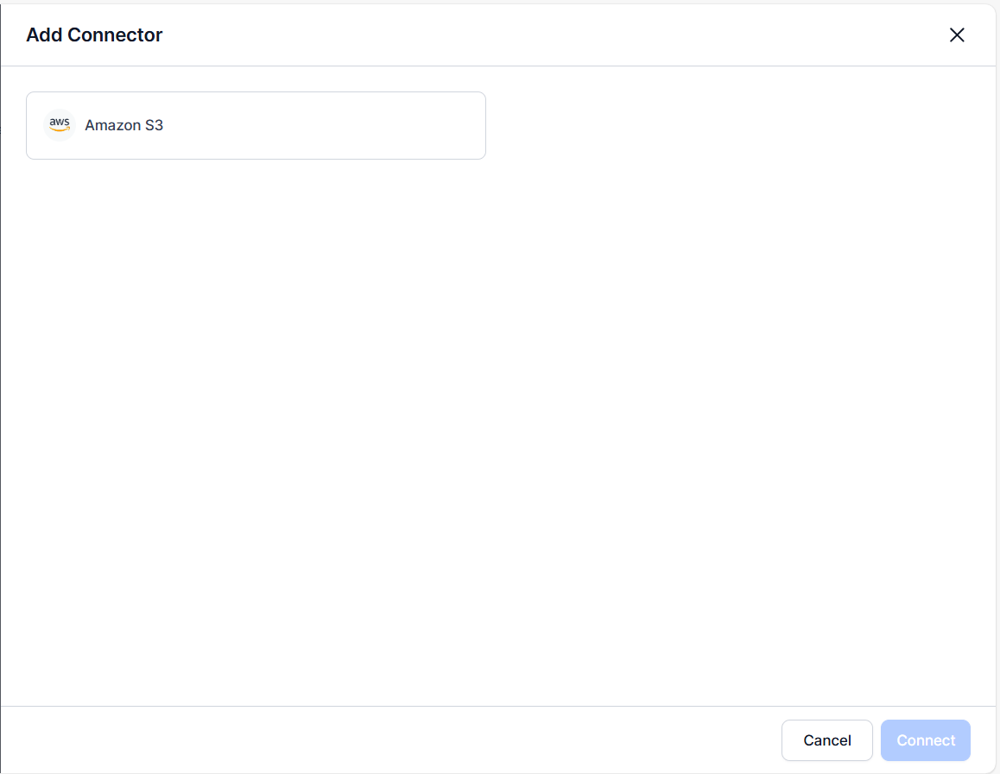

# Conversation Sources

The Conversation Sources section in Quality AI enables users to configure and manage sources of voice and chat conversation data from multiple platforms within a unified interface. It supports data ingestion from Contact Center AI (CCAI), Agent AI, and Quality AI Express. This provides a centralized way to manage and ingest conversation data for seamless interaction tracking, routing, and analysis. The platform collects, processes, and analyzes data across multiple sources, supporting key metadata for accurate insights while simplifying overall management.

You can assign agents to Agent AI and Quality AI Express queues directly through the UI instead of only via Public APIs. The interface lets you enable or disable sources, view and manage queues with details like Queue Name, Queue ID, system-generated IDs, and assigned agents, and add or edit queues. The Add Queue dialog simplifies creating queues by allowing agent mapping through a searchable list. This UI-based mapping improves usability, onboarding, and consistent queue management across platforms.

## Access Conversation Sources

Navigate to **Quality AI** > **CONFIGURE** > **Conversation Sources**.   

## Supported Conversation Sources

Quality AI supports three conversation sources, each designed for specific deployment scenarios and organizational requirements:

### Contact Center AI (CCAI)

This seamlessly integrates and ingests real-time conversation data from the CCAI platform.

* **Integration Method**: Direct API connection

* **Data Processing**: Real-time 

* **Configuration Requirements**: None (automatic integration) 

* **Use Case**: Organizations using Kore.ai's native contact center solution. 

    !!! note

        If the CCAI source is disabled, the system does not process incoming interactions from CCAI on third-party desktops.

### Agent AI

This supports human-agent interactions enhanced by AI augmentation capabilities.

* **Integration Method**: Structured data feeds. 

* **Data Processing**: Real-time with metadata validation. 

* **Configuration Requirements**: Add queues with Agent Queue names and Queue IDs. 

* **Use Case**: Organizations with human agents supported by AI assistance.

    !!! note

        * If the Agent AI source is disabled, the system does not process incoming interactions from Agent AI on third-party desktops. 
        
        * Make sure that Agent email IDs and queue IDs are included during integration.

### Quality AI Express

This imports interactions or data (service records, chat logs, and emails) from external sources such as AWS S3 connectors for third-party contact centers [Connectors](../../searchai/content-sources/connectors/amazons3.md), bypassing CCAI as the ingestion path into the quality AI system.

* **Integration Method**: Amazon Web Services (AWS) S3 Connectors

* **Data Processing**: Batch file processing

* **Configuration Requirements**: Add queues with Agent Queue names and Queue IDs.

* **Supported Data Types**:

    * Customer service records

    * Chat logs

    * Email interactions

    * Audio recordings

    * Structured metadata files 

* **Use Case**: For organizations using third-party Contact Center as a Service (CCaaS) platforms.

    !!! note

        Connectors act as the primary bridge for importing conversations from external systems into Quality AI through file transfer from AWS S3.

## Configuration Requirements

### Prerequisites

Before configuring Conversation Sources, make sure:

* Assign the appropriate user permissions.

* Verify that the required metadata structures are available.

* Confirm that the integration endpoints are available.

### Quality AI Express Setup

Complete these steps before activating **Quality AI Express**:

* Clear all active **Playbook** metrics from evaluated form queues.

* Clear all active **Dialog Task** metrics from evaluated form queues.

Failure to complete clearance prevents activation with a warning message.   

**AWS S3 Configuration**:

* Configure S3 bucket access

* Set up file transfer protocols

* Define data format specifications

* Establish processing schedules

### Conversation Sources Interface

The main interface displays all enabled conversation sources and their respective queues.

* **Enable/Disable Toggles**: Switch each source on or off to start or stop ingestion.

* **Queue List**: Displays existing queues for each source with the following columns:

    * **Name**: Queue name for easy identification.

    * **Queue ID**: User-assigned identifier for the queue.

    * **System Generated Queue ID**: Unique system-generated identifier.

    * **Agents**: Shows assigned agents counts.

* **Actions**: Edit or delete to manage agents or queues.

* **Add Queue**: Select Add Queue to add new queues with agent mapping.

    !!! note

        When you enable **Quality AI Express** in **Conversation Sources**, the system displays **Connectors** in the left navigation menu of Quality AI.

        

#### Chat Script Timestamp Format

Chat Script Timestamp Format controls how Quality AI Express parses timestamps in chat conversation files during ingestion. The script contain multiple timestamp entries for each message exchange. Proper timestamp configuration ensures accurate conversation sequencing, duration calculations, and time-based analytics.

**Why Timestamp Format Matters**

* Order messages chronologically within conversations

* Calculate conversation duration and response times

* Identify hold periods and transfer events

* Generate time-based analytics and reports

* Incorrect timestamp parsing leads to conversation sequencing errors and inaccurate metrics.

Quality AI uses the following timestamp format options:

**Unix Timestamp**

Unix Timestamp (also called Epoch time) represents time as the number of seconds elapsed since January 1, 1970, 00:00:00 UTC.

**Format**: Integer or decimal number representing seconds.

**Examples**: 

* `1735574400` (represents December 30, 2024, 12:00:00 PM UTC)

* `1735574400.523` (includes milliseconds)

**Offset Timestamp**

Offset Timestamp measures time in seconds from the conversation start and end date validation.

**Format**: Integer or decimal number representing seconds from conversation start or end.

**Examples**: 

* `0` (conversation start)
* `45` (45 seconds into the conversation)
* `120.5` (2 minutes and 0.5 seconds into the conversation)

### Queue Management

Configure queues for Agent AI and Quality AI Express sources to route conversations correctly.

#### Add Queue

To map agents to a new queue,

1. Navigate to **Quality AI** > **CONFIGURE** > **Conversation Sources**.   

1. Enable **Agent AI** or **Quality AI Express** source toggle.

1. Select **Add Queue**, and enter the following details:   

    * **Name**: Enter a descriptive queue name.

    * **Queue ID**: Provide a unique identifier for the queue.

    * **System Generated Queue ID**: Generates a unique System Generated Queue ID for internal tracking.

    * **Agents**: Assign agents to the queue using the searchable list.

1. Select **Save** to start or update conversation ingestion and routing.     

## Access Control

### User Permissions

**Auto QA Access Required**:

* Enable/disable Quality AI Express

* Save configuration settings

* Modify source parameters

**Limited Access Users**:

* View-only interface (non-editable)

* Can't save configurations

**Agent-Level Access**:

* Toggle source enable/disable

* Can't save settings

When you disable **Conversation Sources** > **Quality AI Express**, the system hides the following CCAI feature metrics:

* Compare functionality

* Contact Center Efficiency

* Agent Efficacy

    * CSAT

* Agent Performance Monitor

    * Agent Occupancy

    * Playbook Adherence

* Customer Experience

    * Average Wait Time

    * NPS Score

* Interaction Details

    * Dispositions

