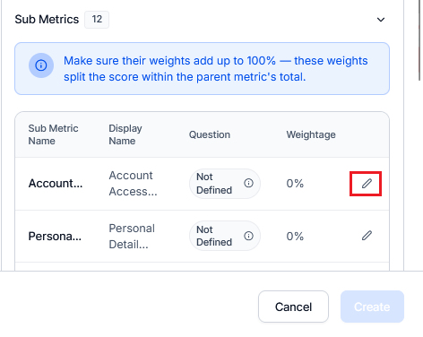

# By AI Agent Metric

The By AI Agent metric lets supervisors configure AI-driven evaluation metrics that intelligently assess multiple aspects of a conversation using agents hosted on the Agent Platform. This metric type introduces a two-level structure, a parent metric that contains multiple sub-metrics, each with its own evaluation question, weight, and adherence logic.

With this setup, a single agentic evaluation call can analyze several aspects of a conversation, returning structured responses and justifications for each sub-metric.

## When to Use By AI Agent Metric

Use this metric type for evaluation scenarios that require:

* **Multi-Dimensional Assessments**: Evaluate several facets (sub-metrics) under one parent metric.

* **Autonomous AI Analysis**: Leverage AI agents to interpret, reason, and assess interactions using contextual understanding.

* **Weighted Evaluations**: Assign different weight to sub-metrics to prioritize specific aspects.

* **Efficient Execution**: Reduce redundant API calls by evaluating multiple sub-metrics within one agentic request.

* **Seamless Configuration**: Select agentic apps directly from the same workspace without entering endpoint URLs.

## Prerequisites

Ensure the following before creating a By AI Agent metric:

* You have access to Quality AI and Agent Platform.

* The same workspace is available across both platforms.

* You have access permissions to view and deploy agentic apps.

* The By AI Agent Metric feature is enabled for your workspace account.

* You have configured at least one agentic app on the Agent Platform with the required response structure.

    * If your workspace has no configured agentic app, the Agent App dropdown shows no options during metric configuration.

    * If the agentic app's response structure does not match the required contract, the Test Connection fails, and blocks you from proceeding with metric configuration.

## Configure By AI Agent Metric

### Step 1: Navigate to Metric Configuration

1. Navigate to **Quality AI > Configure > Evaluation Forms> Evaluation Metrics**.

1. Click **+ New Evaluation Metric**.

1. From the **Evaluation Metrics Measurement Type** dropdown, select **By AI Agent**.   


### Step 2: Create the Parent Metric

1. Enter a descriptive **Name** for the future reference of this metric. For example, compliance disclosure.  

1. Select the **Language** from the dropdown for the AI agent's evaluation process.   


### Step 3: Select the Agentic App

1. In the **Agent App** dropdown, choose from the list of agentic apps available in the same workspace.

1. Choose the Environment you want to use (for example, Draft, Version 1, Version 2).

### Step 4: Test Connection and Fetch Sub-Metrics

1. Select the app and environment.

1. Select **Test Connection**.

1. The system sends a test call to the selected app and retrieves the available sub-metrics for configuration.

1. The retrieved sub-metrics appear under the parent metric with editable fields for customization.  


### Step 5: Configure Sub-Metrics

After a successful connection, the system displays all sub-metrics provided by the agentic app along with their reference names.     


You can configure each sub-metric individually by selecting **Edit** next to the **Weightage** column. This opens a full-screen configuration panel where you can define the following:

| Field             | Description                                                                  |
|-------------------|------------------------------------------------------------------------------|
| **Display Name**      | Label for the sub-metric                                                     |
| **Question**          | The evaluation question for this sub-metric                                  |
| **Positive Weightage**| Assign the positive weight when the criterion is met                          |
| **Negative Weightage**| Assign the negative weight when the criterion is not met                      |
| **Fatal Error**       | Toggle this key if failing this sub-metric must mark the entire interaction as a critical failure |


When you configure all the details, select **Create** to save the sub-metric for AI Agent evaluation.

## Setting up Response Format

1. Navigate to your AI Agent configuration in the Agent Platform.

1. Locate the Description field.

1. Enter the response format specification as shown in the template below.

## Use Case Example: UDAP Compliance

For financial services compliance (UDAP), a single parent metric can evaluate multiple aspects:

* **Fee Disclosure** (Weight - 25%): Verifies that all fees are clearly explained.

* **Interest Rate Accuracy** (Weight - 30%): Ensures correct rate information.

* **Benefit Explanation** (Weight - 20%): Confirms benefits are thoroughly described.

* **Exclusion Details** (Weight - 15%): Validates that exclusions properly are mentioned.

* **Terms Clarity** (Weight - 10%): Assesses overall clarity of terms.

Each sub-metric is evaluated independently with a single API call, providing detailed  justifications for each aspect.

## Evaluation Flow

At runtime, the evaluation process includes the following actions:

* Only one agentic call is made per parent metric.

* The agent analyzes the conversation and returns structured results for all sub-metrics in a single response.

* Each sub-metric’s adherence, justification, and metadata are automatically extracted and displayed under its parent metric.

## Response Format for Sub-Metrics

The Agent Platform must return responses in the following JSON format to ensure Quality AI can process and display sub-metric results correctly.
 
### Expected Response Format

```js
{
  "botId": "string",
  "accountId": "string",
  "conversationId": "string",
  "agentEvaluation": [
    {
      "PARENTMETRIC_ID_VALUE": {
        "subMetrics": [
          {
            "subMetricId": "string",
            "subMetricName": "string",
            "justification": "string",
            "messageIds": ["array"],
            "timestamps": ["array"],
            "source": "agent | customer",
            "isQualified": "YES | NO | NA",
            "failureReason": "string"
          }
        ]
      }
    }
  ]
}

```

### Sample Response from Agent Platform

```js
{
  "botId": "bot_001",
  "accountId": "account_001",
  "conversationId": "conv_001",
  "agentEvaluation": [
    {
      "eval_001": {
        "subMetrics": [
          {
            "subMetricId": "sm_001",
            "subMetricName": "Loan Inquiry Identification",
            "justification": "Agent correctly identified the customer's loan-related query.",
            "messageIds": ["msg_001"],
            "timestamps": ["2025-10-17T10:00:00Z"],
            "source": "agent",
            "isQualified": "YES",
            "failureReason": ""
          },
          {
            "subMetricId": "sm_002",
            "subMetricName": "Loan Eligibility Explanation",
            "justification": "Agent provided some loan eligibility information.",
            "messageIds": ["msg_002", "msg_004"],
            "timestamps": ["2025-10-17T10:00:10Z", "2025-10-17T10:00:35Z"],
            "source": "agent",
            "isQualified": "YES",
            "failureReason": ""
          },
          {
            "subMetricId": "sm_003",
            "subMetricName": "Repayment Plan Guidance",
            "justification": "Agent provided the available service range.",
            "messageIds": ["msg_006"],
            "timestamps": ["2025-10-17T10:00:55Z"],
            "source": "agent",
            "isQualified": "YES",
            "failureReason": ""
          }
        ]
      }
    }
  ]
}

```
