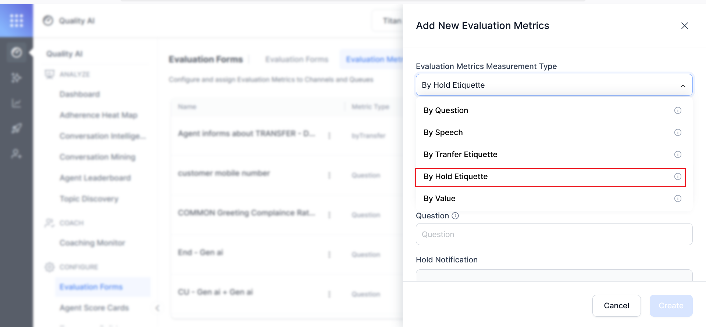
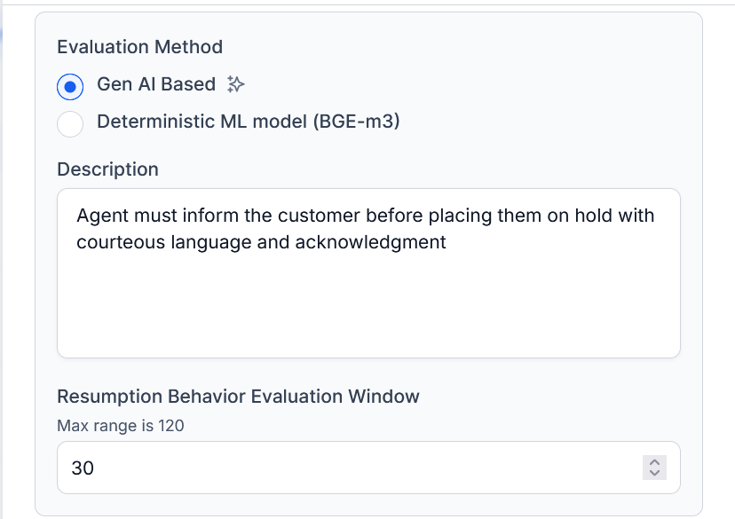
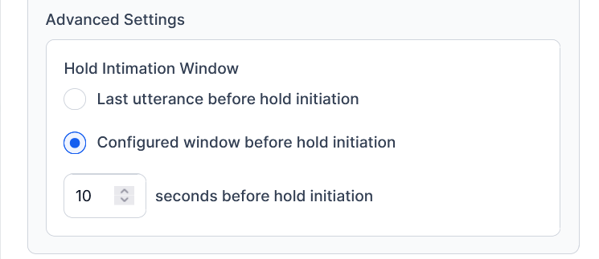
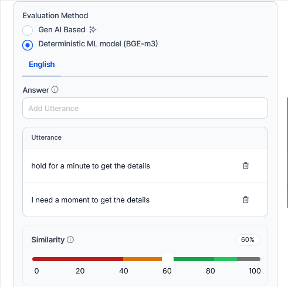

# By Hold Etiquette Metric

The Hold Etiquette Evaluation Metric enables the automated, scalable assessment of how agents manage hold scenarios in voice interactions. Verifies all conversations to ensure agents follow proper etiquette, such as informing customers before placing them on hold, managing hold time appropriately, and resuming the conversations clearly and courteously. This helps maintain consistent service standards, supports compliance, and guides targeted coaching for agents. 

It supports GenAI-based and Deterministic ML-based evaluation methods, integrates with telephony systems for precise event tracking, and provides weighted scoring for customized quality evaluation. The metric applies exclusively to voice interactions. 

## Key Aspects

* **Automated & Consistent Evaluation**: Automatically scores every hold instance to enforce standard hold etiquette and reduce manual effort.

* **AI-Driven Insights**: Uses GenAI or deterministic ML models to assess hold notifications, duration compliance, and resumption behavior.

* **Precision & Transparency**: Integrates with telephony systems for millisecond-accurate event tracking and provides a full audit trail with visual timelines and AI justifications.

* **Customer Experience & Coaching**: Identifies poor hold management to minimize frustration and supports targeted agent coaching.

* **Multi-language Configuration**: Supports all application-enabled languages, allowing global deployment.

## When to Use This Metric

Use the By Hold Etiquette metric when:

* You want to automate evaluation across all voice interactions.

* You want to ensure agents consistently follow hold protocols.

* You need to identify and coach agents on poor hold behavior.

* You want a clear audit trail for regulatory review.

## How It Works 

Checks whether customer hold times meet established service standards. Each hold instance in a call is independently evaluated across three configurable aspects:

* **Mandatory Hold Notification (mandatory)**: Confirms whether the agent courteously informed the customer before initiating a hold.

* **Hold Duration Compliance (optional)**: Checks that the customer was kept on hold within acceptable limits. 

* **Call Resumption Behavior (optional)**: Evaluates whether the agent resumed the conversation appropriately after the hold.

The system is integrated with telephony data for millisecond-accurate tracking of hold events and uses AI or deterministic ML models to interpret agent utterances. It reviews 100% of voice conversations, applying weighted scoring to each hold event for consistent quality assurance, compliance monitoring, and coaching insights.

!!! note

    * Applicable only to voice channel interactions.
    
    * Allows you to add one Hold Etiquette metric per evaluation form. 

    * Each enabled aspect contributes to the overall Hold Etiquette score, calculated per hold instance.

    * The metric is marked as "Not Applicable" if no hold events are detected in that conversation.

# Metric Setup

## Create By Hold Etiquette Metric

To create the By Hold Etiquette metric, configure the following:

1. Navigate to **Quality AI** > **Configure** > **Evaluation Forms** > **Evaluation Metrics**.

1. Click **+ New Evaluation Metric** to select a metric category.

1. Define the Basic Configuration of the Hold Etiquette metric**:

    * From the **Evaluation Metrics Measurement Type** dropdown, select **By Hold Etiquette**.    
     
        
    * Provide a descriptive metric **Name** (for example, Holding Customer for a long time).
 
    * Select applicable **Languages** from the dropdown to which this metric applies. 

        * You must select one language for the metric configuration.

        * You can add/remove languages dynamically.

    * Define an evaluation **Question** that clarifies what the evaluation metric measures for each hold instance during agent-customer interactions. For example: "Did the agent inform the customer before placing them on hold?"  
     

1. Choose a **Hold Notification** assessment to verify whether agents properly informed customers before placing them on hold. 

    * **Evaluation Method**: Choose a method (Gen AI-based or Deterministic ML model). 

        * **Gen AI-Based Method (LLM-based)**: Uses generative AI (flexible, contextual understanding of language) to evaluate whether the agent’s speech meets defined etiquette.

            * **Call Resumption**: In the **Description**, enter a customizable definition of expected hold behavior (for example, the agent must inform the customer before placing them on hold, using courteous language and acknowledgement). 

            * **Resumption Behavior Evaluation Window**: Define the time period after a hold ends (for example, within 10 seconds) after which the resumption behavior of an agent is assessed.    
             

            * **Advanced Settings**: Select a hold initiation option to define the time frame for hold notification. The Gen AI evaluates whether agent utterances meet your description criteria.

                * **Last utterance before hold initiation**: Select this to evaluate only the final statement before the hold. In this, silences or dead air before holds are automatically excluded from evaluation. 

                * **Configured window before hold initiation**: Select this to specify a custom time in the notification window (for example, 1-100 seconds) before the hold during which the notification is valid.   
                    
 
        * **Deterministic ML Method**: Uses a machine learning model with embedding-based phrase matching against a curated list of sample utterances. For example, “Please hold for a moment while I find that information”.
        
            !!! note

                This uses BGE-m3 embeddings to compare agent utterances to sample phrases and configurable similarity thresholds.

            * **Answer**: Add the sample utterances if no utterances are found. 
                * You can add multiple utterances for each configured language to notify customers before putting them on hold. Each language maintains its own distinct set of utterances. For example, “I need a moment to get the details. May I put you on hold?”. 

                * You can check/uncheck utterance checkboxes to include or exclude them from the sample list.

                * You can add and delete the required utterances as needed. 

                * Select the similar utterances to include them from the sample list, and click **Add**.  
                    

            * **Similarity**: Set the minimum**Similarity** threshold score (0-100%, default 60%) that qualifies an agent’s utterance as a match to the sample utterances (indicates how closely the agent has provided a proper hold notification based on similarity to the provided training samples).
  
                * **Orange**: Below threshold (0-60%)

                * **Green**: Above threshold (60-100%)

                * **Default**: 60%

                * **Range**: 0-100% in 1% increments                    
                  
                
1. Specify the **Advanced Settings** time frame to define when to consider the hold intimation, or when the agent must notify customers. 

    * **Hold Intimation Window:** Specify the duration (in seconds) before hold initiation within which the agent must provide the hold notification (for example, 10s, 30s, 60s).

        * **Last utterance before hold initiation**: Select this to evaluate only the final statement before the hold. 

        * **Configured window before hold initiation**: Define a custom detection window before placing them on hold. The agent’s utterance within this window is valid for compliance. Configure the window, 1–100 seconds. The agent must define it within a reasonable timeframe.

        !!! note

            * If the agent provides notification within the configured window, the metric returns a Pass.
            
            * If no valid utterance is found or it falls outside the window, the metric returns a Fail. 

            * Silences or dead air before hold are automatically excluded from evaluation. 

6. Configure the **Sub-Criteria** to assess agent behavior related to call hold events. The configuration varies depending on the selected evaluation method (Gen AI-based or Deterministic ML-based). 

    * **Hold Duration Compliance (Optional)**: 
        * Toggle On the **Hold Duration Compliance** to enable or disable duration-based evaluation.

        * Enter the **Maximum Acceptable Hold Duration** (1-300 seconds, default: 30 seconds), which represents the maximum time an agent can place a customer on hold before being marked non-compliant.

    * **Call Resumption Assessment (Optional):** 
        * Toggle on the **Call Resumption Assessment **to evaluate post-hold agent behavior. This evaluates: 
            * How effectively the agent resumes the conversation after a hold.
            * Whether the agent acknowledges the delay, reconnects context, and proceeds with the solution smoothly. 

1. Choose an **Evaluation method** (Gen AI-based or Deterministic ML model) when Call Resumption Assessment is enabled. 
. 
    * **Gen AI**: Select this to use large-language-model reasoning to semantically analyze the agent’s communication behavior based on configurable time windows and defined behavior expectations.

        * In the **Description** field, define expected resumption behavior. For example, "Agent smoothly resumes the conversation, acknowledges the wait time, and proceeds with relevant information".

        * Enter the **Resumption Behavior Evaluation Window** by specifying the time to analyze utterances (range 1 – 120 seconds; default 10 seconds) after the hold ends.

        * Assign weight (**Sub Criteria Weightage**) percentages to each active sub-criterion. The total across all sub-criteria must equal 100%. Only editable if this feature is enabled.

            * **Sub Criteria Weightage** 
                * **Hold Notification (Positive Weightage): **Enter the weight that the Hold Notification aspect contributes to the total Hold Etiquette score. This indicates the agent’s courtesy and compliance in notifying customers before placing them on hold.

                * **Hold Duration (Positive Weightage): **Enter the weight contribution of compliance with hold time limits.

                * **Call Resumption (Positive Weightage): **Enter the weight contribution of smooth and contextual post-hold resumption.

    * **Deterministic ML:** Select this to use the BGE-m3 embedding model to match agent utterances against predefined samples. It produces binary results (match/no match) based on configurable similarity thresholds.

        * In the **Answers **field, based on the selected **Languages **configured, add sample utterances that agents are expected to use. For example, “I need a moment to get the details. May I put you on hold?” If no utterance is found in the window, it's considered an automatic fail or not applicable. 

            * Click **+ Add Utterance** to enter new reference utterances. Toggle On/Off to include or exclude them from the active sample list.

        * Set the **Similarity **threshold (0–100%) to determine how closely the agent’s actual utterance must match the sample list.

        * Set the **Resumption Behavior Evaluation Window **to define the timeframe after the hold ends for evaluating resumption behavior (range 1 – 120 seconds; default 10 seconds). 

            * **Sub Criteria Weightage** 
                * **Hold Notification (Positive Weightage): **Enter the scoring weight for detecting Hold Notification. This evaluates whether the agent’s utterance matched a trained “hold” phrase within the similarity threshold.

                * **Hold Duration  (Positive Weightage):** Enter the scoring weight for Hold Duration compliance. This evaluates whether the actual hold time remained within the configured limit.

                * **Call Resumption (Positive Weightage): **Enter the scoring weight for Call Resumption**. **This evaluates whether the agent resumed appropriately after lifting the hold.

                    
8. Click **Create** (enabled only when all validation checks pass). 

    **Note**: The **Create **button remains disabled until aspect weights total exactly 100%. If the save is successful, then this metric becomes active and applicable for evaluation. The configured metric appears in the Evaluation Metrics dashboard list.

### Evaluation Scoring Logic

* Each active sub-criterion contributes to the total Hold Etiquette score based on its assigned weight.

* Weights across sub-criteria (Hold Notification, Hold Duration, Call Resumption) must total 100%.

### Binary Pass/Fail Logic (Deterministic ML)**:

* **Pass:** Duration ≤ configured threshold

* **Fail:** Duration > configured threshold

**Example***:* Agents who exceeded the maximum hold duration are marked non-compliant. 

### Outcome Scoring (GenAI / Deterministic ML):

* **Yes:** Agent’s utterance or behavior matches expected criteria. \

* **No:** No match or missing behavior detected within the evaluation window. 

### **Weightage Scoring System**

<table>
  <tr>
   <td><strong>Sub-Criterion</strong>
   </td>
   <td><strong>Example Weight</strong>
   </td>
   <td><strong>Description</strong>
   </td>
  </tr>
  <tr>
   <td>Hold Notification
   </td>
   <td>40%
   </td>
   <td>Courtesy and pre-hold notification compliance.
   </td>
  </tr>
  <tr>
   <td>Hold Duration
   </td>
   <td>30%
   </td>
   <td>Compliance with the maximum allowed hold time.
   </td>
  </tr>
  <tr>
   <td>Call Resumption
   </td>
   <td>30%
   </td>
   <td>Smoothness and clarity of post-hold interaction.
   </td>
  </tr>
</table>

**Calculation Example**:

**Instance Score=**

* (Hold Notification Result × 40%)
* + (Hold Duration Result × 30%)
* + (Call Resumption Result × 30%) 

**Deterministic ML Scoring**

Each sub-criterion is binary:

* 1 = Pass \

* 0 = Fail

**Example: \
**If Hold Notification (40%) and Call Resumption (30%) pass, but Hold Duration (30%) fails:

Total Score = 40% + 30% = 70%

**GenAI Scoring**

For GenAI, each sub-criterion produces a semantic outcome (Yes/No or graded response). \
This outcome is multiplied by its assigned weight to generate a continuous (non-binary) score.

### **Validation and Create**

Before saving:

* Ensure the Metric Name, Question, and Evaluation Method are defined.
* For Deterministic ML, you must add at least one sample utterance.
* Sub-criteria weights must total 100%.