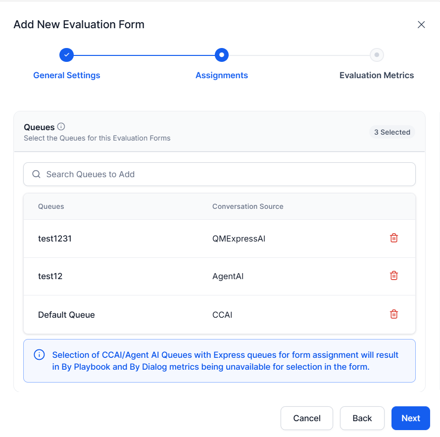
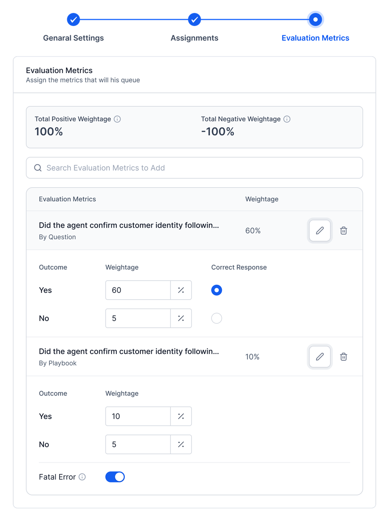
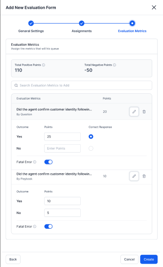

# Evaluation Overview

The Evaluation phase in Quality AI enables QA Managers to create standardized assessments for Voice and Chat interactions. Evaluation forms align scoring with operational goals and promote consistent, compliant evaluations.

Each queue supports one Evaluation Form per channel. Manual Evaluation lets QA Managers mark specific metrics for manual scoring and exclude them from agent attributes and scorecard calculations.

## Key Features and Capabilities

* **Multi-language Support**: Delivers evaluations to different languages with relevant, localized metrics for accurate global team assessments.

* **Flexible Scoring Types**: Supports percentage-based scoring for simpler forms and points-based scoring for complex evaluations.

* **Advanced Scoring Options**: Enables negative scoring, fatal criteria, and pass-score thresholds to refine evaluations and highlight critical issues.

* **Channel-Specific Configuration**: Supports customization of evaluation settings for Voice and Chat channels.

* **Queue and Channel Assignment**: Assigns evaluation forms to specific queues and channels.

* **AutoQA and Manual Audits**: Enables AutoQA scoring alongside manual audit-based assessments for comprehensive coverage.

## Evaluation Forms Structure

Quality AI divides evaluation configuration into two core components: 

* **Evaluation Forms**: Defines the overall scoring structure, scoring type, language, channel, pass threshold, and queue assignments.

* **Evaluation Metrics**: Defines the individual quality parameters used to measure agent performance.

### How It Works 

QA Managers create evaluation forms with weighted metrics totaling 100% to measure agent performance objectively. The system assigns these forms to specific queues and channels for auditing and AutoQA scoring.

This alignment ensures consistent audits, clear insights, and improved customer experience.

## Access Evaluation Forms

Navigate to **Quality AI** > **CONFIGURE** > **Evaluation Forms** to view and manage evaluation forms.    

## Evaluation Forms Elements 

The Evaluation Forms displays the following elements:

* **Name**: Shows the name of the evaluation form.

* **Description**: Shows a short description of the form.

* **Queues**: Shows the forms assigned and not assigned in the queue.

* **Channel**: Shows the assigned form channel mode (voice or chat interaction).  

* **Created By**: Shows the form creator's name.

* **Pass Score**: Shows the minimum score that an agent needs to pass for the specified assigned forms and channels. 

* **Status**: Enables or disables scoring for the individual Evaluation Form (You must enable the form to start scoring). 

* **Search**: Provides a quick search option to view and update the Evaluation Forms by name. 

    !!! Note

        Enable Auto QA in the Quality AI Settings before creating evaluation forms.

## Create a New Evaluation Form

Steps to create a new evaluation form:  

1. Select the **Evaluation Forms** tab.   

2. Select the **+ New Evaluation Forms** displayed in the upper-right corner.    

### General Settings Configuration

This section configures the general settings for the New Evaluation Form. 

Steps to configure general settings:

1. Enter a **Name** and **Description** (optional).

2. Select a **Language** and a **Channel** type (**Voice** or **Chat**). The selected channel determines which metrics are available (Voice or Chat-specific).  

   * **Chat**: Displays only **Chat-relevant** metrics. Excludes speech-based and Voice-specific Playbook metrics.

   * **Voice**: Displays all applicable **Voice-related** metrics, including speech and Playbook metrics.    

3. Select a **Scoring Type** (**Percentage** or **Points**). 
 
6. Set the minimum **Pass Score** percentage for the agent, regardless of the scoring system, to maintain consistent evaluation standards across all forms.     

7. Select **Next**.  

### Assignments Configuration

This section lets you assign available queues to an evaluation form.

1. Use the **Search** bar to find the queues that you want to assign.
1. Select the required queues.
1. Select **Add Queues** to assign them to the evaluation form.
1. You can add or remove assignments at any time as needed.  
   

1. Select **Next**.  

    !!! Note

         You can assign only one evaluation form to each queue in the **Chat** and **Voice** channels.   
    
### Evaluation Metrics Configuration

Use this section to add and configure evaluation metrics for the selected evaluation form. The system applies the same configuration flow for both Percentage-Based and Points-Based scoring. Only the weight type (percentage or points) differs. The system displays only metrics supported for the selected languages and channel.        

 Steps to configure evaluation metrics:

1. Use the Search bar to find and add the available evaluation metrics that you want to include in the form.    

1. Select **Edit** to configure each metric.

1. Choose the correct **Response** that defines what constitutes a match for this metric.

1. Assign a metric **Weightage** for according to the form’s scoring type selected.
    
    * **Percentage**: Enter a percentage weight.   
    

    * **Points**: Enter a points value.   
    

    * **Outcome** (Percentage or Points): A matching agent response (such as greeting a customer) earns positive weight; a non-matching response earns zero or negative weight.

1. Toggle on **Fatal Error** for this metric if it is compliance-critical (optional).

1. Select **Create** to finalize the form creation. 

### Scoring Type Selection

   This scoring type selection determines how you assign weights, percentage or points to evaluation metrics. 

   * **Percentage-Based**: 

      * Assign metric weights as percentages.
      * Metric weight must equal 100%.
      * Best for smaller forms (fewer than 20 metrics).

   * **Points-Based**: 

      * Metric weights as points with no upper limit on total positive points. 
      * Total negative points can’t exceed total positive points.
      * Recommended for complex forms (20+ metrics; ideal for 40+).
      * Supports Manual Evaluation metrics.
        
      
Whenever you try to switch from an existing scoring type, the system shows a warning pop-up to confirm the following: 

   * Changing the scoring type requires reconfiguring all metric weights. 
   * If metrics exist, you must provide a complete new configuration.

### Language Selection Behavior

* Evaluation forms support multi-language selection.  

* The system displays only **By-Question** metrics configured for all selected languages. 

* The system applies an **AND** condition across the selected languages. For example, if you select **English** and **Dutch**, the dropdown shows only metrics available in both languages.

### Language Selection Behavior

* Evaluation forms support multi-language selection. 
* The system displays only **By-Question** metrics configured for all selected languages. 
* The system applies an **AND** condition across selected languages. For example, if **English** and **Dutch** are selected, the dropdown shows only metrics available in both languages.

### Points-Based Scoring Formula  

**Kore Evaluation Score** = [∑(Myi × Wyi) - ∑(Mni × Wni) / ∑(Wyi)] × 100

Where: 

* **Myi, Wyi** = Adhered metrics and positive points.
* **Mni, Wni** = Non-adhered metrics and negative points.

### Scoring Logic

Calculate the conversation score using the selected type: **Percentage** (weighted average) or **Points** (normalized), cap at –100 if negatives exceed positives, and compare to the Pass Score (≥ Pass = Pass, &lt; Pass = Fail). A fatal error sets the score to 0.

### Scoring Rules Comparison

| **Category**                  | **Percentage‑Based Configuration**                                                                                                                                        | **Points‑Based Configuration**                                                                                                                                                                   |
| ----------------------------- | ------------------------------------------------------------------------------------------------------------------------------------------------------------------------- | ------------------------------------------------------------------------------------------------------------------------------------------------------------------------------------------------ |
| **Configuration Type**        | Assign weights as percentages.                                                                                                                                            | Assign weights as points.                                                                                                                                                                        |
| **Weight Assignment**         | Enter percentage values for **Yes** and **No** outcomes.                                                                                                                  | Enter point values for **Yes** and **No** outcomes.                                                                                                                                              |
| **Weight Validation Rules**   | If Correct Response = Yes →  Only positive percentages are allowed for Yes; zero or negative percentages are allowed for No.  If Correct Response = No → Only positive percentages are allowed for No; zero or negative percentages are allowed for Yes.                        | If Correct Response = Yes → positive points for Yes; zero/negative points for No.   If Correct Response = No → positive points for No; zero/negative points for Yes.                            |
| **Validation Requirements**   | Total positive weight must equal 100%. Negative weight allowed within 100% structure. Only metrics valid for selected language & channel appear.                    | No fixed maximum on total positive points. Total negative points ≤ total positive points. Only metrics valid for selected language & channel appear. Manual Evaluation metrics allowed. |
| **Outcome Logic**             | Matching correct response earns assigned percentage; incorrect earns zero/negative; final score 0–100%.                                                                   | Matching correct response earns assigned points; incorrect earns zero/negative; points normalized to 0–100.                                                                                      |
| **Fatal Error Configuration** | Works identically for both scoring systems: if a fatal metric fails, the final score becomes 0, other metric scores are ignored, and the interaction fails automatically. |                                                                                                                                                                                                  |

### Scoring Systems Comparison

| **Feature**                  | **Percentage‑Based (Restrictive)**                            | **Points‑Based (Flexible)**                                               |
| ---------------------------- | ------------------------------------------------------------- | ------------------------------------------------------------------------- |
| **Best For**                 | Smaller forms (fewer than ~20 metrics)                        | Larger forms (20+ metrics)                                                |
| **Total Weight / Scale**     | Must equal 100%                                               | No fixed maximum                                                          |
| **Scalability**              | Limited distribution due to 100% cap                          | High flexibility regardless of number of metrics                          |
| **Weight per Metric**        | Decreases as metrics increase (for example, 40 metrics ~ ~2.5% each) | Assign any point value based on importance                                |
| **Weight Precision**         | May require fractional values (for example, 2.5%)                    | Uses whole‑number allocations (e.g., 50 points for critical, 5 for minor) |
| **Negative Scoring Control** | Managed within 100% structure                                 | Negative points allowed but can’t exceed total positive points            |
| **Flexibility**              | Fixed distribution (restricted by 100%)                       | Highly flexible distribution                                              |
| **Final Evaluation Score**   | Direct percentage (0–100)                                     | Normalized to percentage (0–100)                                          |

### Managing Evaluation Forms

This section guides you through editing and updating the existing evaluation forms.

#### Edit Existing Evaluation Forms

Steps to edit the existing evaluation forms:

1. Click the three-dot (⋮) menu to Edit or Delete to update the required details.
1. Select Update. 

### Switching Scoring Systems 

Changing the scoring type clears all existing weights and requires you to reconfigure metrics. Make sure the percentage totals 100% and points meet validation rules.

### Language Configuration Warnings

Changes to language settings can affect speech recognition accuracy and metric results.

#### Metric Deletion Warnings

This section explains the warnings and prerequisites before deleting a metric. If the metric is used in any evaluation form, the system displays a warning that must be resolved before deletion.

* If the metric is used in any evaluation form, the system displays a warning message.
* Remove the metric from all associated evaluation forms before deletion.
* If any attributes are linked to the metric, assign those attributes to a different metric before deleting it.
* The system allows you to delete the metric only after you resolve all dependencies.

#### Unsupported Language Error (Form-Level)

This error occurs when you add a new language to a form, but some metrics in the form do not support that language. The system blocks the update because the associated metrics (for example, By Question metrics) do not include the selected language. For example, if a form supports English and **Dutch**, and its metrics support only these languages, adding **Hindi** triggers a warning.

To resolve this, perform the following actions:

1. Review the language configuration for each metric used in the form.
2. Update each metric to support the new language (for example, Hindi).
3. Verify that all required metrics support the language.
4. Add the language to the form after updating all metrics.

#### Metric-Level Language Limitation

This warning appears when you try to use metrics within a form that does not support a language already configured at the form level. For example, the form already includes a language, such as Hindi, but some metrics being added or updated are not configured to support Hindi. 

To resolve this, perform the following actions:

1. Configure the required language (for example, Hindi) and update the metric in the form.
2. Choose a metric that already supports all languages configured in the form.

#### Channel Mode Change Warning

* When you switch to any existing or preconfigured channel modes between **Voice** and **Chat**, a warning message appears related to the specific channel's associated metrics.
* The system automatically deletes speech-based metrics when you switch the channel from Voice to Chat or Chat to Voice. 

    To resolve this, perform the following action:

    * You must update the remaining metrics and adjust their corresponding weights to support proper evaluation. 

    * Select **Update** to save the changes once all updates are complete**.
