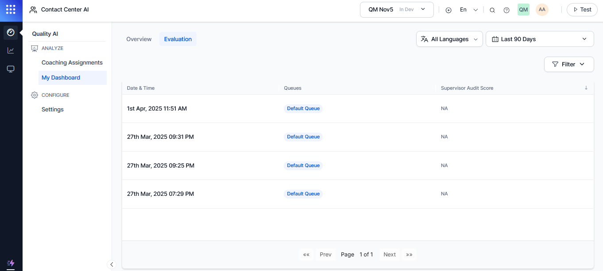
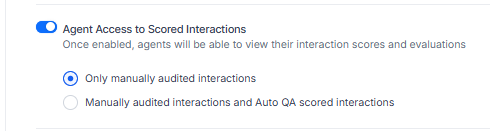
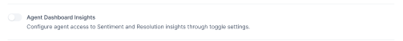

# Quality AI General Settings

The Quality AI General Settings allow you to enhance the performance and compliance of your contact center agents. You can configure agent scorecards, create detailed evaluation forms, and set up bookmarks to highlight key conversation points by enabling specific options within this page. These settings are crucial for maintaining high standards in customer interactions and improving overall service quality.

Supervisors or Administrators can enable or disable auto QA scoring of interactions through the QM settings at the app level. They can also control agent access to interactions, whether only audited interactions or both manually evaluated and Auto QA scored interactions, based on roles and operational procedures. Additionally, they can configure whether agents are allowed to view the names of auditors who scored their interactions, ensuring auditor anonymity under company policies and security requirements.

## Access Quality AI General Settings 

Navigate to **Quality AI** > **CONFIGURE** > **Settings** > **Quality AI General Settings**.   

The Quality AI General Settings include: 

### Auto QA

The Auto QA feature lets you set up Evaluation Forms for automated scoring. When the feature is turned off, automated QA scores are hidden across the entire application and its queues, regardless of whether the user has access to Agent Scorecard and QA functionalities. This also restricts access to features like Conversation Mining, Dashboards, and Evaluation Forms.

#### Enable Auto QA

Steps to enable Auto QA:

1. Expand the **Quality AI General Settings** collapse icon to view the following **Auto QA**.  

2. Enable **Auto QA**.

By enabling this Auto QA option, you can:

* Access features like the Dashboard (Fail Statistics, Performance Monitor), Adherence Heatmap, Conversation Mining, Agent Leaderboard, Coaching Monitor, Evaluation Forms, and Evaluation Metrics. 

* Receive scored interactions even when Conversation Intelligence is disabled.

* Enable Conversation Intelligence without enabling AutoQA.

* Auto QA functions independently of the Conversation Intelligence setting.

3. Select **Save** to save the settings.

!!! Note

    Only the administrator can enable the Auto QA option for agents. By default, the Auto QA toggle remains disabled. When Auto QA is enabled, it provides access to create and configure evaluation forms.
    
When the **Auto QA** feature is enabled, you get the following screen to create and configure evaluation forms.

!!! Note

    When a user with Auto QA permissions turns off the Auto QA toggle in Settings, the Agent Scorecard and bookmarks are disabled, regardless of the user's access to the Agent Scorecard and QA features.

#### Disable Auto QA

Steps to disable Auto QA:

1. Turn off the **Auto QA** toggle.  
2. Select **Confirm** to disable the Auto QA.
3. Select **Save** to save the settings.

!!! Note

    If you disable the Auto QA, the automated QA scoring is disabled across the entire app and all queues within it.
    
### Agent Score Card

This setting enables or disables the agent-level interaction scoring through agent scorecards. By allowing the agent scorecard, you can create and configure evaluation forms to generate automated scores. Users with the relevant permission access can enable or disable this setting. 

#### Enable Agent Score Card

Steps to enable the Agent Score Card:  
1. Expand the **Quality AI General Settings** collapse icon to view the **Agent Score Card**.   

By enabling this Agent Score Card option, you can view features of Agent Leaderboard, Dashboard (Fail Statistics, Performance Monitor, Agent Leaderboard), Coaching Monitor, and Agent Scorecards.

3. Select **Save** to save the settings.

When the **Agent Score Card** is enabled from the **Settings**, you can view the new Agent Scorecard.    

#### Disable Agent Score Card
Steps to disable the Agent Score Card:

1. Turn off the **Agent Score Card** toggle to disable the Agent Scorecard.  

1. Select **Save** to save the settings.

    !!! Note

        If you disable the Agent Scorecard, automated agent scoring is disabled across the entire app and all its queues.

### Bookmarks

This feature lets you use bookmark interactions (conversations, including calls or messages) in different collections (tags) for easy reference later. When created, these collections are added to Conversation Mining.

#### Enable Bookmarks
Steps to Add Bookmarks:

1. Expand the **Quality AI General Settings** collapse icon to view the following **Bookmarks** option.  

2. Enable the **Bookmarks** toggle option to add a new bookmark. Enabling this option lets you view features, such as in **Conversation Mining** (Interactions) and **Dashboard** > **Agent Leaderboard** (Evaluation).

3. Select the **Add Bookmark**. The following new **Bookmarks** row appears.  

4. Enter the **Bookmarks** name for the assigned interactions.
5. Add **Color** for the added bookmarks.
6. Select **Save** to save the settings.

#### Disable Bookmarks
Steps to disable Bookmarks:

1. Turn off the **Bookmarks** toggle.   
2. Select **Confirm** to disable the bookmark.
3. Select **Save** to save the settings.

!!! Note
    
    Deleting any created bookmarks removes only the bookmark itself, not the associated relevant interactions.

## Agent Access to Scored Interactions

This feature allows agents to view their supervisor-audited scores to assess and improve their performance and take action accordingly. By default, this feature is disabled. When enabled, this option adds a new tab next to the **Overview** tab on the agent dashboard. 

Agents can use it to view scored interactions audited by a supervisor, accessible via **My Dashboard** > **Overview** > **Evaluation**.     

Agent Access to Scored Interactions has the following two options: 

1. **Only manually audited interactions**: This interaction only allows you to view the scored interactions the supervisor audited.
     
2. **Manually audited interactions and Auto QA scored interactions**: This selected interaction allows you to view both Auto QA–scored interactions and the interactions the supervisor audited.  

 
Refer to the [Available Interactions Based on Access Settings:octicons-arrow-right-24:](../analyze/my-dashboard-agent-view.md#available-interactions-based-on-access-settings).

### Agent Dashboard Insights

Controls whether agents can view Sentiment Insights and Resolution Insights on their Agent Dashboard at the app level.

* **When Disabled (default)**: Agents cannot view sentiment charts, resolution metrics, or topic-level insights. Their dashboard shows only standard information such as coaching assignments, scorecards, and performance data. 

* **When Enabled**: Agents gain access to additional insights, including:

    * Sentiment trends
    * Topic-level sentiment distribution
    * Resolution rates
    * Drill-down metrics    
    

    These insights match those available to supervisors but apply only to the agent’s own conversations and settings.

### AI Justification and Evidence

When this setting is enabled, agents can view AI-generated justifications and supporting evidence for each question. These details are shown by question, by value, and by AI Agent metric type, helping agents understand how the AI arrived at specific scores or evaluations.

### Audit Settings

The Audit settings have the following two options: 

1. **Allow agents to view AI-generated emotions and sentiment insights**: This allows agents to view the emotional indicators and sentiment scores generated by the AI for each interaction. These insights help agents understand customer tone, identify potential issues, and improve the accuracy of their evaluations. When disabled, agents cannot have access to AI-generated emotional or sentiment data in the audit view.

2. **Hide Auditor Details for Agent**: When this setting is enabled, supervisors can hide auditor identity details from agents who are being evaluated. This helps maintain privacy and reduces potential bias by preventing agents from seeing who performed the audit.

When enabled, agents see the **Anonymous** name instead of the auditor's name for security purposes. 

### Manual Audit

This feature allows supervisors to select additional metric types for comprehensive manual quality evaluations.

#### Audit Speech Metrics

**Purpose**: Provides comprehensive speech analysis capabilities for quality assurance and agent development.

* If **By Speech** is enabled, auditors can input responses for each speech metric (for example, clarity, tone, pace).

* If **By Playbook** is enabled:

    * For **By Step**: Show each step and let the auditor input responses step-wise.

    * For **the entire Playbook**: Show consolidated evaluation interface.

* All tabs support radio buttons or input fields for auditor responses.

#### Audit Playbook Metrics

Evaluates agent adherence to established conversation playbooks and structured interaction protocols. enables the evaluation of speech-related performance indicators during audits.

**For Non-Audited Interactions**

* Agents can only view a non-editable single status:
    * Executed
    * Not Executed
    * Not Applicable

**For Manually Audited Interactions**

* The agent can view only:
    * Non-selected radio buttons
    * The supervisor's selected response highlighted
