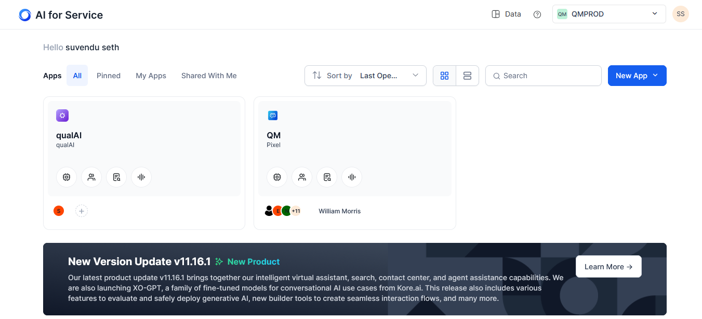
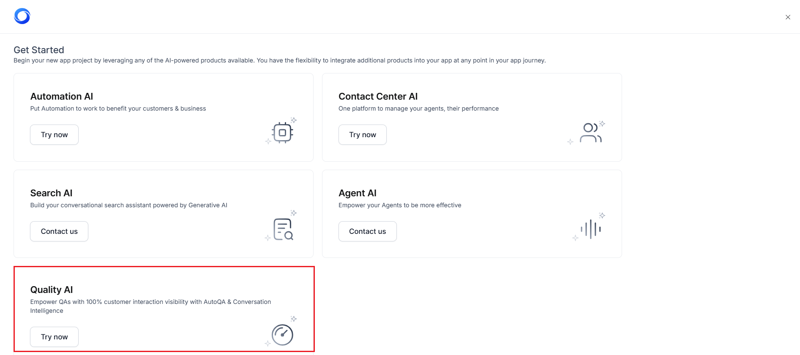
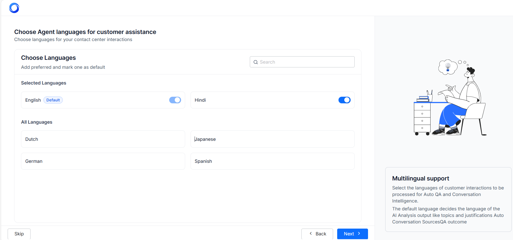
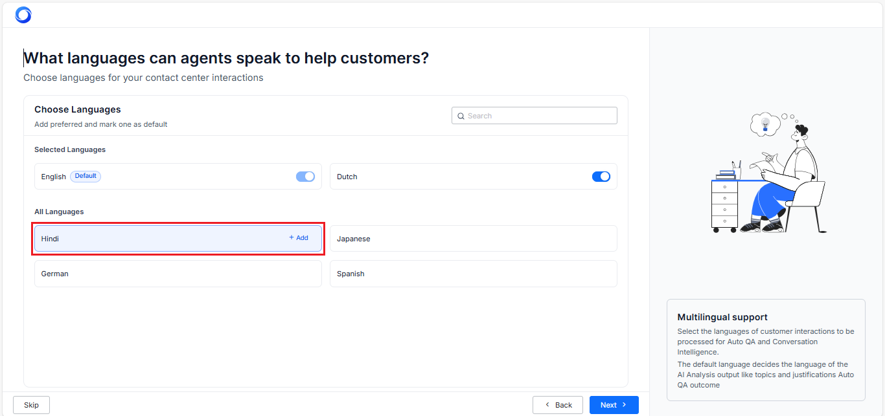
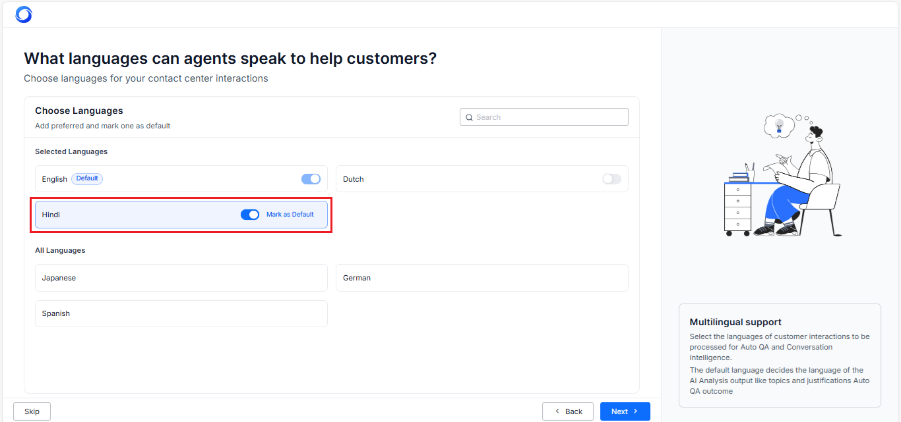
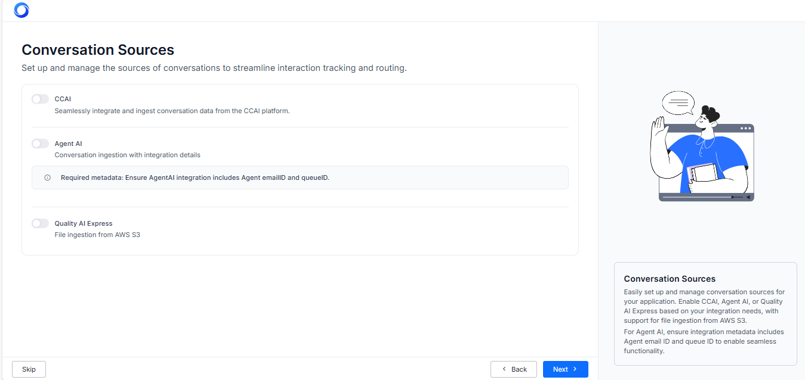
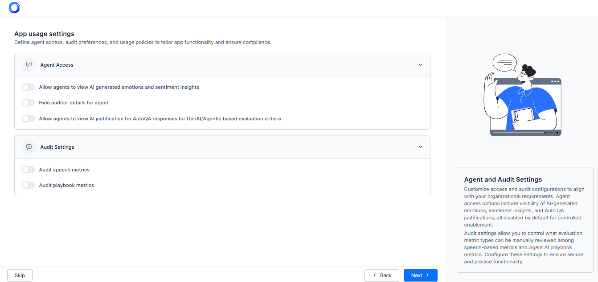
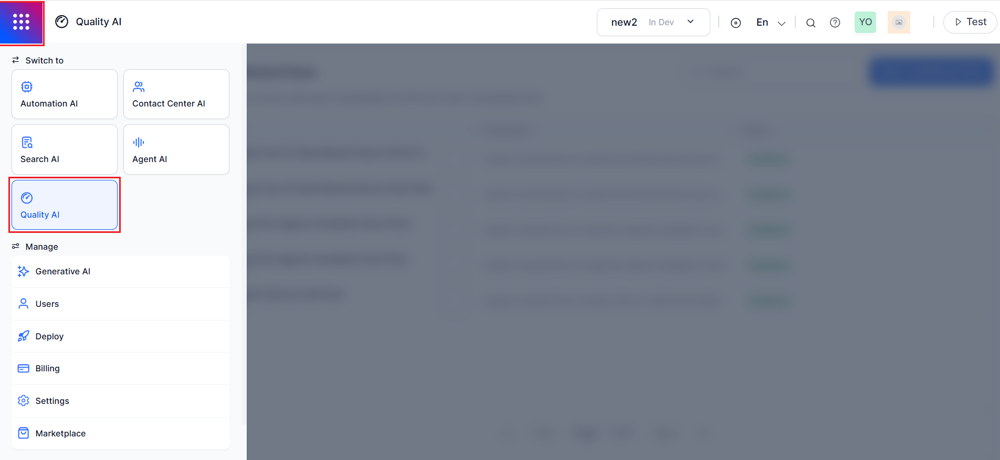
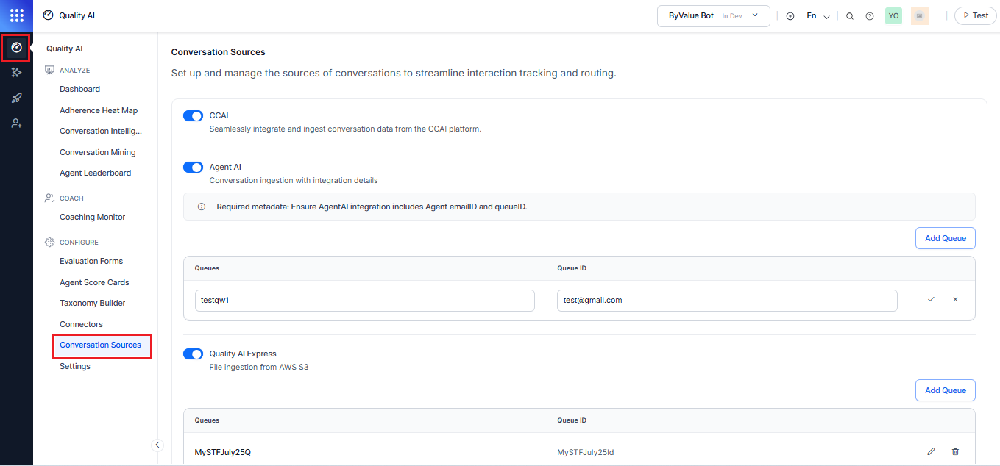
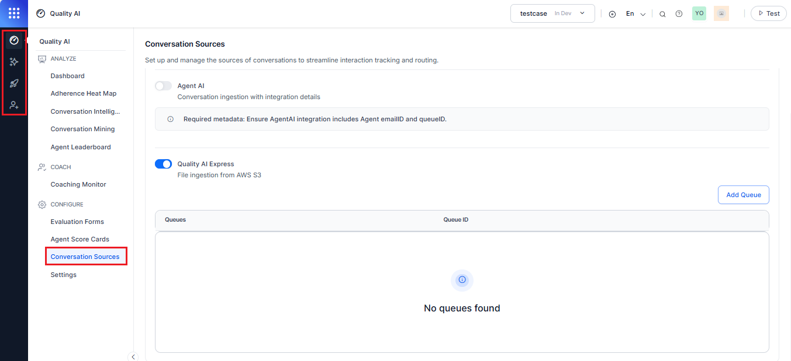

# Quality AI Onboarding Guide

## Overview

Quality AI is an advanced analytics platform that evaluates post-interaction customer conversations to enhance agent performance and improve the overall customer experience.

This guide walks you through the onboarding journey, from account access to application setup and configuration.

## Before You Start

Make sure you have the following prerequisites:

* Administrator access to your AI for Service (XO Platform) account.

* Admin-level credentials for the workspace.

* Enable Quality AI at the workspace level using the public API.

* Selection of a deployment mode.

## Conversation Sources

Quality AI supports three conversation sources:

1. **Standalone (Quality AI Express)**

    * Integrates with any CCaaS platform via file transfer-based ingestion (for example, AWS S3).

1. **Integrated with Agent AI**

    * Integrates with third-party desktops through Agent AI.

1. **Bundled with CCAI**
    * Integrates with existing systems for real-time, unified analytics.

        !!! note

            You can access Quality AI as a standalone product via the app switcher and switch or upgrade licenses/conversation sources at any time.

## Onboarding Journey

### Quality AI Application Creation

Steps to create a Quality AI application via the XO platform:

1. Access to the [AI for Service](../../getting-started/accessing-the-platform.md){:target="_blank"}.

1. Log in through **Email** or **SSO** (Google or Office 365). 

1. Sign up for a new account if you do not have the account. [Learn more](../../getting-started/accessing-the-platform.md){:target="_blank"}.  

1. Select the **New App** dropdown located at the upper right corner of the landing page.

1. Click **+ New App**.   

1. Select **Quality AI**.   

    !!! note

        * For new users, the **Get Started** screen displays a **Try now** option to begin onboarding, followed by the Guided Onboarding. 
        
        * For existing users, the **Get Started** screen displays a **Contact us** option to proceed. The subsequent Guided Onboarding steps are skipped, and the user is taken directly to the **Basic Configuration Settings** section.

1. Proceed with the following guided setup steps (in case of a new user).

### Configure Basic Settings

#### Multilingual Support

This includes multilingual support, and the default language is English.

1. Select agent languages for customer assistance and AI-generated output (Topics, Justifications, QA outcomes).

    !!! note

        Configure an LLM in the GenAI section to enable Quality AI features for non-English languages.

1. Select your preferred language to set it as the default for reports.   

    !!! note

        English is the default language, and you cannot edit or remove it.

1. Click **+ Add** to move the selected language into the **Selected Languages** list.  

1. Toggle on any language to **Mark as the Default**.   

    
1. Turn Off the toggle for a selected language in the **Selected Languages** list to remove it from the default language list.   

    !!! warning "Default Language Removal"

        When you remove the default language, the system stops scoring and analyzing in that language. However, it still shows AI-generated insights (such as topics and names) in the default language, no matter how agents or customers communicate.

1. Click **Confirm** to save your language selections.

### Set up and Manage Your Conversation Sources

Configure conversation sources based on your deployment type 

#### For Standalone or Integrated

* Enable **CCAI** or **Agent AI** connections based on the conversation source.

* Configure queue IDs and agent email ID mappings if **Agent AI** is selected.

#### For Standalone or Express

* Enable **Quality AI Express**.

* Configure file upload settings through connectors.

#### Queue Configuration

* Displayed only when using **Agent AI** or **Quality AI Express** deployment mode is selected.

* Add the required queue names and IDs.  

    !!! note

        Ensure the Agent AI integration includes the unique agent email ID and queue ID from the source system for proper processing and routing. Duplicates may lead to routing or processing errors.

#### Conversation Sources Warnings

* **CCAI**: If the CCAI source is disabled, the system does not process incoming interactions from CCAI on a third-party desktop.

* **Agent AI**: If the Agent AI source is disabled, the system does not process incoming interactions from Agent AI on a third-party desktop.

* **Quality AI Express**: If the Quality AI Express source is disabled, the system prevents file-based conversation ingestion.

### Set Application Usage Permissions

This allows you to define agent access, audit preferences, and usage policies to ensure compliance and tailor application functionality.

#### Enable Agent Access

* Allow agents to view AI-generated emotions and sentiment.

* Allow agents to view AI justifications for GenAI-based Auto QA. 

* Hide auditor details from agents.

#### Enable Audit Settings

* Enable auditing (manual review) for:

    * Audit speech-based metrics

    * Audit Agent AI Playbook metrics   
     

        !!! note

            * The system disables access to both **Agent Access** and **Audit Settings** by default. 
        
            * It shows queue configuration only when you select **Agent AI or Quality AI Express**, not **CCAI** alone.

### Go Live with Quality AI

1. Complete all configuration steps.

1. Once configured, **Quality AI** automatically starts processing conversations.

1. Use the workspace **Product Switcher** to access **Quality AI**.    
 

1. Navigate to **Conversation Sources** under the **Configure** section and select the required conversations to enable and streamline your interaction tracking and routing. 
 

    !!! note

        * Use the workspace switcher to manage multiple environments. 
        
        * Through the feature flag, the Quality AI Switcher is controlled.

### Quality AI Left Navigation Workflow

After launch, the following sections appear in the **Quality AI** left menu:

* **Quality AI** (dashboard and analytics).

* **GenAI** (manages LLM configurations).

* **Deploy** (deployment and publishing workflows).

* **User Management** (assign roles and permissions).     
 
