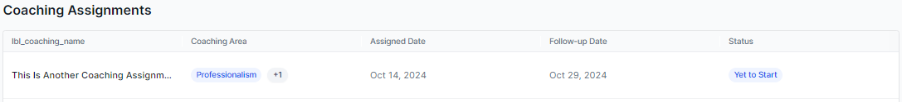

# Agent Dashboard - Supervisor View

This feature provides a personalized dashboard for each agent, accessible by both the agent and their supervisor. It allows supervisors to evaluate performance metrics and coaching opportunities at the individual level. The dashboard displays high-level metrics relevant to the agent, shown in the overview section of the supervisor's Agent Dashboard, and is based on selected periods and channels (voice or chat). It enables supervisors to analyze agent performance, identify areas needing improvement, and create targeted coaching assignments to enhance performance and skills.

You can view the Supervisor dashboard or Agent Leaderboard by navigating to **Contact Center AI** > **Quality AI** > **Dashboard** > **Agent Leaderboard** > **Overview**.

In this, each agent will have a specific dashboard that the agents and their supervisors can access. This dashboard provides high-level metrics to the supervisors.

The supervisor can filter all agent interaction channels (Voice and SMS) by selecting the following date ranges:

* **Today**: All interaction data for this day in the agent’s time zone.

* **Yesterday**: All interaction data of the previous day in the agent’s time zone.

* **Last 7 days**: All interaction data for the previous 7 days (not including today) in the agent’s time zone.

* **Last 28 days**: All interaction data for the previous 28 days (not including today) in the agent’s time zone.

* **Last 90 days**: All interaction data for the previous 90 days (not including today) in the agent’s time zone.

* **Custom Range**: All interaction data from the given date (12:00:00 AM to 11:59:59 PM), in the agent’s time zone, limited to **31** days.

## Overview

This displays the selected agent dashboard metrics, which are calculated for that specific agent for the time selected and for the channel (only voice and chat) selected.  

The overview tab of the supervisor view of the Agent Dashboard which is specific to each agent includes the following:

* **Total Interactions**: This shows the total interactions completed by the agent during the selected time. 

* **Kore Evaluation Score**: This shows the average Kore evaluation score of the agent for the calls they have completed during the selected time.

* **No. of Supervisor Audits**: This shows the total number of manual audits completed for the interactions completed by that agent for the selected time

* **Supervisor Audit Score**: This shows the Average manual audit score for the audited interactions for the selected time.

* **Total Coaching Assignments**: This shows the total number of coaching sessions assigned to the agent over a selected time.

* **No. of Fails**: This shows the total count of scorecard failures for the agent over a selected time.

* **Strongest Attributes**: Shows the top 5 attributes with the highest scores from the scorecards assigned to the agent during the selected time, with each attribute having a score greater than 80, listed in descending order.

* **Opportunity Areas**: Shows the bottom 5 attributes with the lowest scores from the scorecards assigned to the agent during the selected time (the attribute score must be &lt; 80 to be highlighted as an opportunity area).

**Coaching Assignments**

This feature displays all coaching assignments given to an agent as part of the agent dashboard. Supervisors can track performance trends related to scorecards over various periods to assess progress or declines and take necessary actions with coaching assignments.  

The Coaching Assignments include the following items:

* **Agents (Name)**: This shows the name of the Coaching assignment agent.

* **Coaching Area**: This shows all the attributes selected or designated as coaching areas for that assignment.  

* **Assigned Date**: This shows the date that the coaching session was assigned.

* **Follow-up Date**: This shows the assigned date as a follow-up date for that coaching assignment.

* **Status**: This shows three types of status for the coaching assignment, calculated based on the number of interactions opened out of those assigned (including both interactions marked for coaching and best responses) for that assignment as follows:

    * **Start Now**: No interactions clicked through for that assignment. 

        **Note**: This option is only visible to the supervisors.

    * **Yet to start**: Interactions for an assignment are yet to start.

    * **In Progress**: Shows the total number of interactions that have been clicked through for that coaching assignment.

    * **Completed**: All interactions clicked through for that assignment.

For more information on Coaching Assignment, see [Supervisor Dashboard - Supervisor View - Coaching Assignment](https://docs.google.com/document/u/0/d/1yI6u2adhnFNbDL5esdYgpi75WidsCoQc7bXOrfYQ_zc/edit).  

### **Scorecard Trend**

This feature displays an agent's assigned scorecards and allows supervisors to track performance trends over different periods. The scorecard trend widget shows attributes and scoring trends for each scorecard across Daily, Weekly, and Monthly time frames. Supervisors use this information to identify progress or declines and make informed coaching decisions. The agent dashboard includes a tabular scorecard trend widget to facilitate this analysis and scoring trend at an attribute level across the following time ranges (Daily, Weekly, and Monthly).

**Note**: If the administrator or app owner has disabled the Agent Scorecard for a particular agent, then that agent and its Supervisor will not be able to view this feature in the Dashboard. To enable this, the administrator or app owner has to enable it in the Settings.

#### **Avg. Scorecard Score**

From the agent side, the scorecard trend widget shows the average scorecard for the selected time range and the scoring trend at an attribute level across the following time ranges in a tabular view.

When a scorecard is selected, the average score for that agent within the chosen global date range is displayed. If no conversations are made after assigning, then the scorecard does not show any score for that agent. If any conversations exist, then the scorecard is displayed in the dropdown for scorecard trends.

#### **Attributes**

It displays all agent attributes included in the scorecard and the average score for each attribute within the selected date range filter.

The date range selection is done based on the following criteria:

* **Daily**: Last 7 days from the current date.

* **Weekly**: Last 7 weeks from the current week of the year.

* **Monthly**: Last 7 months from the current month.

### **Evaluation**

This allows supervisors to drill down and view specific agents' interactions and the details of evaluations performed in the last selected time period. Supervisors can use these interactions as reference points for coaching to help agents enhance their performance. Based on the reviewed interactions and created bookmarks, supervisors can then assign targeted coaching assignments to the agents. This displays the list of interactions terminated or completed by the agent, with the most recent ones appearing first. This page serves as the starting page for coaching assignment creation.

This Evaluation section has the following interactions listing items:

* **Date**: Shows the date and time that an interaction has started.

* **Actions**: Shows the list of bookmarks assigned to an interaction, which you can filter and assign coaching for later reference.

* **Queues**: Shows the completed queue interaction and its origin.

* **Kore Evaluation Score**: This shows the Kore Evaluation score (Auto QA Score) for the interaction based on the relevant evaluation form.

* **Supervisor Audit Score**: Shows the Supervisor Audited score if the interaction has already been audited or manually evaluated.

* **Sentiment Score**: This shows the system-generated sentiment score for the interaction based on the context of what the customer said in the interaction (keywords and emotions about that topic).

* **Date Range Selection**: This allows you to filter the date range options for agent conversation interactions, with the default setting always showing the last 7 days.

* **Bookmarks**: Allows you to filter the saved bookmark interactions that an agent has handled. This filters only the specific agent's interactions that have been bookmarked for coaching by the supervisor and need to be audited properly. This populates only the bookmarks that are audited in the agent dashboard.

* **Filters**: Allows you to filter the interactions that have been audited based on specific agents for a selected date range.

    The following filtered categories are:

    * **Queues**: Allows you to filter and apply interactions in the queue to assign coaching tasks.  
    
       

    * **Audit Status**: This allows you to filter and apply audited and unaudited interactions separately before applying them for coaching assignments. 
    
       

    * **Filter Interactions**: Shows the total number of filtered interactions.

For more information, see [Coaching Assignments](./coaching-assignments.md).
