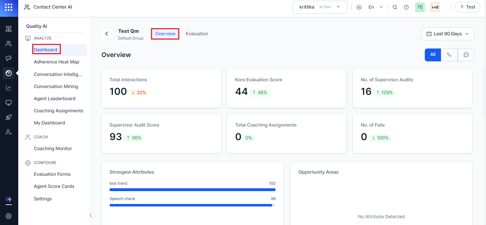
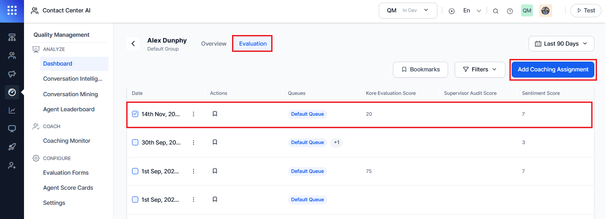
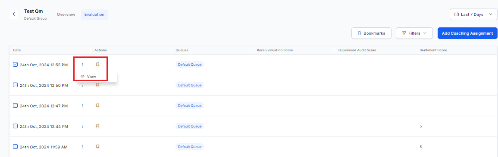
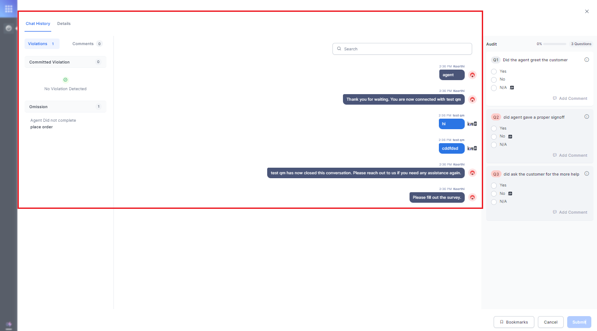
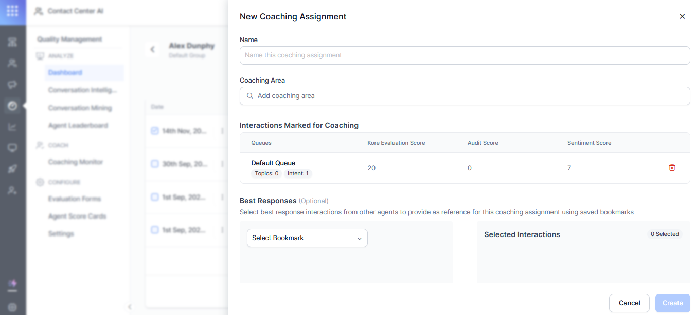
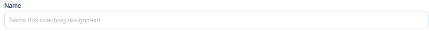
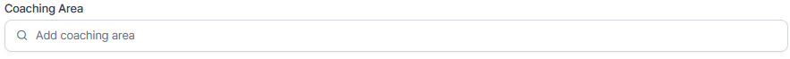
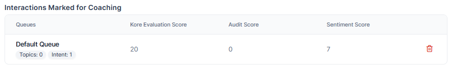
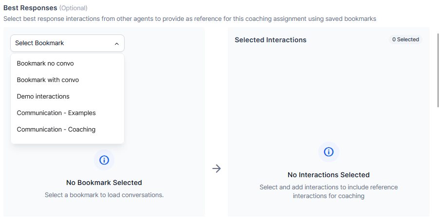

# Coaching Assignments - Supervisor View

This feature assists supervisors in analyzing agent performance and identifying interactions that need targeted coaching. It provides a view of coaching assignments for a specific agent within the agent dashboard. This shows all the assigned coaching tasks of agents.

This page serves as the starting page for coaching assignment creation.

You can add the new **Coaching Assignments** in the following ways:

**Step 1:**

1. Navigate to **Contact Center AI** > **Quality Management** > **Dashboard** > **Agent Leaderboard**. The following screen is displayed.   
2. Click any of the agents from the Agent Leaderboard widget, which navigates you to the **Quality Management** > **Dashboard** > **Overview**  to navigate to the agent-specific dashboard.  
  

## Add Coaching Assignment
Steps to add coaching assignments:

1. Click the **Evaluation** tab. The following screen is displayed to **Add Coaching Assignment**.       

2. Select any of the agent interactions to enable and assign coaching for the agent. 

    Each agent has a dedicated dashboard, which is accessible to both the agents and their supervisors. This dashboard presents high-level metrics for supervisors to review.

3. Right-click on the vertical ellipsis (⋮) button and click **View**.  
    

     Once you click the **View** button, you can view the agent **Chat History** and **Details** of the agent conversation selected.
    

3. Click the **Add Coaching Assignment**, the following screen appears.    
    

4. Enter the **Name** of the coaching assignment.    
     

5. In the **Coaching Area**, enter the agent attributes that are selected for coaching as part of the assignment.  
     

5. By default, the Interactions Marked for Coaching details, which are selected from the evaluation tab, are displayed.  
     

6. Under the **Best Responses** (optional), select the best response interactions from other agents to provide best reference for this coaching assignment using saved bookmarks. You can select more than one bookmark based on the evaluation criteria, for example, one set of interactions for the support queue and another set of interactions for the best responses to get populated in the selected interactions box.  
 

7. In the **Feedback**, enter your feedback for better improvement.
8. Enter **the Action Plan** for the coaching assignment.
9. Provide the input for the **Follow-up Date** chosen for the assignment
10. Click **Create** to assign coaching assignments to an agent, which will be populated in the **Agent Dashboard**.

## **View Agent Interactions**

Steps to view agent interactions

1. Select any of the existing evaluation agent groups to view the agent interactions.     
2. Right-click on the vertical ellipsis (⋮) button.

3. Click **View**. The following screen appears to view the agent **Chat History** and **Details** of the conversation selected.    

For more information, see [My Dashboard - Supervisor View](./agent-dashboard-supervisor-view.md).
