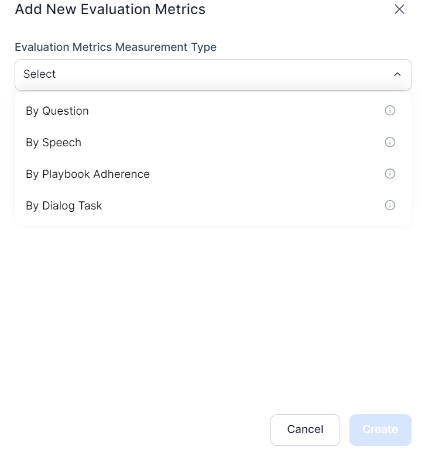

# Evaluation Metrics

This feature is a key component of the Quality AI module, enabling supervisors to define, customize, and monitor performance indicators that measure the quality of agent-customer interactions. This comprehensive system supports six distinct measurement types, each designed for specific evaluation needs through a combination of advanced AI-driven analysis and traditional rule-based methods. 

Users can build and manage custom evaluation criteria using these measurement types within the **Evaluation Forms** section. Among the options is a GenAI-powered adherence metric, which streamlines setup by minimizing the need for large training datasets. This approach improves scalability across multiple languages and diverse agent interactions.

## Access Evaluation Metrics

Access the Evaluation Metrics by navigating to **Contact Center AI** > **Quality AI** > **Configure** > **Evaluation Forms** > **Evaluation Metrics**.  

## Key Benefits

* **AI-Powered Intelligence**: GenAI-based adherence reduces dependency on extensive training datasets.

* **Comprehensive Coverage**: Six measurement types address diverse evaluation scenarios.

* **Multilingual Scalability**: Enhanced support across different languages and interactions.

* **Automated Quality Assurance**: Reduces manual review workload through intelligent analysis.

* **Real-time Validation**: API integration ensures data accuracy and compliance.

*** Flexible Configuration**: Static and dynamic evaluation options for various use cases.

## Evaluation Metrics Interface Elements

The Interface displays the following elements:

* **Name**: Shows the name of the Evaluation Metrics.

* **Metric Type**: Indicates the type of measurement used.

* **Evaluation Forms**: Shows all associated evaluation forms, which are used for configuring and assigning the evaluation metrics to different channels and queues.

* **Ellipsis Icon**: Provides an option to edit and delete the metrics. 

* **Search**: Provides a quick search to view and modify the required metrics.	

* **New Evaluation Metrics**: Enables configuration of new metrics. 

## Create New Evaluation Metrics

Steps to create new evaluation metrics:

1. Click the **Evaluation Metric** tab to access the evaluation metrics.  

2. Click the **+ New Evaluation Metric** displayed in the upper-right corner.

3. Configure the metrics based on your measurement type requirements.

## Metrics Configuration Elements

* **Metric Naming**: Descriptive identifiers for future reference.

* **Language Selection**: Multilingual support configuration.

* **Evaluation Questions**: Supervisory reference prompts.

* **Adherence Types**: Static (universal) vs. Dynamic (trigger-based)
Detection Methods Comparison.

### Detection Methods Comparison

<table>
  <tr>
    <td><strong>Feature</strong></td>
    <td><strong>GenAI-Based</strong></td>
    <td><strong>Deterministic</strong></td>
  </tr>
  <tr>
    <td>Mechanism</td>
    <td>LLM contextual understanding</td>
    <td>Semantic similarity matching</td>
  </tr>
  <tr>
    <td>Training</td>
    <td>Zero-shot prompts</td>
    <td>Sample utterance training</td>
  </tr>
  <tr>
    <td>Flexibility</td>
    <td>High contextual adaptation</td>
    <td>Precise pattern recognition</td>
  </tr>
  <tr>
    <td>Setup</td>
    <td>Description-based configuration</td>
    <td>Utterance-based training</td>
  </tr>
</table>

<!-----

You have some errors, warnings, or alerts. If you are using reckless mode, turn it off to see useful information and inline alerts.
* ERRORs: 0
* WARNINGs: 0
* ALERTS: 2

Conversion time: 1.718 seconds.

Using this Markdown file:

1. Paste this output into your source file.
2. See the notes and action items below regarding this conversion run.
3. Check the rendered output (headings, lists, code blocks, tables) for proper
   formatting and use a linkchecker before you publish this page.

Conversion notes:

* Docs to Markdown version 1.0β44
* Sat Jul 26 2025 08:34:03 GMT-0700 (PDT)
* Source doc: Evaluation Metrics
* This is a partial selection. Check to make sure intra-doc links work.
* This document has images: check for >>>>>  gd2md-html alert:  inline image link in generated source and store images to your server. NOTE: Images in exported zip file from Google Docs may not appear in  the same order as they do in your doc. Please check the images!

----->

>>>>>  gd2md-html alert:  ERRORs: 0; WARNINGs: 0; ALERTS: 2.

<ul style="color: red; font-weight: bold"><li>See top comment block for details on ERRORs and WARNINGs. <li>In the converted Markdown or HTML, search for inline alerts that start with >>>>>  gd2md-html alert:  for specific instances that need correction.</ul>

Links to alert messages:
<a href="#gdcalert1">alert1</a>
<a href="#gdcalert2">alert2</a>

>>>>> PLEASE check and correct alert issues and delete this message and the inline alerts.

## **Metrics Measurement Types**

The following six measurement types are:

1. **By Question - Conversation Content Evaluation**

**Purpose**: Evaluate adherence to specific questions asked or answered during interactions.

**Key Capabilities**:

* **Static Adherence**: Universal application across all conversations.
* **Dynamic Adherence**: Trigger-based conditional evaluation.
* **GenAI Detection**: Contextual understanding without training samples.
* **Deterministic Detection**: Semantic similarity matching with predefined utterances.
* **Flexible Thresholds**: 60% for greetings, 100% for compliance-critical statements.
* **GenAI Adherence**: Leverage GenAI for flexible language interpretation.

    **Used For**: Script adherence, greeting compliance, policy verification, and response quality assessment.

For the detailed configuration, see .

2. **By Speech - Audio Quality Analysis**

    **Purpose**: Analyze speech characteristics and audio quality metrics during voice interactions.

**Available Metrics**:

* **Cross Talk**: Monitors simultaneous speaking instances.
    * Fully customizable thresholds and duration limits.
* **Dead Air**: Track and reduce unproductive silence periods during calls.
    * Configurable thresholds (30-300 seconds).
* **Speaking Rate**: Monitor trends in speech pace to flag potential coaching opportunities.
    * Measures words per minute (WPM) against expected benchmarks.

    **Used For**: Voice interaction quality, conversation flow analysis, and speaking pace optimization.

For the detailed configuration, see .

3. **By Value - Data Accuracy Verification**

**Purpose**: Verify agent-shared customer-specific information against trusted data sources.

**Core Features**:

* **API Integration**: Real-time verification with CRM and external systems.
* **Business Rules Engine**: Five rule types, including first/last value, negotiated value, and strict matching.
* **Compliance Tracking**: Automated deviation detection for regulatory requirements.
* **Audit Trails**: Detailed documentation for supervisory review.

**Business Rule Options**:

* First Value Mentioned by Agent
* Last Value Mentioned by Agent
* Negotiated Value Mentioned by Agent
* Strict Source System Value
* Custom Business Rule

    **Used For**: Pricing accuracy, interest rate verification, account balance confirmation, and compliance validation.

For the detailed configuration, see .

4. **By Dialog Execution - Task Completion Assessment**

**Purpose**: Evaluate completion and quality of specific dialog tasks and workflows.

**Configuration Options**:

* **Dialog Agent Selection**: Choose from available dialog agents.
* **Evaluation Scope**: Entire conversation or time-bound assessment.
* **Time Parameters**: Configurable seconds (voice) or messages (chat).

**Used For**: Workflow adherence, task completion verification, and dialog flow optimization.

For the detailed configuration, see .

5. **By Playbook Adherence - Process Compliance Evaluation**

**Purpose**: Assess compliance with predefined agent playbooks and procedures.

**Adherence Types**:

* **Entire Playbook**: Comprehensive adherence across all playbook elements.
* **Specific Steps**: Targeted evaluation of particular stages and steps.
* **Percentage Thresholds**: Configurable minimum adherence requirements.

**Configuration Elements**:

* Playbook selection from the dropdown
* Stage and step specification
* Adherence percentage thresholds
* Failure criteria definition

**Used For**: Process compliance, procedure adherence, and standardization enforcement.

For the detailed configuration, see .

6. **By AI Agent - Advanced Reasoning Evaluation**

    **Purpose**: Enables sophisticated evaluations using AI agents capable of multi-step reasoning and autonomous decision-making.

**When to Use**:

* **Complex Analysis**: Multi-step reasoning connecting conversation elements.
* **Domain Expertise**: Specialized knowledge requirements (compliance, technical support).
* **Contextual Understanding**: Nuanced evaluation requiring full conversation context.
* **Advanced Decision-Making**: Sophisticated judgment calls beyond pattern matching.

**Key Differentiators**:

* High complexity handling vs. basic pattern matching
* Autonomous decision-making with custom logic
* Comprehensive contextual analysis
* External AI agent integration is required

    **Used For**: Complex compliance assessments, technical troubleshooting evaluation, and sophisticated quality analysis.

For the detailed configuration, see .

## **Managing Evaluation Metrics**

The process of managing evaluation metrics includes the following sections:

**Metric Lifecycle Management**

* **Creation**: Step-by-step configuration wizard
* **Editing**: Real-time updates with validation
* **Deletion**: Dependency resolution and cleanup
* **Language Management**: Multilingual configuration and updates

**Dependency Management**

* **Form Associations**: Evaluation form linkage requirements
* **Attribute Assignments**: Metric-to-attribute mapping
* **Language Dependencies**: Active language protection
* **Deletion Prerequisites**: Dependency resolution before removal

### **Edit or Delete Evaluation Metrics Type**

Steps to edit or delete existing Evaluation Metrics:

1. Right-click on any existing **Evaluation Metric Type **to choose a measurement type, such as **By Question, By Value.**

    

>>>>>  gd2md-html alert: inline image link here (to images/image1.png). Store image on your image server and adjust path/filename/extension if necessary.  (<a href="#">Back to top</a>)(<a href="#gdcalert2">Next alert</a>) >>>>> 

2. Click **Edit **to update the required **Edit Evaluation Metrics **dialog box fields.

    

>>>>>  gd2md-html alert: inline image link here (to images/image2.png). Store image on your image server and adjust path/filename/extension if necessary.  (<a href="#">Back to top</a>)(<a href="#gdcalert3">Next alert</a>) >>>>> 

3. Click **Delete **to remove the selected evaluation metric.
4. Click **Update **to save the changes.