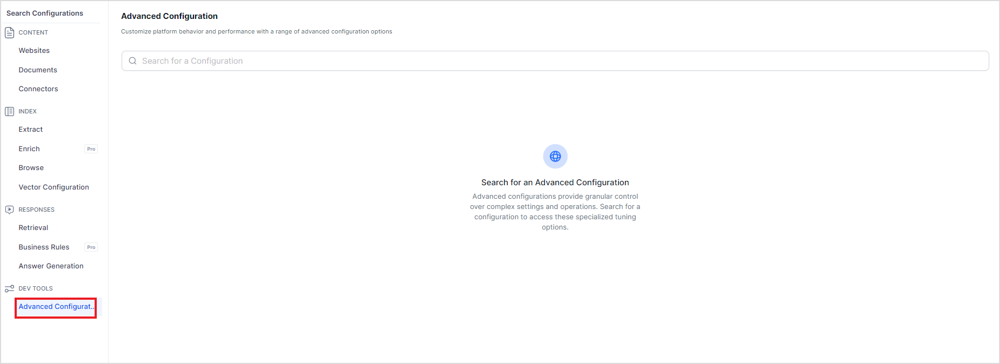

# Advanced Configurations

SearchAI offers advanced configurations that allow you to optimize the answers according to your specific requirements. The following are some of the features and corresponding configurations available in Search AI. To configure these features, go to the **Advanced** **Configurations** page under **Dev** **Tools**.

Search for the config you want to set and select or provide its values. 

## Reranking Chunks (Beta)

**Reranking of Chunks** is helpful in scenarios where the system can retrieve the relevant content successfully, but due to some reasons like the chunks being too similar to each other, the overall ranking of the chunks retrieved is not up to the mark. In such scenarios, use this feature to enhance the chunk retrieval process and improve the relevance and quality of answers. When a user query is made, an initial retrieval process selects chunks relevant to the query based on their similarity score. Reranking involves re-evaluating the retrieved chunks to prioritize or reorder them based on their relevance to the user's query. This process uses specialized models to refine the ranking, ensuring that the most appropriate chunks are used for answer generation.

!!! note
    This feature does not require training of the application. 

**Re-Rank Chunks**: Use this property to select the reranking feature and select the Re-Ranker model to be used. Search AI supports the following re-rankers. 

* **Cross Encoder Re-Ranker** - Uses the _cross-encoder/ms-marco-MiniLM-L-6-v2_ model. It is lightweight, fast, and most suitable for English Language.
* **BGE Re-Ranker** - Uses _BAAI/bge-reranker-v2-m3_ model. It is a lightweight re-ranking model and possesses multilingual capabilities. 
* **MixedBread Re-Ranker** - Uses the _mixedbread-ai/mxbai-rerank-large-v1_ model, which is resource intensive to run and has a higher latency but delivers the highest accuracy and performance.

**Re-Rank Chunk Fields**: Select the fields to rerank the chunks against the user query. It depends on how the content is extracted from documents. By default, Chunk Title, Chunk Text, and Record Title are used for reranking the chunks.  You can select any of the chunk fields for re-ranking. Note that selecting different fields impacts the results generated by the re-ranker.

For instance, if the embeddings are created using the document title, chunk title, and chunk text, you can use the same fields while re-ranking or include/exclude other metadata that provides additional context for the model. 

**Maximum Re-Rank Chunks**: Select the maximum number of chunks to be sent for reranking. This field can take any integer value between 5 and 20. The default value is 20. This field is used only if the reranking of chunks is enabled.

Increasing the number of fields or chunks for reranking typically leads to higher latency due to the added complexity in computation, data retrieval, and processing load. If you are using the generative model and re-ranking is also enabled, the overall latency includes the latency induced by the re-ranker and the LLM.