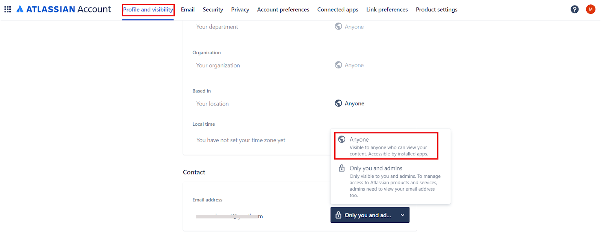
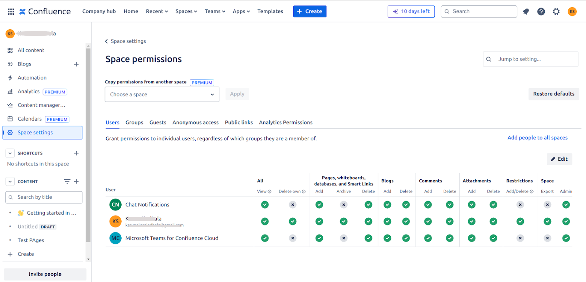
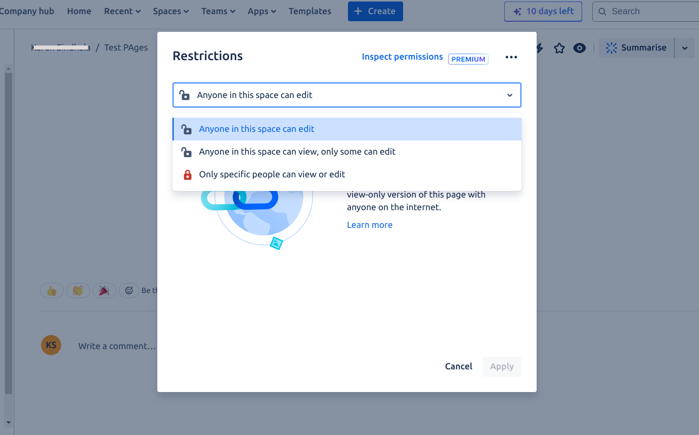

# Confluence Cloud Connector

Specifications

<table>
  <tr>
   <td>Type of Repository 
   </td>
   <td>Cloud
   </td>
  </tr>
  <tr>
   <td>Supported API version
   </td>
   <td>REST API v1
   </td>
  </tr>
  <tr>
   <td>Extractive Model for Answers 
   </td>
   <td>Knowledge Articles
   </td>
  </tr>
  <tr>
   <td>Generative Model for Answers
   </td>
   <td>Knowledge Articles
   </td>
  </tr>
    <tr>
   <td>Access Control Support </td>
   <td>Yes
   </td>
  </tr>
  <tr>
   <td colspan="2" >Note: Only manually created Knowledge articles are supported. Searching through any other types of uploaded content like PDF files,  docs, and images is not supported.
   </td>
  </tr>
</table>

## Authorization Support

Search AI  uses the **OAuth 2.0 authorization code grant type** to access the resources on the Confluence Cloud.

## Integration Steps

To integrate SearchAI with Confluence Cloud, you need to take the following actions.

* Create an OAuth 2.0 integration on the Atlassian developer portal.
* Configure the connector in Search AI with the OAuth 2.0 credentials.

### Configuring OAuth application on Confluence Cloud

#### Prerequisites 

To create an OAuth 2.0 integration on the Confluence cloud, you need the following:

* An admin account in Atlassian’s Confluence.
* A target domain.

#### Configuration Steps

Sign into your developer account in the [Atlassian developer portal](https://developer.atlassian.com/). Click on the profile name at the top right corner and navigate to the **_Developer Console_**.

The developer console will list all your apps.

Click the **Create** button and select **OAuth 2.0 Integration**.

Provide a name for the application and click **Create**.

Once the application is created, you can update its name and description from the **Settings** tab. You can also add an avatar for the application. Update the settings and click **Save changes**.

Next, configure Authorization code grants to allow SearchAssist to access data. To do so, go to the **Authorization** tab. Enter the SearchAI Callback URL provided to you and click **Save changes**. You can use one of the following callback URLs as per your region.

* JP Region Callback URLs: https://jp-bots-idp.kore.ai/workflows/callback
* DE Region Callback URLs: https://de-bots-idp.kore.ai/workflows/callback
* Prod Region Callback URLs: https://idp.kore.com/workflows/callback

The next step is to grant the necessary permissions. Go to the **Permissions** tab. Add the following scopes:

* User Identity API
* Confluence API

To add permissions to the User Identity API, click the **config** link.

On the following page, click the Edit Scopes button.

Grant the following permissions and click **Save**.

* Read:me
* Read:account

Similarly, for **Confluence API**, go to the **Granular Scopes** and click **Edit Scopes**. Add a read operation filter, select all the filtered permissions, and click **Save**.  

After adding permissions, go to **Settings** and find the **Client ID** and **Secret** at the end of the page. Save these fields as these will be used for configuring the SearchAI connector in the next step.

You also need the Host URL in Confluence to configure the SearchAI Connector.  To fetch this field, go to the [Confluence home page](https://www.atlassian.com/software/confluence) and click on Profile. 

Go to the **Products** tab.

The host URL will be displayed at the bottom of the page.

### Configuring SearchAI Connector

Go to the **Connectors** tab under **Sources** and select **Confluence Cloud** connector. On the **Authorization** tab, enter the following fields for authentication.

<table>
  <tr>
   <td><strong>Fields</strong>
   </td>
   <td><strong>Description</strong>
   </td>
  </tr>
  <tr>
   <td>Name 
   </td>
   <td>Name for the connector
   </td>
  </tr>
  <tr>
   <td>Authorization Type
   </td>
   <td>Set this to OAuth 2.0 
   </td>
  </tr>
  <tr>
   <td>Grant Type
   </td>
   <td>Set this to Authorization Code
   </td>
  </tr>
  <tr>
   <td>Client ID
   </td>
   <td>Client ID of the OAuth application created on Confluence.
   </td>
  </tr>
  <tr>
   <td>Client Secret
   </td>
   <td>Client secret generated for communication with Confluence. 
   </td>
  </tr>
  <tr>
   <td>Host URL 
   </td>
   <td>The confluence server base URL  (without trailing slash), as fetched from the Confluence Cloud.
   </td>
  </tr>
</table>

Click **Connect**. This will initiate the authorization process. On successful authorization, it is marked as **Connected**. Note that authorization does not initiate content synchronization.

### Content Ingestion

Go to the **Configuration** tab and select the content to be ingested. You can choose to sync all the content from the Confluence Cloud account or select specific content.

### Content Filters

The connector allows you to set up rules to selectively ingest content from the application. To define such rules, select **Sync Specific Content** and click on the **Configure** link. The following page allows you to define rules for selecting the content. Each rule can be defined using a parameter, operator, and its values.

The Parameter field can take one of the following values. You can also add other CQL fields defined for your Confluence content. Refer to the complete list of supported fields [here](https://developer.atlassian.com/cloud/confluence/cql-fields/).

* Ancestor: Affects the direct child pages/content and descendants of the given content IDs as value. 
* Content: Affects the content defined using content ID only. 
* Created: Affects the content with the given creation date. It takes Date as values in the following format “yyyy/mm/dd hh:mm”, “yyyy-mm-dd hh:mm”, “yyyy/mm/dd”, “yyyy-MM-dd”
* Creator: Affects the content created by the User account IDs provided as values. 
* Label: Affects the content by its label. 
* Parent: Affects the content under a given parent. 
* ID: Affects the content based on its content ID. 
* Space: Affects the content based on the space that it is available in.
* Title: Define the rule using the title of the pages
* User: Define the rule using userId 

The Operator field can take different values depending upon the parameter selected like equals to, not equals to, contains, etc. 

The value field is used for providing the value as per the parameter.

For instance, you can choose all the pages and sub-pages under a given ancestor using the following rule. 

Similarly, to selectively ingest only the pages created or modified after Jan 1, 2024, you can configure the rule as shown below. 

Note:

* You can define more than one condition to choose different types of content from the connector using the OR operator. 
* Every rule can have one or more conditions to select a subset of content using the AND operator. For example, to ingest the latest content created after Jan 1, 2024, and having the word ‘SearchAI’ in its title, define the rule as:
  

### Content Sync Schedule 

You can trigger a **manual sync** or **schedule an automatic sync** operation for the connector to ingest content. 

To perform a manual sync operation at any time, click the **Sync Now** button. This ingests all the updates from the Confluence Cloud account available at the time of synchronization. 

You can also set up automatic sync in the background at a specific time or at regular intervals. Regular sync ensures that the content in the Search AI application is always up to date and also saves time for an admin to perform manual sync. To enable automatic sync, enable the **Schedule Sync** option and select the date, time, and frequency of sync. 

### Access Control 

SearchAI supports access control for content ingested using Confluence Cloud Connector. To enable access control on the content, go to the Permissions and Security tab and select Permission Aware access.  

* **Permission Aware** honors the permissions of a user in the Confluence Cloud. The user will view search results from a file only if the user has access to the file in the enterprise application. 
* **Public Access** overrides the permissions of the user in the Confluence Cloud. It allows every user to access the ingested content irrespective of the permissions in the enterprise system. 

#### Prerequisites

Access control in SearchAI relies on fetching user’s email address as their unique identity. To ensure proper user identity management in SearchAssist, it is mandatory that the account used for configuring SearchAI must be able to view user email addresses. This typically requires using an admin account or ensuring users have enabled the following necessary settings in their Confluence profiles. 

#### Permission Sets in Confluence Cloud

Two levels of permissions control the user’s access to a page in Confluence Cloud. 

**Space Permissions**

Every space has an independent set of permissions managed by the space administrators, which determine the access settings for different users and groups. SearchAI application requires a minimum permission of **view permission **to allow a user to access the content. 

**Page Restrictions**

Pages inherit the space permissions. However, a page can define its own restrictions. It can allow access to all the members of the space or restrict access to selected members. If the page restrictions are marked as “Only specific people can view & edit,” then the space permissions are not considered. 

#### Handling Confluence Cloud Permissions in SearchAI

* **Individual Access**: Users who are added to a space or a specific page within that space are listed in the racl (user identity – email address) field of the indexed content in SearchAssist. Based on their permissions, these users can directly access the content.
* **Group Access**: If access permissions are granted to user groups, SearchAI creates a corresponding permission entity for the group. In this case, the racl fields in the indexed content will have the permission entity IDs for the groups. To enable access for all users within a group, add the users to the respective permission entity using the Permission Entity APIs. 

#### Limitation

* Anonymous Access: SearchAssist does not support anonymous access to content. If a page is publicly accessible or allows anonymous access in Confluence Cloud, SearchAssist will not currently permit viewing of the file content.