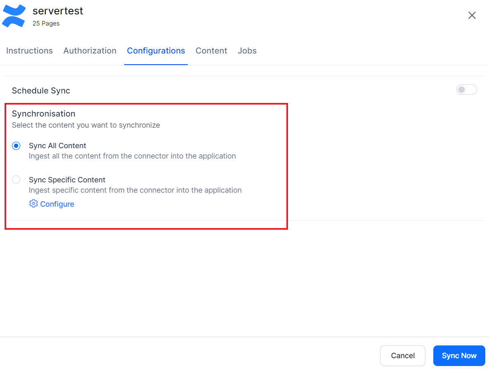
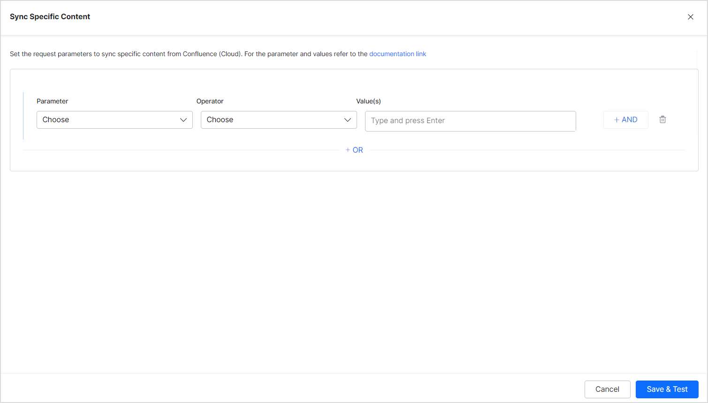
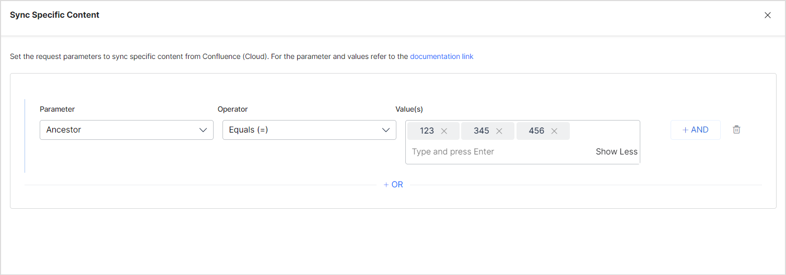
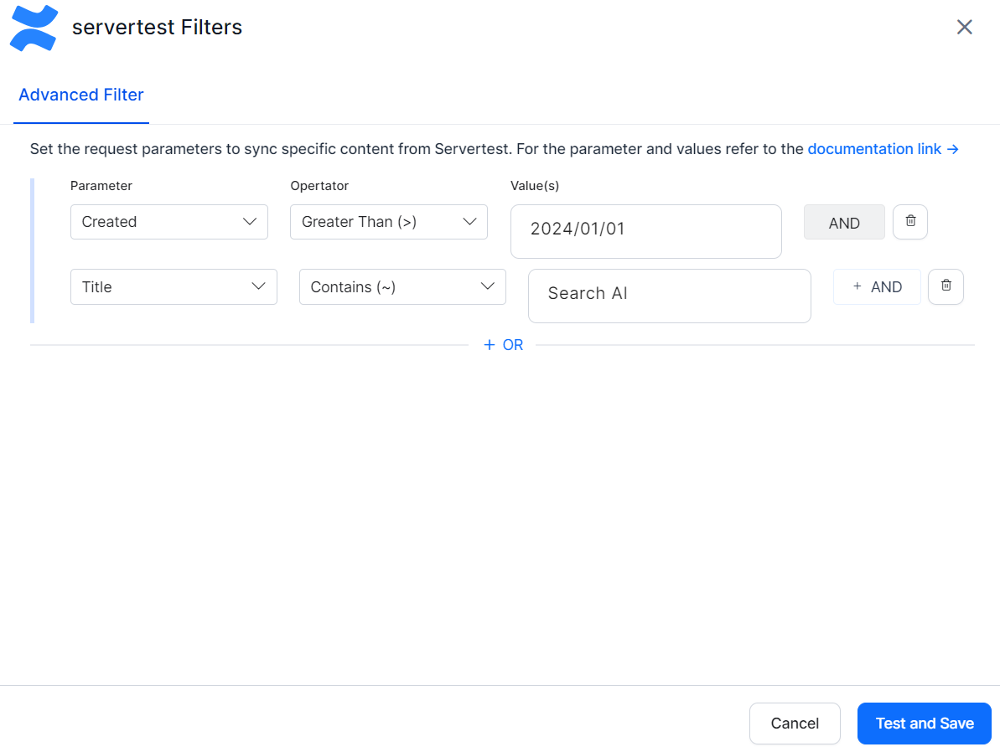

# Confluence Server

If you use Confluence Server to store knowledge content, the Search AI Confluence Server Connector lets you securely index, filter, and search your Confluence data with expanded coverage and improved indexing controls.
The connector provides enhanced ingestion capabilities, space-based filters, advanced filtering, and optional incremental sync with webhook-based deletion.

Specifications

<table>
  <tr>
   <td>Type of Repository 
   </td>
   <td>On-Premise
   </td>
  </tr>
  <tr>
   <td>Content Supported
   </td>
   <td>Knowledge Articles, Spaces, Blogs, and Comments
   </td>
  </tr>
  <tr>
   <td>RACL Support
   </td>
   <td>Yes
   </td>
  </tr>
  <tr>
   <td>Content Filtering Support
   </td>
   <td>Yes
   </td>
  </tr>
</table>

## Authorization Support for Confluence Server

The connector provides two authorization mechanisms:

* Basic Authentication
* OAuth 2.0

For more information on auth types, refer to [this](../connectors.md). 

**Basic Authentication**

When you use basic authentication, no server‑side configuration is required. Go to step 2 to configure the connector in Search AI.

**OAuth 2.0 Authentication**

1. Register Search AI as an OAuth client in Confluence Server.
2. Configure the connector with the generated OAuth credentials.

## Step 1: Register the Search AI app in the Confluence Server

* **OAuth 2.0 authentication** requires creating an incoming link under **application links** in the Confluence Server.
* During setup, use the **Redirect URL** for your region:

| Region   | Redirect URL                                     |
| -------- | ------------------------------------------------ |
| **JP**   | `https://jp-bots-idp.kore.ai/workflows/callback` |
| **DE**   | `https://de-bots-idp.kore.ai/workflows/callback` |
| **Prod** | `https://idp.kore.com/workflows/callback`        |

After creating the link, you will receive:

* Client ID
* Client Secret

These values are required in Search AI. For more information, refer to [this](https://confluence.atlassian.com/doc/configure-an-incoming-link-1115674733.html). 

## Step 2: Configure the Confluence (Server) Connector

In Search AI:

1. Go to **Connectors**.
1. Choose **Confluence (Server)**.
1. Under **Authentication**, enter the required fields.
    * Authorization Type: Basic Auth, OAuth 2.0, or Header Based Authorization
    * Basic Auth fields: Connector Name, Username, Password, and Confluence Server host URL.
    * OAuth 2.0 fields: Connector Name, Client ID, Client Secret, Confluence Server Base URL, Domain Name and Grant Type (**Authorization Code grant type** or **Client Credentials**). For more details, refer to [this](../connectors.md).
    * Header Based Authorization fields: Header, Token, and Host URL.
Click **Connect** to initiate authorization.

### Content Ingestion

Go to the **Content** tab and select the content to be ingested. You can choose to sync all the content from the Confluence Server or select specific content. SearchAI now supports ingestion of the following Confluence object types:

* Pages (Knowledge Articles)
* Spaces (including space metadata and descriptions)
* Blogs (blog posts and associated metadata)
* Comments (page comments and discussion threads)

**NOTE**: If there are any attachments to the content being ingested, then the content from the attachments is also automatically ingested into the application. At present, only PDF format attachments are supported.

#### Incremental Sync and Deletion Handling

The Confluence Server connector supports incremental synchronization to ensure efficient content updates. During each sync cycle, only newly created or modified Pages, Blogs, Spaces, and Comments are fetched and updated in SearchAI.

**Deletion Handling**

SearchAI can process deletion events from Confluence using webhook-based notifications. When enabled, webhook callbacks make it possible to automatically remove deleted content—such as pages, blogs, or comments—from the SearchAI index, ensuring that search results always reflect the latest state of Confluence.

These capabilities help maintain accurate and up-to-date indexed content while minimizing ingestion time and system load.

### Content Filters

The connector allows you to set up rules to selectively ingest content from the application. To define such rules, select **Sync Specific Content and** click on the **Configure** link. The following page allows you to define rules for selecting the content. Each rule can be defined using a parameter, operator, and its values. 

The Parameter field can take one of the following values. You can also add other CQL fields defined for your Confluence content. The following parameters now apply to Pages, Spaces, Blogs, and Comments. Refer to the complete list of supported fields [here](https://developer.atlassian.com/cloud/confluence/cql-fields/).

* Ancestor: Affects the direct child pages/content and descendants of the given content IDs as value. 
* Content: Affects the content defined using content ID only. 
* Created: Affects the content with the given creation date. It takes Date as values in the following format “yyyy/mm/dd hh:mm”, “yyyy-mm-dd hh:mm”, “yyyy/mm/dd”, “yyyy-MM-dd”. 
* Creator: Affects the content created by the User account IDs provided as values. 
* Label: Affects the content by its label. 
* Parent: Affects the content under a given parent. Parent-child evaluation now applies to Pages, Blogs, and threaded Comments. 
* ID: Affects the content based on its content ID. 
* Space: Affects the content based on the space that it's available in. Applicable to Pages, Blogs, and Comments.
* Title: Define the rule using the title of the pages or blogs.
* User: Define the rule using userId 

The Operator field can take different values depending upon the parameter selected like equals to, not equals to, contains, etc. 

The value field is used for providing the value as per the parameter.

For instance, you can choose all the pages and sub-pages under a given ancestor using the following rule. 

Similarly, to selectively ingest only the pages created or modified after Jan 1, 2024, you can configure the rule as shown below. 

Note:

* You can define more than one condition to choose different types of content from the connector using the OR operator.
* Comments inherit context from their parent page or blog.
* Spaces can be filtered by space key and space type.
* Blogs can be filtered by publication date and author.
* Every rule can have one or more conditions to select a subset of content using the AND operator. For example, to ingest the latest content created after Jan 1, 2024 and having the word ‘SearchAI’ in its title, define the rule as:

### Access Control

SearchAI supports access control for content ingested using the **Confluence Server**. To enable access control on the content, go to the **Permissions and Security** tab and select **Permission Aware** access.

* **Permission Aware** honors the permissions of a user in Confluence Server. Users can only view search results for content they're permitted to access within the Confluence instance.

* **Public Access** overrides native Confluence permissions, making all ingested content visible to all users in SearchAI regardless of actual access in Confluence.

#### Prerequisites

Access control in SearchAI relies on associating users with their unique identity—typically an email address. Ensure the account used for ingestion has adequate access to:

* Read page-level and space-level permissions

* Retrieve user and group details (using API tokens with appropriate access)

This may require an admin account or permissions that allow access to user directories in Confluence.

#### Permission Sets in Confluence Server

Confluence Server supports a two-level permission model:

**Space Permissions**

Each space defines its own set of permissions, managed by space administrators. These permissions control who can view, edit, or administer the content in that space. SearchAI requires at least **view** access to ingest and apply access control correctly.

**Page Restrictions**

Pages may inherit permissions from their parent space but can also have their own **view** or **edit** restrictions. If a page is restricted to specific users or groups, these settings override inherited space permissions.

#### Handling Confluence Server Permissions in SearchAI

* **Individual Access**: Users added directly to a space or specific page are included in the `sys_racl` field of the ingested document. These are typically represented by user email addresses or usernames, depending on your Confluence setup.

* **Group Access**: When you grant access to groups (for example, `confluence-users` or `engineering-team`), SearchAI creates **Permission Entities** based on group identifiers. These entities are stored in the `sys_racl` field. To ensure correct access, use the **Permission Entity APIs** to associate users with the appropriate group or entity in SearchAI.

#### Limitation

**Anonymous Access**: SearchAI does **not support anonymous access** to content. If a page is publicly viewable in Confluence (for example, not requiring login), that page will **not be searchable** unless explicitly shared with known users or groups.
