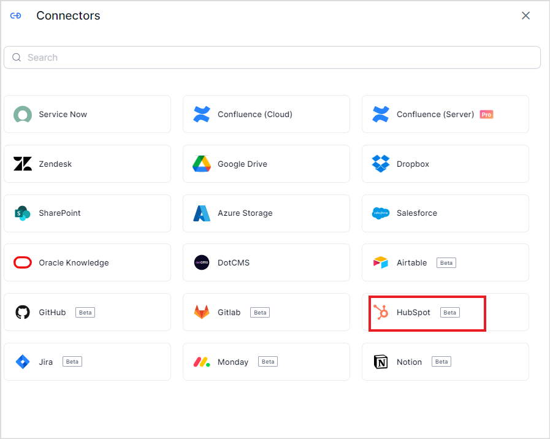

# HubSpot Connector

HubSpot offers a knowledge base that can be used for content management. SearchAI’s HubSpot Connector enables you to easily integrate with the HubSpot application to ingest content and use it to answer user queries.  \

<table>
  <tr>
   <td>Type of Repository 
   </td>
   <td>Cloud
   </td>
  </tr>
  <tr>
   <td>Extractive Model for Answer Generation
   </td>
   <td>Yes
   </td>
  </tr>
  <tr>
   <td>Generative Model for Answer Generation
   </td>
   <td>Yes
   </td>
  </tr>
  <tr>
   <td>Supported Content Type
   </td>
   <td>Tickets
   </td>
  </tr>
</table>

## Authorization Support

You can set up communication between Search AI and HubSpot using a **private app** or set up **OAuth Authorization Code Grant Type** for communication. 

* **Private App**: If you are authenticating via a Private App, you must use your Access Token to set up the connector. Refer to the [official HubSpot documentation](https://developers.hubspot.com/docs/api/private-apps) to learn how to obtain the access token. This access token is used while configuring the connector in Search AI. 
* **OAuth setup**: If you use OAuth to authenticate, Refer to [Hubspot's official documentation on Setting Up the OAuth app.](https://developers.hubspot.com/docs/api/working-with-oauth) After the setup, a client ID, client secret will be generated. Use the client credentials to generate an access token and a refresh token for SearchAI to use for communication.

## HubSpot Connector Configuration

Go to the **Connectors** page and select **HubSpot**. 

On the **Authorization** page, provide the following information to enable SearchAI to establish a connection with HubSpot. 

* **Name**: Unique name for the connector
* **Authentication**: Select one of the following.
    * **OAuth Authorization:** For this type of authentication, provide the **client ID and client secret and the refresh token** generated above.
    * **Private App:** For this type of authorization, provide the **Access Token** generated in the HubSpot account. 

In order to map the properties of Tickets in HubSpot to the fields in SearchAI, there are additional configuration fields to consider. Currently, only the default field values are supported in the current version, so providing these values is not mandatory.