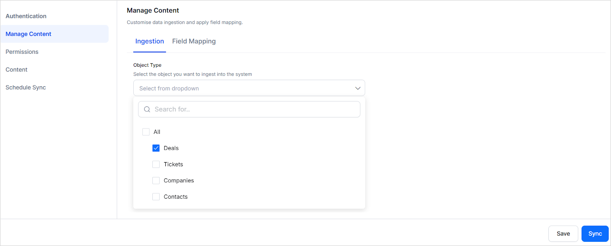
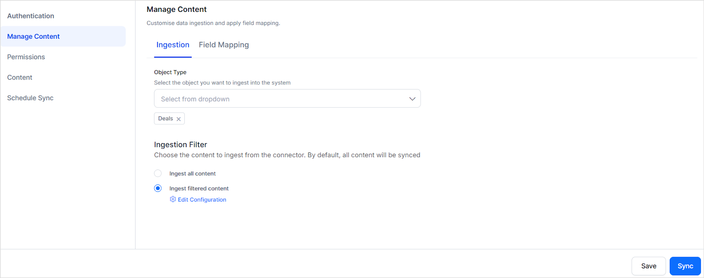

# HubSpot Connector

HubSpot provides a CRM platform with different tools to enable businesses to manage customer service, operations, marketing, sales, and more. SearchAI’s HubSpot Connector enables you to easily integrate with the HubSpot application to ingest **Tickets, Contacts, Companies, and Deals-related content** and use it to answer user queries. 

<table>
  <tr>
   <td>Type of Repository 
   </td>
   <td>Cloud
   </td>
  </tr>
  <tr>
   <td>Supported Content Type
   </td>
   <td>Tickets, Contacts, Companies, Deals
   </td>
  </tr>
  <tr>
   <td>RACL Support
   </td>
   <td>Yes
   </td>
  </tr>
  <tr>
   <td>Content Filtering
   </td>
   <td>Yes
   </td>
  </tr>
</table>

## Authorization Support

You can set up communication between Search AI and HubSpot using a **private app.** 

**Private App**: If you are authenticating via a Private App, you must use your Access Token to set up the connector. Refer to the [official HubSpot documentation](https://developers.hubspot.com/docs/api/private-apps) to learn how to obtain the access token. This access token is used to configure the connector in Search AI. 

The following **permissions** are required to ingest the required data from the HubSpot account. Select the following scopes while creating the app. 

* crm.objects.users.read
* tickets
* crm.objects.owners.read
* settings.users.teams.read
* crm.objects.companies.read
* crm.objects.deals.read
* crm.objects.contacts.read

## HubSpot Connector Configuration

Go to the ***Connectors*** page and select **HubSpot**.  On the **Authentication** page, provide the following information to enable SearchAI to establish a connection with HubSpot. 

* **Name**: Unique name for the connector
* **Authentication**: Currently authentication via **Private App is supported.**
* **API Key:** Provide the **Access Token** generated in the HubSpot account. 

## Content Ingestion

After successfully connecting the Search AI connector to the HubSpot account, go to the **Manage Content** page and select the type of content to be ingested from HubSpot. You can select one or more of the supported content types under **Object Type**. 

Upon sync, Search AI can ingest **Tickets, Contacts, Companies, and Deals** from the HubSpot account. 

For each of the four types of ingested content, the following fields are captured as the `content `field in the Search AI index. The` type` field in the ingested content suggests the type of content. Other properties are stored in dedicated fields within the indexed content or as metadata fields. 

Tickets: 

* Content of the ticket
* Priority
* creation Date
* Owner Name
* Last activity date
* Associated Companies 
* Associated Contacts

Deals:

* Amount
* Creation Date
* Deal Stage
* Owner Name
* Last Activity Date
* Associated Companies
* Associated Contacts

Contacts:

* Email Id 
* Phone number
* Company name
* Total Revenue
* Recent Deal amount
* Creation Date
* Last Activity Date
* Owner Name 
* Associated Companies. 

Companies

* Description
* Domain Name
* Industry
* City
* Employees Count
* Annual Revenue
* Owner Name
* Associated Contacts

Note that at each sync, the content from the **past 90 days** is ingested from the account. 

## Content Filtering

HubSpot connector offers advanced filters to allow selective ingestion of content from the HubSpot account. 

Go to Manage Content and select the Object Type. Select one or more of the supported content types listed in the dropdown. 

To ingest all the content related to a given content type, click on **Sync**. 

To further filter the content for ingestion, select **Ingest Filtered Content** and click on **Edit Configuration**. 

Under **Advanced Filters**, you can create filter rules based on the properties of the content types selected for ingestion. All default properties are available in the **Parameter** list. For each parameter, specify an appropriate operator and value.

You can define one or more filter conditions using logical **AND** and **OR** operators to explicitly retrieve the desired content from your HubSpot account.

Set up filters and click **Save**. 

Note:

* If a filter is configured using a content type that is not selected under **Object Type** on the **Manage Content** page, the application will ignore the filter.
* Each content type includes a set of default parameters shown in the **Parameter** drop-down, which can be used to define filters. To ensure accurate content selection, make sure to choose appropriate operators and values when setting filters.
* To use a parameter not listed in the drop-down, select the **Add** option. Ensure that the parameter name exactly matches the corresponding name in your HubSpot account.

## RACL Support

For each of the content types ingested from HubSpot, the following fields are added to the sys_racl field. 

* Owner of the content type, e.g. owner of the ticket, deal, etc. For the owner, the sys_racl field directly contains the email address of the owner. 
* The teams having access to the content type, i.e., the teams that the owner of the content belongs to. A permission entity is created corresponding to each team that has access to the content. To enable access control for the team members in Search AI, associate users to the corresponding permission entity using the [Permission Entity APIs](https://docs.kore.ai/xo/apis/searchai/permission-entity-apis/). 