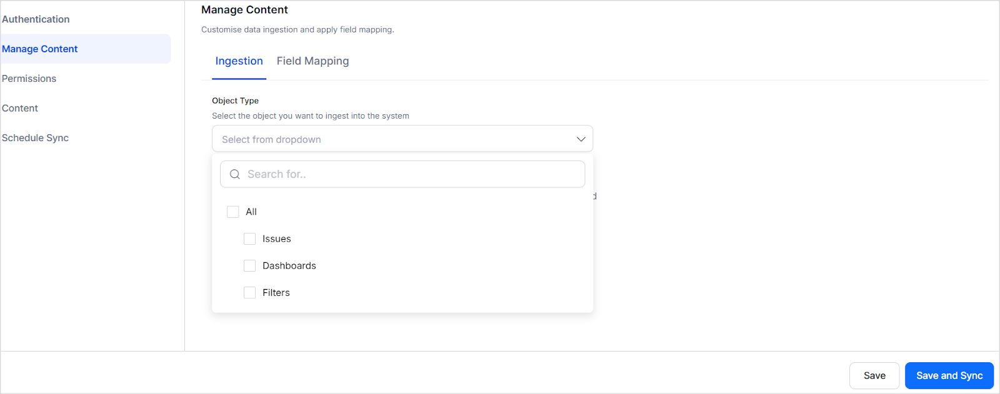
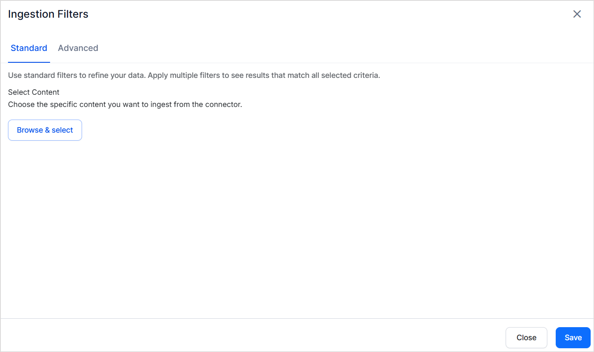
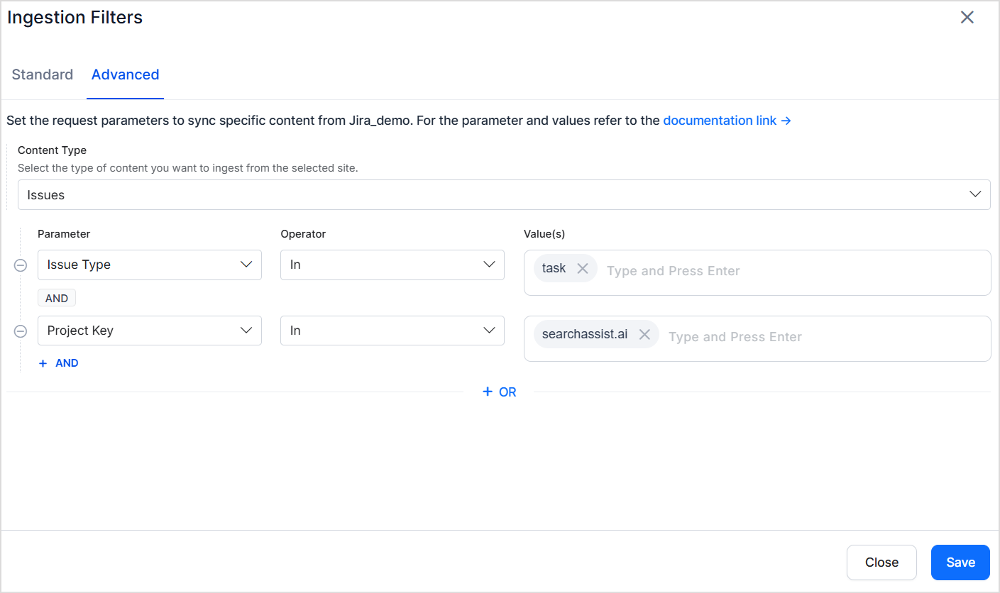

# Jira Connector

Jira is typically used for issue tracking and agile project management, enabling teams to plan, track, and coordinate tasks through customizable workflows.

Search AI enables easy integration with Jira to ingest, index, and search through the** issues, dashboards and filters. **This ensures efficient search and retrieval, improving accessibility to content from JIRA.

**JIRA Connector Specifications**

<table>
  <tr>
   <td>Type of Repository 
   </td>
   <td>Cloud
   </td>
  </tr>
  <tr>
   <td>Supported Content Type
   </td>
   <td>Issues, Dashboards, Filters
   </td>
  </tr>
  <tr>
   <td>Access Control Support 
   </td>
   <td>Yes
   </td>
  </tr>
  <tr>
   <td>Content Filtering Support
   </td>
   <td>Yes
   </td>
  </tr>
</table>

## Setup guide

## Prerequisites

An Atlassian account with admin access. This account will be used to fetch content and find the access permissions on the indexed content. 

### Set up Jira[​](https://docs.airbyte.com/integrations/sources/jira#step-1-set-up-jira)

Search AI interacts with Jira through the APIs. Hence, to set up integration, create an **API token** with the Atlassian account. Follow the instructions in this [documentation](https://support.atlassian.com/atlassian-account/docs/manage-api-tokens-for-your-atlassian-account/) for step-by-step instructions. 

While generating the API Key, enable following scopes to allow Search AI to access relevant information from JIRA. 

* read:application-role:jira
* read:comment:jira
* read:comment.property:jira
* read:dashboard:jira
* read:filter:jira
* read:group:jira
* read:issue-details:jira
* read:issue-type-hierarchy:jira
* read:issue-type:jira
* read:jira-work
* read:jql:jira
* read:project-category:jira
* read:project-role:jira
* read:project-version:jira
* read:project.component:jira
* read:project.property:jira
* read:project:jira
* read:user:jira

### Configure Jira Connector in SearchAI 

Go to the **Connectors** page and add **the Jira Connector**. Provide the following details to configure the connector. 

* Name - Provide a unique name for the connector.  
* API Token - Provide the API token generated above. 
* Domain - The URL of your Jira application instance. 
* Email - Email address for the Atlassian account set up for indexing. 

## Content Ingestion

Ingested content from Jira into Search AI includes three object types—Issues, Dashboards, and Filters—each with a defined set of fields. By default, the connector fetches content for the past 90 days from the application. 

* Issues
    * title: the issue’s summary or title
    * content: the full description of the issue
    * url: direct link to the issue in Jira
    * doc_created_by_name: name of the user who created the issue
    * doc_created_on: timestamp when the issue was created (UTC)
    * doc_updated_on: timestamp of the latest update to the issue (UTC)
    * doc_source_type: indicates the type of content - Issues, Dashboards or Filter.
    * priority: issue priority (High, Medium, Low, etc.) 
    * status: issue status like open, close, etc
    * assignee: username of the person currently assigned
    * reporter_name: name of the user who reported the issue
    * comments: all comments on the issue concatenated into one field along with the commentator name. 
    * issueType: type of issue (Bug, Task, Story)
    * resource_type:  type of issue
    * project_name: name of the Jira project

* Dashboards
    * title: the dashboard’s name
    * content: dashboard description or notes
    * URL: direct link to the dashboard in Jira
    * doc_created_by_name: name of the user who created the dashboard
    * doc_source_type: Always ‘dashboard’ for this object type. 

* Filters
    * title: the filter’s name
    * content: JQL query or filter description
    * URL: direct link to the filter in Jira
    * doc_created_by_name: name of the user who created the filter
    * doc_source_type:  Always ‘filter’ for this object type. 

!!!note
  * All timestamps are stored in UTC.
  * The **doc_source_type **field distinguishes the type of Jira content.
  * Issue comments are concatenated together as comments. Individual comment metadata is not indexed.

## Content Filtering

Jira Connector offers standard and advanced filters on the indexable content allowing users to choose specific set of searchable content. 

Go to **Manage Content** page and select the **Object Type** that defines the types of content to be ingested. All subsequent filter settings apply *only* to this chosen object type(s).

Further you can set **ingestion filters **to select specific content. Select Ingest filtered content and click on** Edit Configuration** link.

There are two types of filters - **Standard Filters and Advanced Filters.**

Jira connector offers Standard filters to ingest selected objects from the specific projects. You can select one or more projects.  By applying this filter, every object of the selected type in the chosen projects will be ingested.

Alternatively, you can set up advanced filters to select content by specifying field-based rules. Like selecting specific type of issues from a given project as shown below. 

Choose from commonly used fields in the dropdown or enter any valid Jira field name for your instance. Note that the field name should match the field name for the selected object in  your JIra instance. 

**Filter Precedence & Scope**

* **Advanced Filters override Standard Filters** whenever their criteria conflict. For instance if one project is selected in Standard Filter and an Advanced filter is set up using project key for another project, the project in advanced filter will be applied. 
* **Filters affect only the selected Object Type.** If an advanced filter is set up for issues whereas only dashboards are selected on Manage content page, the filter is ignored. Only results within the specified objects types are shown. 

By selecting the Object Type first, then applying Standard Filters, and finally Advanced Filters, you can ensure that only the precise set of Jira content you need is ingested into Search AI.

## Access Control

SearchAI supports access control for content ingested from Jira accounts in different ways. 

**Issues**

* In Jira, each issue is linked to a specific project through a unique **Project ID**.
* This **Project ID** is stored in the **RACL field** of the chunks related to the content ingested from Jira.
* For Search AI to determine which users can access a specific issue, use the **Permission Entity APIs** and associate users with the project ID.
* Users added to the corresponding Permission Entities gain access to the issues associated with those projects.

**Dashboards and Filters**

When Jira dashboards or filters are shared, Search AI populates the RACL field to mirror those sharing settings. The table below describes how each sharing option maps to entries in the RACL field:

<table>
  <tr>
   <td>
    <strong>Sharing Option</strong>
   </td>
   <td>
    <strong>RACL Field Entries</strong>
   </td>
  </tr>
  <tr>
   <td>
    <strong>Project</strong>
   </td>
   <td>
    One or more Project IDs (for each project the item is shared with)
   </td>
  </tr>
  <tr>
   <td>
    <strong>My Organization</strong>
   </td>
   <td>
    The Organization ID
   </td>
  </tr>
  <tr>
   <td>
    <strong>Group</strong>
   </td>
   <td>
    One or more Group IDs (for each group granted access)
   </td>
  </tr>
  <tr>
   <td>
    <strong>Public</strong>
   </td>
   <td>
    *
   </td>
  </tr>
  <tr>
   <td>
    <strong>User</strong>
   </td>
   <td>
    Email addresses of all individual users with access
   </td>
  </tr>
  <tr>
   <td>
    <strong>Private</strong>
   </td>
   <td>
    Email address of the item’s owner
   </td>
  </tr>
</table>

If multiple sharing options apply (e.g. both a Project and specific Users), all corresponding IDs and emails are included in the RACL field.
