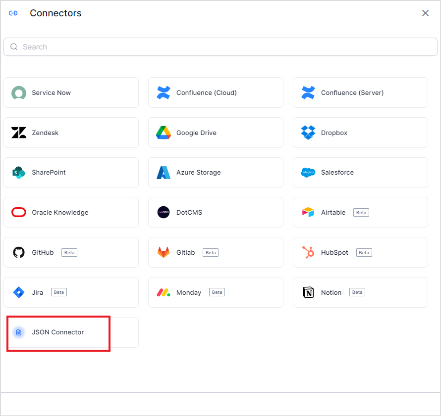
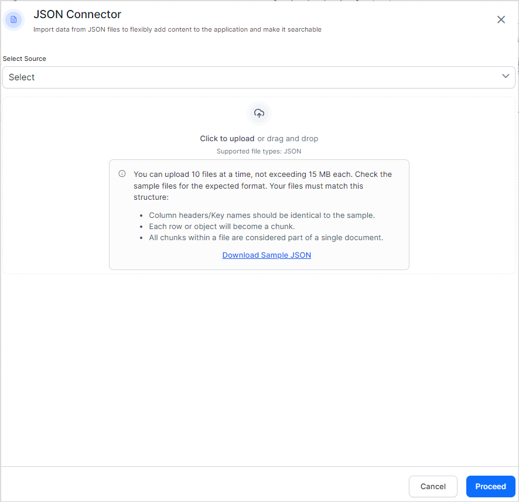
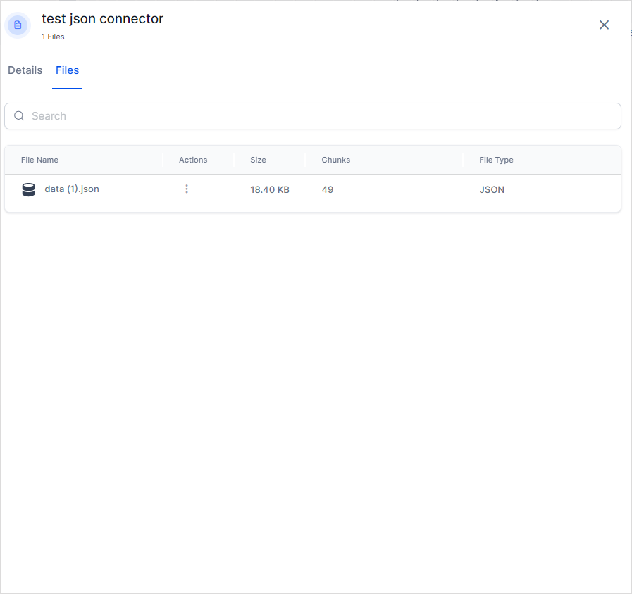
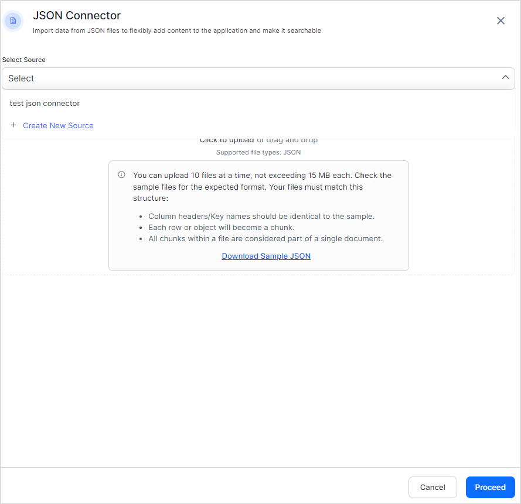

# JSON Connector

JSON Connector enables the ingestion of chunked content directly into the SearchAI application. This content is immediately added to the indexed content, ensuring seamless integration and efficient data retrieval within SearchAI. This gives the users the flexibility to ingest any type of data to the application by creating structured data from it in a given format. 

The content can be added to the application as one or more files containing chunked content in JSON format. Each file should have an array of JSON objects where each object corresponds to a chunk. Hence, it is mandatory that the keys of the object exactly match the chunk fields in the application. 

## File Format

The structured content can be uploaded to the application using a JSON file.

Currently, the structured content in the JSON file is expected to be in a specific format for the Search AI application to understand. Key things to remember:

* The name of the file is used as the recordTitle. 
* The JSON file structure is expected to be an array of objects where each object presents the details of a chunk. 
* The chunk fields are expected to match the fields listed below. 

<table>
  <tr>
   <td>
Field name
   </td>
   <td>Description
   </td>
   <td>Mandatory
   </td>
  </tr>
  <tr>
   <td>chunkText 
   </td>
   <td>This is the content that will be used to render the final answer to the user for extractive answers and will be sent to the LLM for generative answers.
   </td>
   <td>Yes
   </td>
  </tr>
  <tr>
   <td>recordUrl
   </td>
   <td>This is the URL used to generate user references. References explain where the content was originally sourced from.
   </td>
   <td>Yes
   </td>
  </tr>
  <tr>
   <td>sourceACL
   </td>
   <td>This field stores the list of user identities that have access to the information stored in this chunk
   </td>
   <td>No
   </td>
  </tr>
  <tr>
   <td>sourceUrl
   </td>
   <td>This is the URL of the primary source. For example, for content from the Kore website, if recordUrl: <a href="www.kore.ai/products">www.kore.ai/products</a>, set sourceUrl: www.kore.ai. If this is empty, it is set to the same value as the recordUrl. 
   </td>
   <td>No 
   </td>
  </tr>
  <tr>
   <td>chunkMeta
   </td>
   <td>This field can be used to store any metadata associated with the chunk. This can be used to further process the content in the application, generate embeddings etc.
   </td>
   <td>No
   </td>
  </tr>
  <tr>
   <td>chunkTitle
   </td>
   <td>This is the title that will be used to render the final answer to the user for extractive answers and it will be sent to the LLM for generative answers.
   </td>
   <td>No
   </td>
  </tr>
  <tr>
   <td>cfa1	
   </td>
   <td>This custom field of type array is available for users to use according to their requirements.
   </td>
   <td>No
   </td>
  </tr>
  <tr>
   <td>cfa2	
   </td>
   <td>This custom field of type array is available for users to use according to their requirements.
   </td>
   <td>No
   </td>
  </tr>
  <tr>
   <td>cfa3	
   </td>
   <td>This custom field of type array is available for users to use according to their requirements.
   </td>
   <td>No
   </td>
  </tr>
  <tr>
   <td>cfa4
   </td>
   <td>This custom field of type array is available for users to use according to their requirements.
   </td>
   <td>No
   </td>
  </tr>
  <tr>
   <td>cfa5
   </td>
   <td>This custom field of type array is available for users to use according to their requirements.
   </td>
   <td>No
   </td>
  </tr>
  <tr>
   <td>cfs1
   </td>
   <td>This custom field of type string is available for users to use according to their requirements.
   </td>
   <td>No
   </td>
  </tr>
  <tr>
   <td>cfs2
   </td>
   <td>This custom field of type string is available for users to use according to their requirements.
   </td>
   <td>No
   </td>
  </tr>
  <tr>
   <td>cfs3
   </td>
   <td>This custom field of type string is available for users to use according to their requirements.
   </td>
   <td>No
   </td>
  </tr>
  <tr>
   <td>cfs4
   </td>
   <td>This custom field of type string is available for users to use according to their requirements.
   </td>
   <td>No
   </td>
  </tr>
  <tr>
   <td>cfs5
   </td>
   <td>This custom field of type string is available for users to use according to their requirements.
   </td>
   <td>No
   </td>
  </tr>
</table>

Refer to the sample file for reference. 

## Configuration Steps

Go to the **Connectors page** under **Content**. Add the **JSON Connector**. 

Select the source name to which the JSON content is to be uploaded. If there is no existing source, create a new source. Upload the file with the structured data in JSON format. Use the sample file as a reference for the JSON file format. 

Click **Proceed**. This will ingest content from the files into the application. Click on the **Files** tab to view the contents of the connector at any time. 

To add more content to the connector, add JSON Connector again,** select the same source name** as before, and add more files. 

Things to note:

* You can upload up to 10 files at a time, where each file should not exceed 15MB in size. 
* The name of the file used to upload JSON content is used as the recordTitle. 