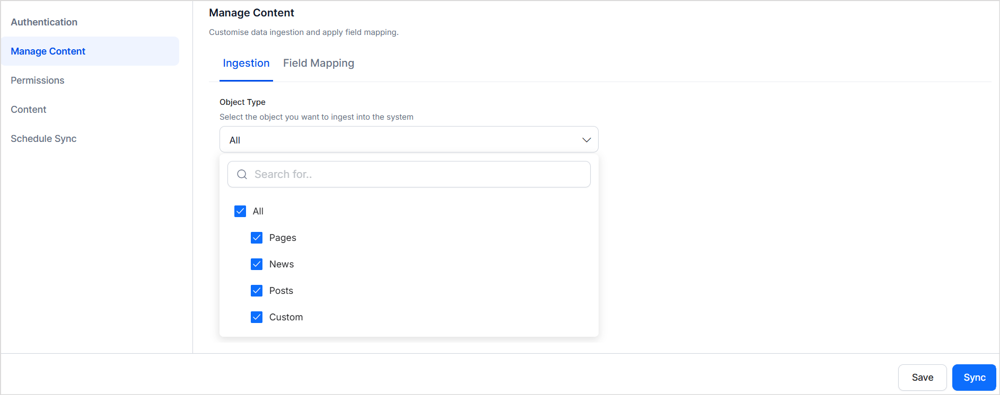
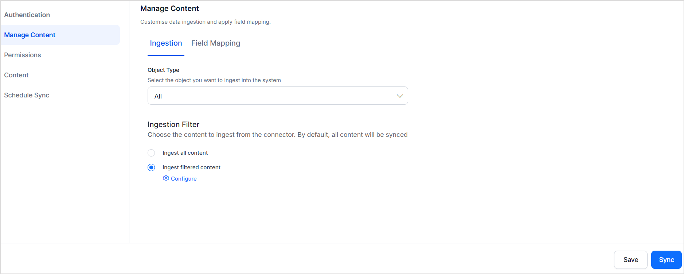
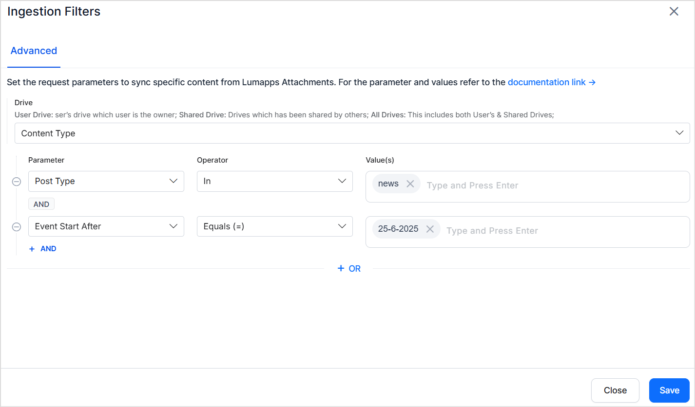
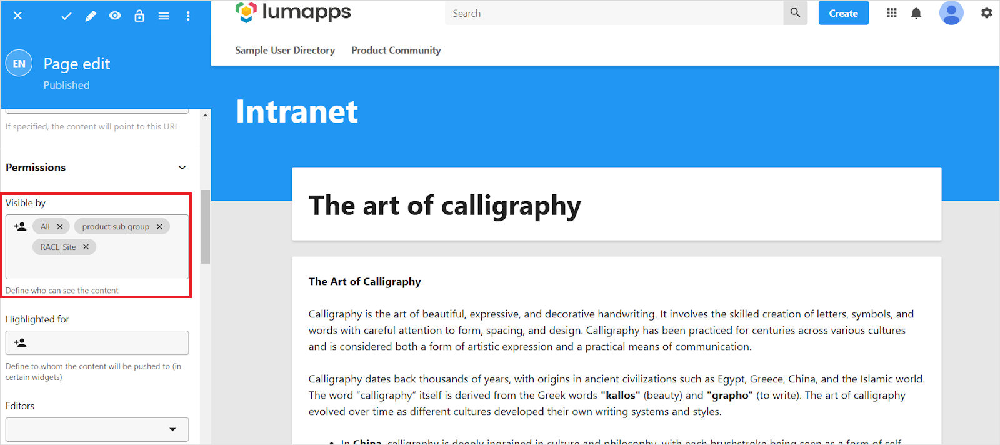

# LumApps Connector

**LumApps** is a digital workplace platform that enhances internal communication, collaboration, and employee engagement within organizations. It serves as a centralized hub where employees can access company news, documents, and tools, and collaborate effectively.

LumApps organizes content into key types, such as pages, news, and custom objects. It also enables the creation of communities and the sharing of content as community posts.

<!-----

Conversion time: 0.35 seconds.

Using this Markdown file:

1. Paste this output into your source file.
2. See the notes and action items below regarding this conversion run.
3. Check the rendered output (headings, lists, code blocks, tables) for proper
   formatting and use a linkchecker before you publish this page.

Conversion notes:

* Docs to Markdown version 1.0β44
* Tue Jul 01 2025 05:52:38 GMT-0700 (PDT)
* Source doc: LumApps Connector
* This is a partial selection. Check to make sure intra-doc links work.
----->

**LumApps Connector Specifications**

<table>
  <tr>
   <td>Type of Repository 

   </td>
   <td>Cloud

   </td>
  </tr>
  <tr>
   <td>Content Supported

   </td>
   <td>

* Content Objects
    * Pages
    * News
    * Custom Objects
* Community Posts
   </td>
  </tr>
  <tr>
   <td>
RACL Support

   </td>
   <td>Yes

   </td>
  </tr>
  <tr>
   <td>Content Filtering

   </td>
   <td>Yes

   </td>
  </tr>

</table>

## Connector Configuration

Search AI interacts with LumApps through its APIs. To set up this communication, you need to create an OAuth application and generate client credentials. 

### Create an OAuth Application

In the LumApps back office, go to Extensions > Installed extensions page and do the following configuration. 

1. Select Oauth Application Manager > Details.
2. Go to the Settings tab.
3. Click Add an OAuth application.
4. Enter a name in the Application name field.
5. In the Scopes field, select the following. 
    1. **All.read**
6. Leave the Authorized User ID field blank.
7. Click Save.
8. Copy the Application ID and Application secret.

### LumApps Connector Configuration in Search AI

On the **Authorization** tab of the connector, provide the following details.

* Name - Unique name for the connector. 
* Authorization Type: Select Token as the type.
* Grant Type: Select Client Credentials. 
* Client ID: Provide the Application ID generated above. 
* Client Secret: Provide the Application Secret generated above. 
* Organization ID: Unique identifier assigned to your organization’s platform. This ID is present in your platform URL after the word, ‘org-’. For example, in this instance, `https://org-3731839993107899.app.lumapps.com/`, the organization ID is `3731839993107899`. You can also find this information in the debug dialog in the customer platform. **To view the debug dialog, press CTRL + SHIFT + ?.**
* User ID: User ID used to access the content from LumApps. This user will be impersonated to fetch the content. Find this info from the debug dialog. 
* Host URL: This is the URL of the LumApps API host. This is also referred to as the **Haussmann cell.** This host varies depending on the LumApps environment your platform is hosted on. Use the debug dialog to find this information. 
* Content-Type: Select the type of content to be ingested from LumApps. You can select all the content or specifically Pages or community posts.  

Click on **Connect** to authenticate and set up a connection with the LumApps account. 

## Content Ingestion

In LumApps, content is managed using various content types. Search AI enables the ingestion of **Pages, News, and Custom content objects** from LumApps. Additionally, it also enables the ingestion of **posts from communities** created in LumApps. 

Each page, post, news item, or custom content item is ingested as a separate document in Search AI. 

The **resource_type** field identifies whether the record is a content object or a community post. The **doc_source_type** field in the ingested content specifies the type of content object (e.g., page, news, or custom). The content field contains the textual content from the ingested record. Other details like title, URL, creation, and updation date are captured in respective fields.

### Handling attachments in LumApps

Attachments to content objects or community posts are ingested as **separate records** in Search AI. If any ingested content has attachments:

* The **parent record** includes an **attachment** field that lists all associated attachments, along with their **name** and **URL**.

For the **attachment record**:

* **doc_source_type** is set to **attachment**.
* **resource_type** is inherited from the parent content object.
* The record also contains **metadata of the parent** object: parent_name, parent_url and parent_id.

    **Supported Attachment Types:**

* .doc
* .docx
* .ppt
* .pptx
* .pdf
* .txt
* .html 

The attachment types are ingested and indexed to support content discovery and search relevance, like all other ingested objects.

### Content Filtering

LumApps Connector offers content filtering support to enable selective ingestion of content from the LumApps account. 

To ingest only specific types of content from your LumApps account, navigate to the **Manage Content** page and use the **Object Type** selector to specify the type of content you want to ingest (e.g., Page, News, Custom Object, or Community Post).

Once the object type is selected, you can further refine the content ingestion by applying **ingestion filters** based on specific fields within the content—such as title, creation date, author, or tags—to ingest only the relevant records. To do so, select Ingest Filtered Content and click on the **Configure** link to configure the rules of selection. 

**Advanced Filters** allow more granular control by letting you define **field-based rules**. For example, you can configure filters to ingest news from the past week.

Choose from available fields for the selected object type in the dropdown and provide the operators and values to specify the condition. Note that when adding a new field to the condition,  the field name should match the field name for the selected object in your LumApps account. 

You can also use **logical operators** to specify more than one condition to define a rule. 

## RACL Support

### **Content Objects**

* In **LumApps**, various content objects such as **Pages, Custom Content, and News** can be shared with different user groups. This is controlled through the **Visible By** field in the UI, which determines accessibility. 

* For **Pages, Custom Content objects, and News**, the sys_racl field stores the groupID associated with the user group that has access to the content. The groupID is managed as a **Permission Entity**. Administrators can use **Permission Entity APIs** to map users to their respective groupID, ensuring controlled access to content.

### **Community Posts**

* **Community Posts** are accessible **only to the members** of the respective community. \

* The sys_racl field for community posts contains the **Community ID**, ensuring that posts remain visible exclusively to authorized community members. Use the permission entity APIs and associate community members with the community ID. 