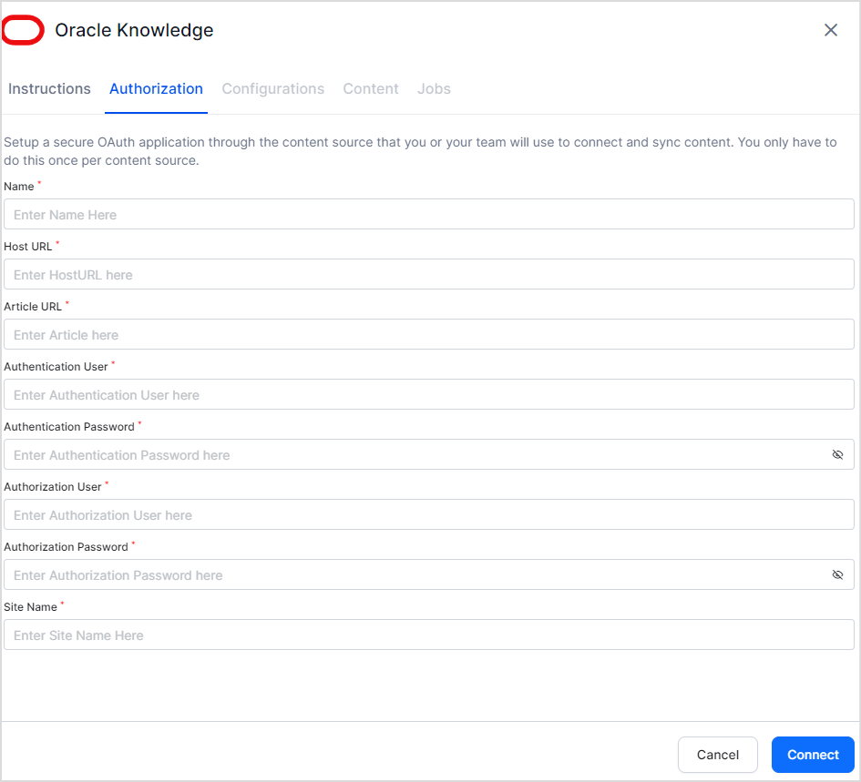

# Oracle Knowledge Connector

With the help of Oracle Knowledge Connector, SearchAI enables seamless search through your data available on the Oracle Knowledge Base.

<table>
  <tr>
   <td>Type of Repository 
   </td>
   <td>Cloud
   </td>
  </tr>
  <tr>
   <td>File type Support
   </td>
   <td>Knowledge Articles
   </td>
  </tr>
  <tr>
   <td>RACL Support
   </td>
   <td>No
   </td>
  </tr>
</table>

To integrate your SearchAI application with  Oracle Knowledge, follow the below steps. 

## Step 1: Get Your Oracle B2C Service Knowledge Advanced Account Info

SearchAI fetches relevant data from the Oracle Knowledge base using REST APIs.  To access the REST APIs on the Oracle knowledge base, we need two types of users – an API User with access to the required resources and a Console user. 

So, fetch the following information from your Oracle Knowledge account.

* REST Server URL 
* API User credentials
* Console user credentials

For more details on how to create an API user and Console user, refer to [this](https://docs.oracle.com/en/cloud/saas/b2c-service/cxska/OKCS_Authenticate_and_Authorize.html). 

## Step 2: Configure the Oracle Knowledge Connector

Go to the **Connectors** page and select **Oracle Knowledge**. On the Configuration page, enter the following details and click **Connect**. 

* Name: Unique name for the connector in SearchAI
* Host URL:  The URL of your Oracle B2C Service Knowledge Advanced server 
* Article URL: The URL where the knowledge articles are hosted. This will be used to show the article links in the search results. 
* Authentication user: User name for the API user.
* Authentication Password: Password for the API user.
* Authorization User: User name for the Console user.
* Authorization Password: Password for the Console user.
* Site Name: The name of the site from where you are trying to access the APIs. 