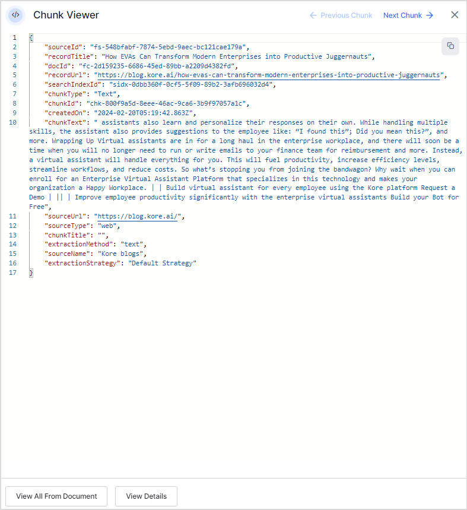

# Web Crawl

Websites usually provide detailed information about an organization's products and services but have numerous pages and links. Finding a particular piece of information on a website can be a time-consuming task. Search AI simplifies this process by indexing the content of websites, enabling the data and information on the web pages to be readily available as answers to the user's queries. 

## Features

* You can ingest web content through web crawling at regular intervals, allowing you to access the most recent data for efficient searches.
* Web crawler only needs a base web URL. It automatically discovers the pages on the site using its navigation plan and hyperlinks found on the page. 
* You can define crawl rules to enable or disable specific pages to be crawled. 
* There is authentication support to allow a crawler to access restricted content. 

To manage the data ingested through web pages or to add new web sources, go to the **Websites** page under the **Content** section.

## Adding a new web crawler for a web source

To add a new web source, click **+Web Crawl**.

Alternatively, if some web domains are already configured for crawling, you will see the list on this page. Click **+Web Crawl** on the top right to add a new web domain for crawling.

Provide details of the crawl configuration on the **Configuration** tab and click **Save & Crawl**.

This validates the configuration provided and by default, automatically initiates the crawl process after validation.

You can choose to run the crawl in the background which allows you to perform other tasks on the application. Alternatively, you can also schedule the crawler to run at specific times in the future.

### Crawl Configuration

**Source Title** – Provide a unique name for the web source. 

**Description** - Enter a description of the source. This field can contain any information about the source, such as the data it offers and the reason for adding it as a source. 

**Crawl Sources** – There are three ways to initiate crawling for a web domain. 
    1. **URL** – Provide the base URL of the web domain to be crawled. When a URL is provided, the crawler automatically goes through the web pages that are discoverable through this URL in the domain based on the **crawl configuration** discussed below.
    2. **Upload Sitemap** – Provide a list of sitemaps as a CSV file and a Base URL. The base URL is used to validate the URLs in the sitemaps.  It crawls through all the web pages listed in each sitemap in the CSV file, for which the URL matches the Base URL. If a URL in the sitemap does not match the base URL, the crawler skips that URL and does not crawl it. The crawl options are used to refine the URLs further for crawling. You can use the sample sitemap CSV to learn the format of the CSV file.  
    3. **Upload URL**– Provide a list of URLs to crawl in the form of a CSV file and a base URL. The base URL is used to validate the URLs in the CSV file.  In this case, the crawler goes through all the pages listed in the CSV file that match the Base URL. The URLs that match the base URL are crawled, and those that do not match are skipped. The crawl options are used to refine the URLs further for crawling. In this case, crawl depth and max URL crawl options are not required.  Use the *Sample URL CSV* to learn about the format of the CSV file.

**Crawl depth** – Each website contains multiple levels of the hierarchy of pages and subpages. The source URL is considered to be at the top of the hierarchy, and other pages linked to the source URL create nested layers. Crawl depth refers to the maximum number of nested levels that the crawler should go to. Set to 0 to indicate no limit. If no value is provided for the field, the default crawl depth is set to 5. 

**Max URL Limit** - This field refers to the maximum number of URLs to crawl. Set to 0 to indicate no limit. If no value is provided, this field uses the default value of 10.

**Advanced Crawl Configuration** - This section provides advanced configurations to optimize the crawling process and filter the web pages to be crawled. 

* **Use Cookies** – Check the field if you want to crawl web pages that require cookie acceptance. If the field is unchecked, the web pages which require cookie acceptance will be ignored. 

* **JavaScript Rendered** – Check this field if the content rendered through Javascript code is to be crawled. This field can be useful if the web pages are Javascript-heavy and may have useful information for the user. If disabled, any content that is rendered on the website through Javascript will be skipped. 
   
!!!note
    Tip: Websites with dynamic content are usually Javascript rendered. 

When the **JavaScript Rendered** option is enabled, specify the **Crawl Delay field** that specifies the time that a crawler waits before considering a web page as fully rendered and starting indexing of the page.

* **Crawl Beyond Sitemap** – Sitemap is a file that provides information about the important pages and files on the website. Check this field to crawl URLs beyond those listed in the sitemap. If this is unchecked, only the URLs defined in the sitemap are crawled.  

* **Respect robots.txt directives** – Robots.txt file contains information about the URLs that the crawler can access on the website. This field, when checked, forces the crawler to honor any directives in the robots.txt file for the web domain.  

* **Processing Options** - This enables you to choose the content for ingestion from a given web page. 

    * **Automatic Cleaning**- This option is useful for web pages where the header and footer may not contain information useful to the end users. When automatic cleaning is selected, the content in the header, footer, and head tags from the web page are removed before ingestion into the Search AI application. This helps exclude irrelevant sections and unnecessary content to be indexed from the web pages.
    * **Retain Original** - When this option is selected, all the content from a web page (including all HTML tags and their content) is ingested into the application. Use **Workbench** to transform the content on this page specifically.

* **Crawl Options**– This field can be used to further filter the web pages to crawl from the list of URLs defined using the crawl source. You can choose to crawl and index all the URLs in the crawl source or allow or block specific URLs from being crawled. This configuration can be used to avoid crawling unnecessary web pages from the source, thereby, optimizing indexing for efficient searches. The field can take one of the following values:
    * **Crawl everything** – Use this option when all the URLs in the domain specified by the Crawl Source are to be crawled. By default, when a new domain is added, this option is used, and all the URLs in the domain are used.
    * **Crawl everything except specific URLs** – Use this option when all the URLs except the blocked URLs are to be crawled. You can add rules to identify the blocked URLs, like _block if URL_ _contains or doesn’t contain _a specific term or if the_ URL is equal to_ a specific URL, as shown below. Select the condition from the drop-down list and specify its values in the text box on the right. 
        
    

    * **Crawl only specific URLs** – Use this option when only selected URLs that satisfy a given condition are to be crawled. For example, if only the blog section is to be crawled, you can set the rule as _Allow if URL contains “blog”_.
        
    
        
    You can use any of the following types of conditions to choose the URLs:
    * **Equals to** - when the URL exactly matches the given value. 
    * **Not equal to** - when the URL does not match the given value. 
    * **Contains** - when a given string is found in the URL. 
    * **Does not contain** - When a given string value is not found in the URL. 
    * **Begins with** - when a given string is found at the beginning of the URL.
    * **Ends with** - when a given string is found at the end of the URL.
            
    You can **add any number of rules** to selectively choose the URLs from the web domain in the above two options. 
        
    

* **Set Schedule Timer** - Enable this field to schedule the crawling at a particular date and time. You can also set a frequency for recrawling the web domain at regular intervals. 
    
To set a schedule, enter the following:    
   * **Date**: The date you want to schedule the first crawl of the web source.
   * **Time**: When you want to schedule the first crawling of the web source. Specify the hours and minutes in a 12-hour format along with the timezone.
   * **Frequency**: Crawling at regular intervals ensures users have up-to-date information. Use this field to specify the  the frequency of recrawling the website. If you want to crawl it only once, set it to ‘Does not repeat’. You can choose daily, weekly, monthly, annual, or custom values for this field.

* **Is this an Authenticated website?** - Enable this field if an authentication mechanism protects the source website. If the website requires authentication, provide relevant information to access the website depending on the authentication method. 

Search AI web crawling supports the two types of authentication - **Basic Authentication** and **Form-based Authentication**. Both are simple authentication schemes built into the HTTP protocol that are used to protect web resources. Although both mechanisms use a username and password to authenticate the client, the difference is in the way both are implemented. Basic Authentication uses an HTTP header to provide the username and password when making a request to the server. Whereas Form-based authentication uses standard HTML form fields to pass the username and password values to the server via a POST request. Depending on the authentication mechanism supported by the web domain, choose the authentication method from the drop-down menu. 

**Basic HTTP authentication**: Basic HTTP authentication requires auth credentials and other optional auth parameters to be validated to access the website. The authentication URL may or may not be the same as the source URL. So, to enable access to a website,  provide the values for the following fields.
    
    <table>
    <tr>
    <td><strong>Field</strong>
    </td>
    <td><strong>Description</strong>
    </td>
    </tr>
    <tr>
    <td><strong>Username or email</strong>
    </td>
    <td>Username or email address, whichever is used to identify the user.
    </td>
    </tr>
    <tr>
    <td><strong>Password</strong>
    </td>
    <td>Password corresponding to the username specified above.
    </td>
    </tr>
    <tr>
    <td><strong>Authorization Field</strong>
    </td>
    <td>Additional field, if any, required by the authentication site for authorization. This is an optional field. You can add one or more auth fields. You can also choose how to send the field and its value in the request like as part of the request header, payload, query string, or as a path parameter. These fields can be used when the authentication URL requires additional fields than the standard ones. For example, if a URL requires an employee ID along with the username and password, add the employee ID to the request using the auth field. 
    </td>
    </tr>
    <tr>
    <td><strong>Authentication URL</strong>
    </td>
    <td>Provide the authentication URL where the identity is to be authenticated. This may or may not be the same as the source URL. 
    </td>
    </tr>
    <tr>
    <td><strong>Test Type</strong>
    </td>
    <td>The type of test to be performed on the response from the authentication URL upon sending the auth request. This field can take one of the following three values:
    <ul>
    <li><strong>Text Presence</strong>: When a specific keyword or text is expected to be returned in the response.
    <li><strong>Redirection to</strong>: When successful authentication is expected to redirect the user to another URL in response.  
    <li><strong>Status Code</strong>: When the response is expected to have a particular value of HTTP status code. 
    </li>
    </ul>
    </td>
    </tr>
    <tr>
    <td><strong>Test value</strong>
    </td>
    <td>Expected response from the authentication URL on sending the auth request. This value depends upon the value of the Test Type. For example, if you set Test Type to <strong><em>Status code</em></strong>, set this to appropriate status code values like 200 (OK), 201(Created), etc. Similarly, if you expect certain keywords or text in the response, set Test Type to <strong><em>Text Presence</em></strong> and provide the expected value in Test Value. 
    </td>
    </tr>
    </table>
    
!!!note
    For increased security, ensure that the websites use a secure communication protocol (HTTPS). 

**Form-based authentication**: In this type of authentication,  auth information is required in the form of fields in a form. On the first successful authentication, the session is maintained, and used for subsequent requests.  Enter the values for the following fields to configure form-based authentication.
    <table>
    <tr>
    <td><strong>Field</strong>
    </td>
    <td><strong>Description</strong>
    </td>
    </tr>
    <tr>
    <td><strong>Form Field</strong>
    </td>
    <td>You can create one or more fields in a form to send as auth information. For each field, define 
    

        <strong>Field key</strong>: Identifier of the field
    

        <strong>Field type</strong>: Type of the field 
    

        <strong>Field value</strong>: Value of the field.  
    </td>
    </tr>
    <tr>
    <td><strong>Authorization Field</strong>
    </td>
    <td>Additional field, if any, required by the authentication site for authorization. This is an optional field. You can add one or more auth fields. You can also choose how to send the field and its value in the request like as part of the request header, payload, query string, or as a path parameter. These fields can be used when the authentication URL requires additional fields than the standard ones. For example, if a URL requires an account ID along with the username and password, add the account ID to the request using auth field.
    </td>
    </tr>
    <tr>
    <td><strong>Authentication URL</strong>
    </td>
    <td>Provide the authentication URL where the identity is to be authenticated. This may or may not be the same as the source URL. 
    </td>
    </tr>
    <tr>
    <td><strong>Test Type</strong>
    </td>
    <td>The type of test to be performed on the response from the authentication URL upon sending the auth request. This field can take one of the following three values:
    <ul>
    <li><strong>Text Presence</strong>: When a specific keyword or text is expected to be returned in the response.
    <li><strong>Redirection to</strong>: When successful authentication is expected to redirect the user to another URL in response.  
    <li><strong>Status Code</strong>: When the response is expected to have a particular value of HTTP status code. 
    </li>
    </ul>
    </td>
    </tr>
    <tr>
    <td><strong>Test value</strong>
    </td>
    <td>Expected response from the authentication URL on sending the auth request. This value depends upon the value of the Test Type. For example, if you set Test Type to Status code, set this to appropriate status code values like 200 (for success), etc. 
    </td>
    </tr>
    </table>

## Updating an existing web crawler

You can edit the configuration for any crawl source at any time. This can be useful if the authentication methods have changed, the crawl rules need to be updated, the crawling schedule needs to be modified, etc. 

!!!Note
    We can use all the properties of the web crawler except the crawl source. 

Any changes made to the configuration become effective either when you manually recrawl the domain after making the changes or at the next scheduled recrawl time.  

To make any changes in the source configuration, click the source title from the list of configured sources and make appropriate changes under the **Configuration** tab. 

## View execution status and crawled pages

Crawling a web domain takes time, depending on the crawl options set for the source. For example, if all the URLs are to be crawled and the crawl depth and max URLs are set to maximum, it may take longer than a configuration where the crawl depth is set to 2, and the max URLs are set to 10. When a new web source is added, you can execute the crawling process in the background. Also, the scheduled recrawls, which run at specific times, are automatically run in the background. To view the pages that have been crawled in a web source, go to its **Pages** tab. This tab lists the pages that were crawled in the last update, along with the user who initiated the crawl and the URL of the crawled pages in three different categories:
1. **Successful**: Pages that were successfully crawled
2. **Failed**: Pages that failed to crawl
3. **Skipped**: Pages that were skipped during crawling
 
This information can be very useful for understanding the data retrieved from the web source.

It lists the pages crawled in the last update, the user who initiated the crawl, and the URL of the crawled page. You can also recrawl a given page or delete it using the actions for the page. 

You can also go to the detailed view of a given page and take these actions as shown below. 

Additionally, to view how the page is stored in the application, click on the **View JSON** button. 

To view the execution status and logs, go to the **Executions** tab for the source.

It shows the current status of the web crawl, the timestamp of the most recent crawl, and the corresponding logs.

## Recrawling a web source

Recrawling is required to keep up with the changes in the source. You can either schedule recrawling of the website at regular intervals using the scheduler or you can manually perform a recrawl operation as and when required. To manually recrawl a web source, click the **recrawl** action against the name of the source.

You can also use the Re-Crawl on the configuration page of the web source. 

You can also recrawl selected pages of the source when you know the specific pages that have been updated. This can avoid the unnecessary crawling of the whole source. Go to the **Pages** tab of the source and click the **Recrawl** link under **Actions** for the page to be crawled.

## Deleting an existing web crawler

When a resource is no longer required and you do not want the information to appear in the answers, delete the source from the application. To do so, go to the **Web Crawl page** that lists all the existing sources and click the delete link for the source you want to delete.

You can also delete one or more of the crawled pages individually from the source without deleting the source. To do so, go to the **Pages** tab for the selected source and click the **Delete** link under **Actions** for the page to be removed.

!!!note
    Note that if a specific page is deleted manually as explained above and the web source is recrawled, the page reappears in the crawled pages list unless the crawl options are modified to disable the crawling of this page( like adding it in the exclude list). 

## Web Crawl Errors and Troubleshooting

There can be various scenarios when the application either fails to crawl a web page or successfully crawls the page but does not index the web page’s content and, hence, does not return the expected results. 

Whenever the application fails to validate the crawl configuration provided and is unable to initiate the crawling process, the details of the error are displayed as shown below.

If the web crawl fails while running in the background, you can see the crawl errors in the status field as shown below. Hovering over the info icon gives you more details about the error.

Hovering over the info icon gives you more details about the error. 

Below are some of the most common error scenarios. Refer to [this list](../web-crawl-errors) for an exact list of errors, potential causes, and the next steps to take. For any specific queries or issues, please [contact us](https://kore.ai/).

1.**Web Crawl Failure:**

* Ensure you have permission to log in to the web pages you are trying to crawl and have provided the correct credentials in the web crawl configuration.
* Verify that the URL is accurate and complete, directing to the intended pages for crawling.
* Confirm that the domain is whitelisted for the XO platform. 

2.**Successful Web Crawl but Unsuccessful Indexing:**

* Verify that your web pages are not rendered in Javascript. By default, the application does not crawl JS-rendered pages. Hence, if your pages are completely or partially JS rendered, the web crawl will not index all the content. To enable the crawling of such pages, enable the “Javascript Rendered” option in the crawl configuration. 
* Verify that the inclusion and exclusion rules are set appropriately. 
* Verify that the crawl depth and max URLs are set appropriately.  These configuration parameters impact the number and sequence of pages crawled. 
* Ensure that the page is discoverable. Web crawler uses sitemaps and links between pages to find a page. If a page is not linked from other pages and not listed in the sitemap, the web crawler will not discover it.

3.**Web Crawl Takes Too Long:**

* Verify if the web pages are JavaScript-rendered and enable the option if necessary. This situation may arise when many pages on the website being crawled return no content because they are JavaScript-rendered. The crawler continues to crawl the next pages until it crawls the specified number of pages (defined by *‘max URLs’* ).
