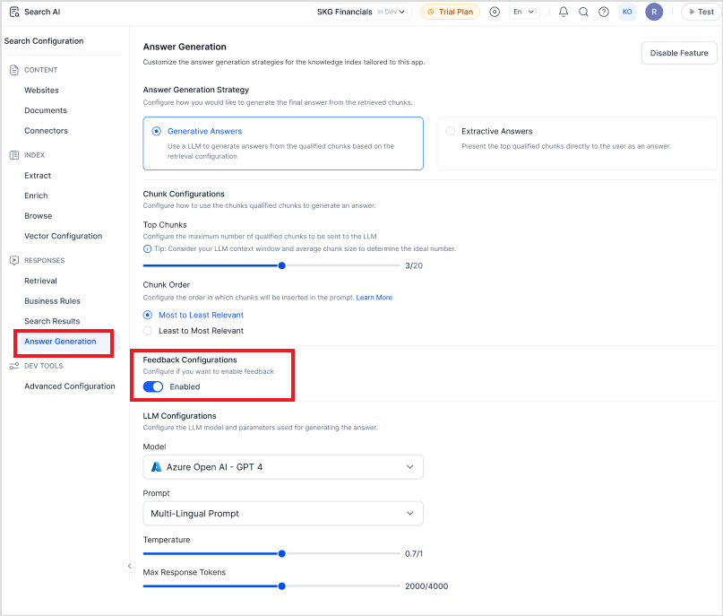
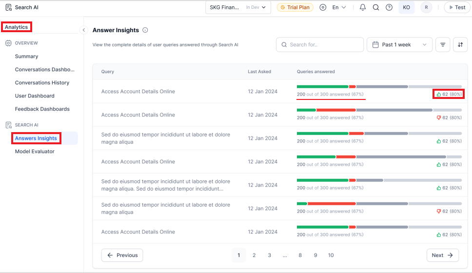

# Feedback Mechanism in Search AI

The feedback mechanism in Search AI plays a crucial role in evaluating and improving the quality of answers delivered by the application. It allows end users to express their satisfaction with a response through a simple thumbs up or thumbs down action, which can be captured either via the Web SDK or through the public API.

## Enabling Feedback Mechanism

To enable the feedback mechanism in answers displayed in the web SDK, go to the **Answer Generation** page and enable the **Feedback Configuration**. 

When a user interacts with a response by giving it a thumbs up or down through the SDK or via the public APIs, the feedback is recorded and associated with that specific answer. This data is then shown in the **Answer Insights** page, providing administrators and content teams with a clear view of how well responses are resonating with users.

In cases where an answer receives both positive and negative feedback, the system highlights the majority sentiment. For instance, if an answer gets 20 feedback entries with 16 positive and 4 negative, the feedback is displayed in green with a count of 16, indicating a favorable user experience.

To view individual feedback on a query, click the query. It navigates to the Answer Summary page that lists all the answers that the users have received on the query, along with the feedback on the answer. 

Click View Details link for any of the answers to view the user comments along with the feedback. 

To capture the feedback via the APIs, use the [Feedback API](../apis/searchai/feedback.md).  
