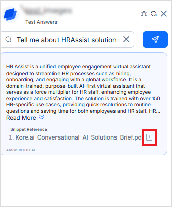

# Use Information in Images to Generate Answers

Search AI can extract text from image-based content and use it for retrieval and answer generation. This capability enables the system to deliver precise responses from visual documents such as PDFs, screenshots, and infographics.

For optimal results, it’s important to select the right *extraction strategy*, as it determines how the system interprets and uses visual data to generate answers. Search AI supports two extraction strategies for visual content:

## Image-Based Document Extraction Strategy (Recommended)

This strategy is designed to handle complex PDF files, particularly those containing non-textual layouts such as forms, tables, or visually rich content. 

In this approach, 

* Each page of the PDF is first converted into an image, preserving the layout, structure, and visual context. 
* These page images are then processed using a VDR embedding model, which generates embeddings that capture both the textual and visual semantics. 
* When a user submits a query, the query is converted into two embeddings - one using a text model and another using an image model.
* The text embedding is used to search against text-based chunks. The image embedding is used to search against image-based chunks.
* The system retrieves the top 5 image chunks and top 20 text chunks,, then sends them to the LLM for answer generation. For image chunks, the image URLs are also passed to the model, allowing it to access and interpret the images directly when forming the answer.

**End User Experience**

When answer is displayed users can see both the text extracted from the image and references to the image from which the answer is generated. Click on the info icon to see the preview of the image.
 

[Learn More.](../content-extraction/extraction.md#image-based-document-extraction)

## Layout-aware Extraction Strategy

This strategy extracts data by considering the content's layout and structure. This method allows customization of data extraction based on the specific layout or format of the content. Configuring the strategy to particular layout requirements enables more effective extraction of data chunks.

The layout-aware extraction method uses the following approach.

* The application identifies objects in documents by combining OCR, layout-detection models, and layout-aware rules. 
* When a query is made, relevant chunks are shortlisted and sent to the LLM.
* If llm uses these chunks to answer then the image is also presented to the user.

[Learn More.](../content-extraction/extraction.md#layout-aware-extraction)

## Configuration Steps

1. Upload content. Refer to this to learn more about the supported formats for different content sources.
2. Set up Extraction Strategy. Choose one of the following based on your document type:
    1. *Image-Based Document Extraction* (recommended)
    2. *Layout-Aware Extraction*
3. Train the application.
4. Verify the images extracted as part of the chunks in the Browse section.
5. Go to the Index Configuration. If using the image-based extraction strategy:
    3. Under the Image tab, select XO GPT - VDR embeddings Model and the prompt. You can use the default prompt or create a custom one. 
6. Configure the retrieval and answer-generation settings. For layout-aware, all the models are supported. When using Image-Based Extraction, ensure one of the following answer generation models is selected.
    * OpenAI models - gpt-4o, gpt-4o-mini, gpt-4 turbo
    * Azure OpenAI models -  GPT-4o, GPT-4o-mini, GPT-4 Turbo
    * Note: Custom LLMs and Amazon Bedrock are not supported. 
7. Test the answers. Go to the Answer Generation page and use the Test Answer widget to verify the results. When queries are made against indexed images, the text extracted from the image appears as part of the generated answer. The complete image can be viewed by clicking the Preview icon next to the references.