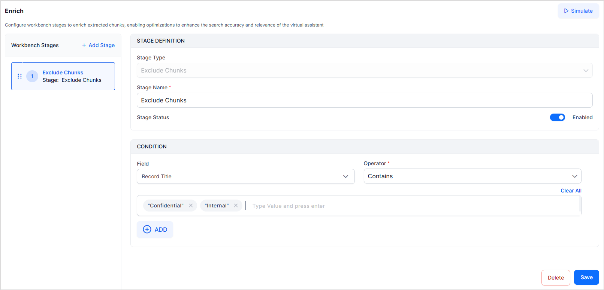

# Exclude Document

The Exclude Document stage prevents specific documents from being processed in the Workbench. When documents meet the defined exclusion condition, the system ignores them and doesn't index them.

Use this stage to filter out unwanted or irrelevant content before it enters the indexing pipeline.

## Exclude Document Configuration

Use the following properties to configure this stage.

* Stage Type: Set this field to Exclude Document type
* Stage Name: Set a unique name for the stage.
* Condition: Define a condition to select the documents to be excluded from processing. Use the basic or script mode to define the condition. You can define any number of conditions with the AND operator between the conditions to find the exact set of data to be excluded. 

For example, to exclude all the files with the keyword ‘Confidential’ in the title, add the condition as shown below. 

