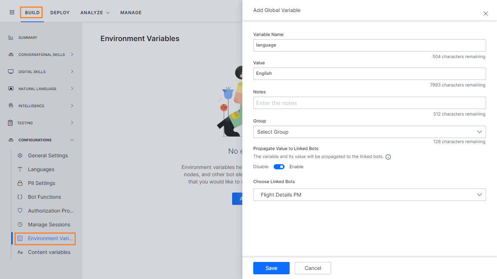
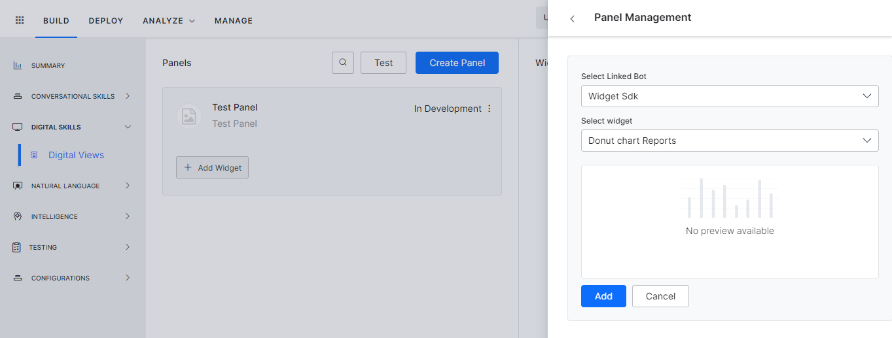

# Customizing the Universal Bot’s Default Dialog Task

	

		

			

While a Universal Bot acts as a container for Standard Bots and has limited functionality. Listed here are the aspects that can be customized:

* Training,[ refer here](https://developer.kore.ai/docs/bots/advanced-topics/universal-bot/training-a-universal-bot/)
* Enabling Languages,[ refer here](https://developer.kore.ai/docs/bots/advanced-topics/universal-bot/enabling-additional-languages-for-the-universal-bot/)
* Default Dialog customization,[ refer here](https://developer.kore.ai/docs/bots/advanced-topics/universal-bot/customizing-the-universal-bots-default-dialog-task/#Default_Dialog_Task)
* Event Handling,[ refer here](https://developer.kore.ai/docs/bots/advanced-topics/universal-bot/customizing-the-universal-bots-default-dialog-task/#Event_Handlers)
* Variable Management,[ refer here](https://developer.kore.ai/docs/bots/advanced-topics/universal-bot/customizing-the-universal-bots-default-dialog-task/#Variable_Management)
* Sentiment Management,[ refer here](https://developer.kore.ai/docs/bots/advanced-topics/universal-bot/customizing-the-universal-bots-default-dialog-task/#Sentiment_Management)
* Digital Views,[ refer here](https://developer.kore.ai/docs/bots/advanced-topics/universal-bot/customizing-the-universal-bots-default-dialog-task/#Digital_Views)

		

	

	

		

			

## Default Dialog Task

**Before you Begin**

This article assumes that you understand the fundamentals of creating dialog tasks using the Kore.ai Bots Platform and therefore focuses on the aspects specific to the universal bots. To refer to the fundamentals of dialog tasks, read[ Dialog Tasks](https://developer.kore.ai/docs/bots/bot-builder-tool/dialog-task/dialog-tasks/).

		

	

	

		

			

Universal bots come with a built-in dialog task that triggers automatically for unidentified intents. You can customize this dialog task, or import another, but cannot replace it with other standard responses. You can add more nodes to the default dialog task to build a custom experience.

		

	

	

		

			

#### Default Dialog Nodes

Nodes that can be added to universal bot are limited compared to the standard bots. Below is the list of nodes that can be added to the default dialog task in the universal bot:

* Send a message
* Ask a question
* Ask for an entity
* Make a service call
* Run a JavaScript
* Initiate Agent Transfer
* Enable WebHook connections

		

	

	

		

			

#### Customize the Default Dialog

Follow these steps to customize the default dialog message:

1. Open the universal bot for which you want to configure the default dialog.
2. Select the **Build** tab from the top menu.
3. Select **Intelligence > Default Dialog**.
4. Listed will be the default dialog – **Intent Not Identified**. 

    

5. Click to open the dialog. You will see an Intent and Message node already configured.
6. You can customize the default dialog like any other dialog task adding the above-mentioned nodes.

		

	

	

		

			

#### Customizing the Default Dialog for an Enabled Language

If the Kore.ai NLP engine cannot recognize the user intent, the universal bot responds to the users with the default dialog. You must create language-specific versions of the default dialog for each enabled language so that such bot responses go in the users’ preferred language. Otherwise, the universal bot responds applies the default bot language regardless of the user’s preferred language.[ Learn more](https://developer.kore.ai/docs/bots/advanced-topics/universal-bot/enabling-additional-languages-for-the-universal-bot/).

		

	

	

		

			

## Event Handlers

**Before you Begin**

This article assumes that you understand the fundamentals of Event Handler functionality using the Kore.ai Bots Platform and therefore focuses on the aspects specific to the universal bots. To refer to the fundamentals of Event Handling, read[ Event Based Bot Actions](https://developer.kore.ai/docs/bots/bot-intelligence/event-based-bot-actions/).

The ‘Events’ in the Universal Bot support triggering of the Dialog Tasks from the linked bots. For events that support the execution of tasks, you can choose the linked bot and a task from the linked bot.

The linked task will be executed at the trigger of the event. If the linked bot task is not available at the run time or in the language that the end-user is having the conversation in, then the end-user would be presented with the relevant Standard Response ‘Dialog task required for conversation is not available’

		

	

	

		

			

## Variable Management

While building Universal bots you might want to propagate a few values to the linked bots, like:

* the environment details, when building multi-lingual bots, while migrating the universal bot from one environment to another.
* the tenant values for scoping the bot intents.

**Before you Begin**

This article assumes that you understand the fundamentals of creating variables using the Kore.ai Bots Platform and therefore focuses on the aspects specific to the universal bots. To refer to the fundamentals of variable management, read[ Using Bot Variables](https://developer.kore.ai/docs/bots/bot-settings/bot-management/using-bot-variables/).

		

	

	

		

			

### Variable Declaration

As with Standard bots, you can

* Define Global and Content variables.
* Enable the propagation of the variable value to a selected linked bot. 

* You can access these variables in the script using `{{env.&lt;variable-name}}` and `{{content.&lt;variable-name>>}}`
* In case the variable name is defined in both linked and universal bot, the Universal bot variable value would take precedence.

		

	

	

		

			

## Sentiment Management

**Before you Begin**

This article assumes that you understand the fundamentals of Sentiment functionality using the Kore.ai Bots Platform and therefore focuses on the aspects specific to the universal bots. To refer to the fundamentals of Sentiment Management,[ refer here](https://developer.kore.ai/docs/bots/advanced-topics/sentiment-management/).

The Sentiment Based Events in the Universal Bot support triggering of the Dialog Tasks from the linked bots. For events that support the execution of tasks, you can choose the linked bot and a task from the linked bot.

The linked task will be executed at the trigger of the event. If the linked bot task is not available at the run time or in the language that the end-user is having the conversation in, then the end-user would be presented with the relevant Standard Response ‘Dialog task required for conversation is not available’.

		

	

	

		

			

## Digital Views

**Before you Begin**

This article assumes that you understand the fundamentals of Digital Views functionality using the Kore.ai Bots Platform and therefore focuses on the aspects specific to the universal bots. To refer to the fundamentals of Digital Views,[ refer here](https://developer.kore.ai/docs/bots/bot-builder-tool/digital-views/).

The Digital Views in the Universal Bot allows you to view the desired information (via widgets) from various linked bots in a single UB panel so that you can get the relevant details without conversing with the bot.

You can create a panel in the Universal Bot and add Widgets from the linked bots. You cannot edit the widgets. You can perform only the following actions on the panel

* Edit the panel name, display name, and icon
* Add Widgets from linked bots
* Remove a widget from the panel
* Test a Panel
* Delete a Panel

		
