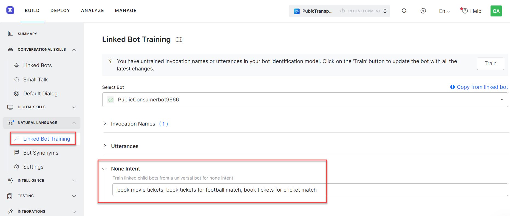

# Training a Universal Bot

You can train a Universal Bot to guide it to the most relevant link bot(s) from which the intents are to be identified. You can use a combination of Invocation Phrases and Training Utterances to define the Bot Identification Training.

Training a Universal Bot is essential for the following reasons:

* To ensure that the user utterances are routed to the relevant linked bots.
* Training Utterances or Invocation Names help the Universal Bot to identify the linked bots and route the user utterances to these identified linked bots.
* In case no linked bots are qualified, then the utterances are routed to the linked bots as Fallback Bots.
* You must review the linked bot identification flow from the Utterance Testing module.

## Training

In the following section, we elaborate on the training steps and best practices to make your Universal Bot efficient and functional.

Remember that the training for Universal bot should be aimed at ‘bot identification‘ and not for ‘intent identification‘ as provided for any standard bot. The utterance will be routed to the identified linked bots (or fallback bot if nothing is identified).

Training a Universal Bot is a three-way process:

1. Train with Invocation Phrases to identify a specific intent in a specific linked bot;
2. Train with Invocation Names that would help identify a specific linked bot;
3. Train with user utterance for scoping linked bots.

!!! note

    Inclusive bots need not be trained. If you choose to train the same, the training will not be used for bot scoping but will be used later if the linked bot is deselected as an Inclusive Bot.

Training can be done from the **Build** tab from the top menu, by selecting the **Natural Language > Linked Bot Training** option.

Note the expectation of this document is that you have already created a Universal Bot and have linked bots to the same.[ Refer here for steps](https://developer.kore.ai/docs/bots/advanced-topics/universal-bot/creating-a-universal-bot/).

### Invocation Phrases

Invocation Phrases refer to the typical phrases that contain a reference to a specific linked bot and intent from that specific linked bot.

For example – ‘_Can you check with HR if I have enough leave balance_’, or ‘_Show my latest leads from salesforce_’, etc.

Each invocation phrases constitute the following components

* **Trigger Phrase** to identify the linked bot. It consists of:
    * **Trigger** word support is provided by the platform by default and this support is extended to language-specific values, too. Refer below for the list of supported trigger words.[ See below for details](https://developer.kore.ai/docs/bots/advanced-topics/universal-bot/training-a-universal-bot/#Trigger_Words).
    * **Invocation Name** can be regarded as synonyms for the linked bot names.[ See below for details](https://developer.kore.ai/docs/bots/advanced-topics/universal-bot/training-a-universal-bot/#Invocation_Names).
* **Intent Phrase** would be the task related to the linked bot that the user wants to perform.

#### Patterns

The presence of a trigger phrase and invocation name should follow the below-mentioned pattern rules:

<table>
  <tr>
   <td><strong>Pattern</strong>
   </td>
   <td><strong>&lt;trigger words></strong>
   </td>
   <td><strong>&lt;intent words></strong>
   </td>
   <td><strong>&lt;connecting words></strong>
   </td>
   <td><strong>&lt;invocation Names></strong>
   </td>
   <td><strong>&lt;question words></strong>
   </td>
  </tr>
  <tr>
   <td rowspan="2" >&lt;<em>intent words</em>>&lt;<em>connecting words</em>>&lt;<em>Invocation name</em>>
   </td>
   <td>Not relevant
   </td>
   <td>*
   </td>
   <td>by, from, in, with, using
   </td>
   <td>User defined
   </td>
   <td>Not relevant
   </td>
  </tr>
  <tr>
   <td>Example
   </td>
   <td colspan="4" ><em>Get nearby restaurants using Zomato</em>
   </td>
  </tr>
  <tr>
   <td rowspan="2" >&lt;<em>Trigger words></em>&lt;<em>Invocation name</em>>

{ &lt;<em>connecting words</em>> }

{ &lt;<em>question words</em>> }

&lt;<em>intent words</em>>
   </td>
   <td>Ask, Tell
   </td>
   <td>*
   </td>
   <td>to, about, for, if, whether
   </td>
   <td>User defined
   </td>
   <td>what, when, where, how, which, why
   </td>
  </tr>
  <tr>
   <td>Example
   </td>
   <td colspan="4" ><em>Ask Uber to book my ride</em>

or <em>Tell Clea I want today’s schedule</em>
   </td>
  </tr>
  <tr>
   <td rowspan="2" >&lt;<em>Trigger words></em>&lt;<em>Invocation name</em>> &lt;<em>connecting words</em>>&lt;<em>intent words</em>>
   </td>
   <td>Ask, Tell, Search, Open, Talk to, Launch, Start, Run, Resume, Load, Begin, Use
   </td>
   <td>*
   </td>
   <td>and, to
   </td>
   <td>User defined
   </td>
   <td>Not relevant
   </td>
  </tr>
  <tr>
   <td>Example
   </td>
   <td colspan="4" ><em>Launch Youtube to play videos from FilterCopy</em>
   </td>
  </tr>
</table>

	

		

			

#### Trigger Words

The following trigger words are supported by default in the platform ([see here for multi-lingual support](https://developer.kore.ai/docs/bots/how-tos/multi-lingual-bot-behavior/#TriggerExit_Phrase_Support)):

* Ask
* Tell
* Search

* Open
* Load
* Begin

* Launch
* Talk to
* Run

		

	

	

		

			

### Invocation Names

The Linked bot’s name is considered an implicit invocation name.

Apart from this, you can define one or more Invocation Names for each of the linked bots. These will be treated as a special set of synonyms defined against linked bot names and the bot users might be using these when referring to the linked bots.

		

	

	

		

			

### Utterances

Training utterances refer to the typical ways in which the users are expected to ask for intent from a linked bot. This usually includes the key training utterances used for training the intents of the linked bots. Keep in mind unlike the ML training, these utterances can identify multiple linked bots, not zero it on one.

You can add up to 500 training utterances.

You can also use the **Copy from linked bot** option to choose and add the utterances from the linked bot.

		

	

	

		

			

From the Linked Bot listing page, you can get an overview of their training status and invocation names, and training utterances.

		

	

	

		

			

#### Exit Phrase

The following trigger words can be used by the user to exit from an exclusive context of a linked bot.

* Exit

### None Intent

The None Intents are used to qualify/disqualify the linked bots based on user utterances defined in them. The None intent is a placeholder that prevents the Machine Learning model from identifying the wrong intent for untrained or ambiguous utterances. For more information, see[ None Intent](https://developer.kore.ai/docs/bots/nlp/advanced-nlp-configurations/#None_Intent) and[ Creating a Universal Bot](https://developer.kore.ai/docs/bots/advanced-topics/universal-bot/creating-a-universal-bot/#Step_3_Training) articles.

### Configurations

For each linked bot, you can set the **Bot Qualification Threshold** as the minimum score needed to qualify the bot for the intent identification process.

By default, it is set to 0.3 and can be set to any value between 0 and 1.

		

	

	

		

			

### Fallback Bots

You can mark certain bots as fallback bots which would be used for detecting intents when no other bots are identified from other training options.

**Points to note**:

* A maximum of 15 bots can be marked as Fallback Bots
* You can change the list of preferred bots at any time to suit the business needs

### Inclusive Bots

Inclusive bots need not be trained with sample utterances to participate in the bot scoping process. These bots will always be considered for Intent Detection at the time of evaluating the user utterances, except when the user invokes a linked bot either using ‘Invocation Phrases’ or ‘Trigger Phrases’. 
 Up to 3 linked bots can be marked as inclusive bots.

		

	

	

		

			

!!! note

    A linked bot can be marked either as Fallback or Inclusive, not both.

### Linked Bots

The information related to the in-context linked bot would be available in the Session context under the following key:

* **currentLinkedBotid** for Linked Bot ID;
* **currentLinkedBotName** for Linked Bot name.

		

	

	

		

			

### Eligible Bots

As Universal Bot developer you can assign specific bots to specific end-users so that only the intents from these bots are made available to them.

The following functions can be used with eligible bots:

* To get the list of currently eligible bots for the given user context: 
 `UserContext.getEligibleBots()`
* To set the eligibility bots: 
 `UserContext.setEligibleBots(["st-linkedBot1","st-linkedBot2"]) 
` where _st-linkedBot1_, _st-linkedBot2,_ etc. are the bot ids of the linked bots (obtained from Setting -> Config Settings -> General Setting) 
 This function will replace the current eligible bots with the ones given.
* To remove the list of currently eligible bots for the given user context: 
 `UserContext.removeEligibleBots()`

You can set the eligible bots based on the user authorization or any other approach that your organization may have in place.

You can also define the bot behavior when the bot assignments are not provided, from the settings,[ see below](https://developer.kore.ai/docs/bots/advanced-topics/universal-bot/training-a-universal-bot/#Settings).

		

	

	

		

			

### Settings

The configuration settings can be accessed from the **Build** top menu tab, left menu, under **Natural Language > Settings**.

The following configurations are to be provided in the Bot Builder so that you can configure these thresholds:

* **Use of Bot Synonyms** – toggle to enable or disable the use of bot synonyms in intent detection. Disabled by default.
* **ML threshold** to define the minimum ML score to qualify an intent as a probable match can be set to any value between 0 and 1. The default setting is 0.3. 
 Post v8.1, this setting has been replaced with Bot Qualification Threshold for each linked bot,[ see above](https://developer.kore.ai/docs/bots/advanced-topics/universal-bot/training-a-universal-bot/#Configurations).
* **Switch to Older Version** can be used to switch to an older version of Universal Bots.[ See here for details](https://developer.kore.ai/docs/bots/advanced-topics/universal-bot/creating-a-universal-bot-older-version/).
* **Trigger Phrases** can be used to allow users to trigger linked bots using Trigger Phrases i.e. without specifying the intent. Once enabled you can define the bot behavior to
    * display the Welcome message defined in the linked bot, or
    * show a custom message. Use **Manage response** to define the message to be displayed.
* **Recently Used Bots** setting can be used to refine the scoping linked bots when no linked bot is identified from training data. The Bot can be configured to remember up to 5 recently used by the user. 

    

* **Intent Rescoring** can be used to define Universal Bot behavior while handling the linked bot intents. By default, the universal bot rescores the intents received from the linked bots to identify the winning intents. This intent identification process depends on the training provided both at the UB and the linked bot. But if the universal bot is not trained properly, rescoring might lead to wrong intent identification. You have an option to disable the intent rescoring for winning intent identification. The setting (introduced in ver8.0) can be:
    * _Rescore the qualified intents to find the best possible match_ – this is the default selection and you can further configure
        * **The proximity of Probable Matches** to define the maximum difference allowed between top-scoring and immediate next possible intents to consider them as equally important. It can be set to a percentage between 0 and 20. The default setting is 2%.
    * _Present all the qualified intents to the end-user for selection_ – this would present the list of ambiguous intents to the user if multiple definitive or/and probable matches are returned from one or more linked bots. If only one intent is returned by a single linked bot then that intent is executed.
* **Bot Assignment Behaviour** can be used to define the behavior when the eligible bots are not set for a given user ([see here](https://developer.kore.ai/docs/bots/advanced-topics/universal-bot/training-a-universal-bot/#Eligible_Bots)). The setting can be:
    * _Assign all Child Bots_: All linked bots are eligible. This is the default setting.
    * _Do not Assign any Child Bot_: The user is not eligible for any of the linked bots.

 
 If your bot is trained in one or more languages that use NLP Version 2, you will see a banner notifying you about the upcoming[ auto-upgrade to NLP Version 3](https://developer.kore.ai/docs/bots/nlp/optimizing-bots/#NLP_Version_3).

		

	

	

		

			

## Implementation

Let us look at how the Universal Bot works.

The universal bot processes user input in multiple stages to identify the appropriate bot and invoke the appropriate intent.

#### Stage 1 – Scoping of Bots

Users should be able to use trigger phrases like “Talk to Salesforce”, “Ask Eva” (Eva being HR bot), or patterns like “Schedule a meeting” or “add a task” to invoke the linked bot.

* The user utterance (invocation phrase) is evaluated for the linked bot name (invocation name).
* This bot name is compared with all linked bot names or eligible bot names (in case eligibility criteria for the user is defined) to shortlist one or more scoped linked bots. 
 **Bot** **Eligibility**: Different users may have access to a different set of bots/skills based on their role or association with teams, in the organization. Using the restricted scope, the universal bot will be able to identify a more appropriate bot based on the user’s access controls.

#### Stage 2 – Fork input to linked bots

Once a set of bots has been scoped, the user input is sent to all the in-scope linked bots. The ranking of intents from each of the linked bots is accumulated and further evaluated.

* The utterance is sent to the scoped linked bots for intent identification.
* Identified intents are then forwarded back to the universal bot’s ranking and resolver for further evaluation and action.

#### Stage 3 – Ranking and Disambiguation

Response from the linked bots is ranked and, if more than one bot is qualified for user input, disambiguated using additional context. If not possible then a disambiguation dialog is presented to the bot user.

#### Stage 4 – Invoke fulfillment

* The winning intent is executed.
* In the case of no winning intent:
    * the universal bot is checked for matching small talk intents.
    * the Fallback bot is executed.

		

	

	

		

	

		

	

	

		

			

### Next Steps

* You can also look into how the Universal Bot can be customized by defining the default dialog and variables[ from here](https://developer.kore.ai/docs/bots/advanced-topics/universal-bot/customizing-the-universal-bots-default-dialog-task/).
* Learn to enable additional languages[ from here](https://developer.kore.ai/docs/bots/advanced-topics/universal-bot/enabling-additional-languages-for-the-universal-bot/).

		
