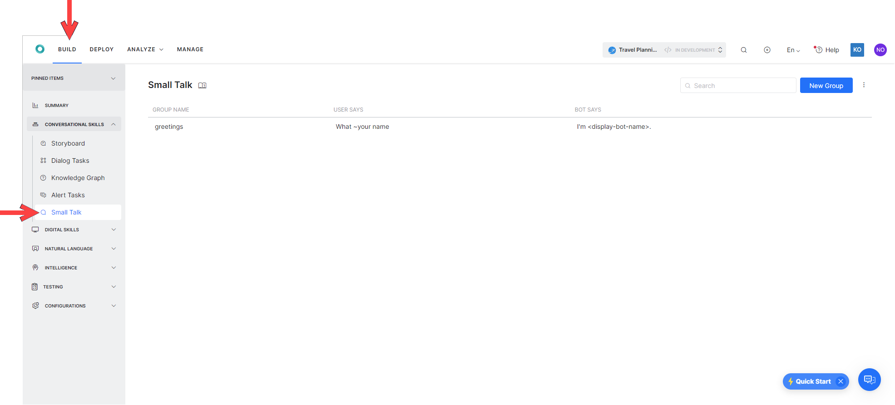
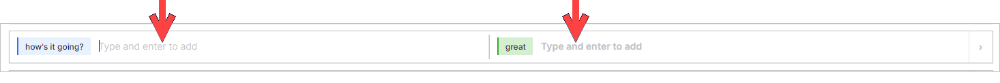

# **Small Talk**

**Small Talk** refers to the casual conversations that a Virtual Assistant can have with end users. The ability to engage end users in casual conversations helps your assistant socialize better with customers and improves recall rates.

The Small Talk conversation is designed as a series of interaction volleys between the assistant and the user. VAs that can answer social inputs like _How Are You?_ are more likely to create a positive impression and help build an invaluable connection with the user.

You can find Small Talk on the Unified XO Platform under **Build > Conversational Skills > Small Talk**.



# Benefits
Positive interactions are key to businesses today, especially in the context of CRM automation. Even when people know that they are not being assisted by a human, they still appreciate the occasional joke, casual chat or other friendly cues that make human-to-human conversations more engaging. This is why a Virtual Assistant that can handle small talk improves the experience for your users or customers.

The Small Talk Engine within the Kore.ai XO Platform lets you configure the conversational elements that are specific to your business context, so that you can create a conversational VA that recognizes when people make small talk and responds accordingly, thus providing a friendly experience, rather than one that feels dry and technical. 

# Features
The Small Talk Engine provides the following features:

* **_Custom Small Talk_** allows you to build a personality and train the VA to conduct casual conversations around your areas of interest.
* **Nested conversations **to answer follow-ups during a conversation and make the VA more engaging.
* **Emoji identification**: The XO Platform can identify the emojis in user utterances and respond accordingly, using Small Talk.
* **Small Talk works with intent detection.** Interjections, such as _hello _at the start of an utterance will not be considered as small talk. For example, the user’s utterance _Hello, I need to book a flight _will be matched with the intent: _book a flight, _so the VA will address the user’s need, rather than use Small Talk.

# Overview
Small Talk is a series of User Utterances and Bot Responses. The primary objective of Small Talk is to engage users in casual conversations and in general, functional topics or business transactions are not included in Small Talk.

The various user queries in Small Talk are categorized into groups and assigned hierarchical structure. The **Greetings** category is auto-generated by default for all new assistants. This group contains various questions related to greetings and pleasantries. You can define additional groups or categories and build interaction flows under each group.

* Each group can have one or more top-level questions. A top-level question can have one or more child questions.
* A child question can have one or more subsequent child questions up to three levels. Every question can have one or more alternate questions.
* Every question can have one or more responses. When multiple responses are present, the Platform will pick one at random.

# Terminology

Following are the various terms associated with Small Talk:

1. **Groups** – Based upon the purpose and content, Small Talk is categorized into groups.
2. **User Queries** – For each group, you can add User Queries, Alternate Queries, and Child Queries. Queries are formed using patterns. [Know more about patterns](https://developer.kore.ai/docs/bots/nlp/fundamental-meaning/#managing-patterns)
3. **Bot Responses** – Each User Query must be associated with a bot response. These can be in plain text format or JavaScript. You can specify channel-specific responses. You can also enter multiple responses, one of which will be picked randomly by the Platform at runtime.


# Default Small Talk

Small Talk is a VA-level task that is configured automatically. When you create a new VA, the Small Talk is generated by default.


> **Note**:
When you open the Small Talk Task in an existing VA, you will be informed of the migration of standard responses related to greetings to the Small Talk feature. You can choose not to Proceed and continue with the Standard Responses.
If you proceed with the migration, the Greetings will be permanently deleted from the Standard Responses section and cannot be retrieved.

The following are the messages under the Greetings group (these are the Standard Responses of Greeting and other categories that are migrated to Small Talk once you choose to **Proceed**)


<table>
  <tr>
   <td colspan="2" ><strong>GREETINGS</strong>
   </td>
  </tr>
  <tr>
   <td>Response when User says Hi
   </td>
   <td>Shown when the user says <em>hi</em>, <em>hello</em>, <em>hey</em>, etc, or just enters the VA’s name.
   </td>
  </tr>
  <tr>
   <td>Response to ‘how are you’?
   </td>
   <td>The user asks “how are you?”
<p>
NL interprets the following ways in which the user can say that:
<p>
&lt;how are you>, &lt;how are u doing> &lt;how are u how are u>
<p>
&lt;how have u been doing> &lt;how have`u`been> &lt;how`do`u`do> &lt;how`are`u`doing> &lt;how`are`u>
<p>
whazzupp whatcha`upto watsup wassup howzit
<p>
comment`est`vous comment`ca`va ca`va
<p>
&lt;what`up &lt;what`is`up`today
<p>
&lt;what`is`up &lt;what`is`the`word> &lt;what`is`the`latest`word> &lt;what`is`new> &lt;what`is`happening>
<p>
&lt;what`is`going`on> &lt;what’up &lt;is`everything`OK &lt;is`everything`alright &lt;how`you`feeling
<p>
&lt;how`you`doing &lt;how`is`tricks &lt;how`is`life &lt;how`is`it`going &lt;how`is`everything
<p>
&lt;how`is`by`you &lt;how`have`you`been`doing> &lt;how`have`you`been> &lt;how`goes> &lt;how`goes`things
<p>
&lt;how`goes`it &lt;how`is`your`day &lt;how`do`you`do> &lt;how`are`you> &lt;how`are`things>
<p>
&lt;heya>
   </td>
  </tr>
  <tr>
   <td>Response to ‘who are you?’
   </td>
   <td>Shown when the user says “who are you”
   </td>
  </tr>
  <tr>
   <td>User says ‘great’, ‘awesome’, etc. when there is no task in context
   </td>
   <td>Shown when the user says great, awesome, etc. (probably after finishing a task)
   </td>
  </tr>
  <tr>
   <td>User says ‘that helped’, ‘that was useful’, etc.
   </td>
   <td>Shown when the user says good, great, awesome, cool, “fair enough”, “that helped”, “it helps”, “that was useful”, “that was handy” etc. (probably after finishing a task)
   </td>
  </tr>
  <tr>
   <td>User says ‘no’, ‘nope’, etc. when there is no task in context
   </td>
   <td>This is small talk in the response to when the user utterance is – ‘No’, ’Nopes’ etc.
   </td>
  </tr>
  <tr>
   <td>User says ‘I am done’, ‘That’s it for now’, etc. when there is no task in context
   </td>
   <td>Shown when the user says “I am done”, “that’s it for now”, “that’s all”, done, etc. (probably after finishing a task)
   </td>
  </tr>
  <tr>
   <td>User implies to end the conversation (eg. ‘good night’, ‘bye’, ‘ttyl’)
   </td>
   <td>This condition occurs only for Dialog tasks for which the following Follow-up Tasks Setting is configured: “Yes, at the end of this dialog ask the user to select and perform a task from ‘Follow-up task’ list in the Dialog settings.” The VA shows this message when it presents the Follow-Up Intents array to the user at the end of the Dialog.
   </td>
  </tr>
  <tr>
   <td>User says thanks
   </td>
   <td>Shown when the user thanks the VA.
   </td>
  </tr>
  <tr>
   <td>User says ‘OK’, ‘fine’, ‘yes’ etc. when there is no task in context
   </td>
   <td>Shown when the user says OK, fine, got it, etc (probably after finishing a task)
   </td>
  </tr>
</table>


# Customize Small Talk
This section provides step-by-step guidance on the general set up and group configurations to customize Small Talk for your VA.
## General Setup

To add Small Talk to your VA, follow the below steps:

1. Open the VA to which you want to add Small Talk;
2. From the top menu, go to **Build** and access the sub-menu **Conversational Skills -> Small Talk**
3. You need to start by adding a **New Group.**
4. Next, you need to add **User Queries** and **Bot Responses**.


## Add Groups

You can create a **New Group** manually by clicking **New Group**.


On the **New Group** dialog box, enter a name in the **Group Name** field, then click **Proceed**.


From the Small Talk editor that opens you can enter User Utterance – Bot Response pairs and **Add** to the list.


### Group Settings

On hovering over any Small Talk group, you have the option to:

* **Delete** the group.
* **Settings** that will allow you to:
* Manage Variable Namespaces by associating a variable namespace to use with this Small Talk group. This option is visible only when the variable namespace is enabled for the VA. For more information, refer to [Managing Namespace. \
](https://developer.kore.ai/docs/bots/bot-settings/bot-management/managing-namespace/)


## Import Small Talk

If you have already had Small Talk for your company, you can import it using a JSON or TSV file  

* While in Small Talk, click the **more** (ellipses) icon and select the **Import** option.


* At this point you can download  a sample file to get the formatting details, if you need them. Once your import file is prepared, select it and click **Next**.  \


* The import begins instantly.

> **Warning**
> Existing Small Talk will be replaced with the imported file.

## Modify the Existing Greetings Group

You can click the existing Greetings group to modify it, if the default small talk does not fit your needs. From the Small Talk editor that opens you can now enter User Utterance – Bot Response pairs and **Add** to the list.


## Work with Query – Response Pairs

Once you create/import a group, you can add/modify the query-response pairs.

1. Enter the User Query in the **User** column and the corresponding Bot Response in the **Bot** column.
2. Press **Enter** or **Add** to add the query-response pair to the list. 

3. Queries are designed using patterns. [Know more about patterns](https://developer.kore.ai/docs/bots/nlp/fundamental-meaning/#managing-patterns).

4. For each User Query, you can enter **alternate questions** that depict a different way the user might ask the same query.

5. For each bot response, you can enter **alternate responses**. The Platform picks one response at random during runtime.


6. Using the handlebar icon that appears in front of the question on hover, you can rearrange the order of the questions.


7. Each User Query can have a **child query**. The child-questions can be asked only when the parent-question is asked and responded to. To add a Child Query, use the **+** icon that appears next to the question when you hover over it.


8. You can delete query or response alternatives by hovering over them and clicking the red **x** on the top right corner.


9. You can also delete the entire Query-Response pair, along with its child pair by hovering over the parent and clicking the **bin** icon on the far right. You will be asked to confirm your choice. 


10. Responses are **Channel-specific** and **Java Script** formatted. By clicking the **Settings** (gear icon) that appears next to the response, when you hover over it you will reach the Manage Response window. Here is where you can configure the following:
  * Add a default message to be displayed on all channels.
  * For channel-specific responses:
    * Click **+ Add Response**.
    * Click the **New Prompt Message**.
    * Select **Channel**.
    * Enter the response in standard text or in Java Script using the Advanced Mode. If applicable Select a Template. ([see here](https://developer.kore.ai/docs/bots/sdks/message-templates/) for more on message formatting). 
    
    * Click **Save**.


# Small Talk Context

You can mark desired information in the user utterance pattern definition and it will be available in the context. A new section called **Small Talk** is introduced under **NLP Analysis** which stores the contextual information from the ongoing small talk. You can use this information to personalize the Small Talk messages.

Marking a section in the user input pattern by including an underscore ‘_’ symbol you can indicate the required information. For example, _I am from _~location Where are you from?_ will allow you to capture the location from the user utterance. \
This information is stored in the Small Talk context and can be accessed using: `context.smallTalk.matchData._0` The following is the JSON structure: \
`context.smallTalk.matchData._0 The following is the JSON structure:`

```
{
  "pattern": "I am from _~location Where are you from?",
  "matchData": {
    "_0": "chicago"
  },
  "previousMatchData": []
}
```
You can define and store multiple pattern tokens in the same user input and they can be accessed using the positional count variables – *0*, *1*, *2* so on, and so forth. Since they capture the positional content, they are not continuous in case the optional token is missing from the user utterance. 

For example, consider the pattern: *how is the *[ climate temperature ]  { at _~location } ~time*

**Case1**: user utterance: “_how is the temperature in London today_“

context: 

```
{
  "pattern": "how is the _[ climate temperature ]  { at _~location } ~time",
  "matchData": {
    "_0": "temperature"
    "_1": "London"
    "_2": "today"
  },
  "previousMatchData": []}
```
**Case2**: user utterance: “*how is the climate today*“

context: 
```
{
  "pattern": "how is the _[ climate temperature ]  { at _~location } ~time",
  "matchData": {
    "_0": "climate"
    "_2": "today"
  },
  "previousMatchData": []
}

```
The context can be accessed from the child nodes under _previousMatchedData_ array using: `context.smallTalk.previousMatchData[i].matchData._0` with the variable _i_ taking the index value of 0, 1, and 2 based on the parent level.

The JSON structure for the parent Small Talk context would be:

```
{
  "pattern": "That is nice",
  "matchData": {},
  "previousMatchData": [
    {
      "pattern": "I am from _~location Where are you from?",
      "matchData": {
        "_0": "chicago"
      }
    },
    {
      "pattern": "That is far.",
      "matchData": {}
    }
  ]
}
```
The context persists until one of the below scenarios occurs:

* End of the session.
* A new primary Small Talk intent is detected.
* Any other intent which is not Small Talk is triggered.


# Training

Once you have made changes to the Small Talk, it needs to be trained for the VA to pick up the Small Talk. Click  **Train** on the Small Talk editor screen to train the assistant.

> **Note**:
Importing Small Talk file triggers the training automatically.


> Important
>
> * Only three levels of child nodes are allowed in Small talk. The child questions are identified only if the corresponding parent level question was answered in the previous volley.
> * The questions are evaluated in the order in which they are added to a group. It is advisable to add generic small talk at the end and specific small talk at the beginning (For example, how is your day today? must be added first and then followed by how are you). You can re-order the primary questions after adding them.
> * Groups are also evaluated in the order in which they are added.
> * Duplicate top-level questions, across all categories, are not allowed.
> * Intents and Knowledge Collection will take precedence over Small Talk i.e. when Intents (or FAQs) and Small Talk are detected, preference is given to Intents (or FAQs).
> * Any Small Talk identified is displayed after Ranking & Resolver.
> * Small talk is language-specific. If your assistant is multilingual, then you can design Small Talk in each of the enabled languages.
> * Interruption Behavior for Small Talk is handled using the following options from Build > Intelligence > Manage Interruptions > Interruption Behavior for Small Talk:
> * Respond to Small Talk and resume the on-hold task – this is the default setting.
> * Execute the Small Talk using *Hold & Resume* settings.
